# 🚀 AdaBoost (Adaptive Boosting)

[](https://en.wikipedia.org/wiki/AdaBoost)
[](https://en.wikipedia.org/wiki/Ensemble_learning)
[-orange.svg)](https://en.wikipedia.org/wiki/Time_complexity)

## 🎯 Overview

AdaBoost (Adaptive Boosting) is a **powerful ensemble learning algorithm** that combines multiple weak learners to create a strong classifier. It adaptively focuses on misclassified examples by increasing their weights, making subsequent learners pay more attention to difficult cases. This iterative process creates a robust model that often achieves excellent performance.

## 🧠 Algorithm Workflow

```mermaid
flowchart TD
    A[📊 Training Dataset] --> B[⚖️ Initialize Equal Weights]
    B --> C[🌳 Train Weak Learner]
    C --> D[📊 Calculate Error Rate]
    D --> E[🎯 Calculate Learner Weight]
    E --> F[⚖️ Update Sample Weights]
    F --> G{🔄 Max Iterations Reached?}
    G -->|No| H[📈 Normalize Weights]
    H --> C
    G -->|Yes| I[✅ Combine Weak Learners]
    
    J[🔍 New Data Point] --> K[🌳 Apply All Weak Learners]
    K --> L[⚖️ Weighted Vote/Average]
    L --> M[📈 Final Prediction]
    
    I --> K
    
    N[🔧 Key Features] --> N1[⚖️ Adaptive Weighting]
    N --> N2[🎯 Error-focused Learning]
    N --> N3[🌳 Sequential Training]
    N --> N4[📊 Weighted Combination]
    
    style A fill:#e1f5fe
    style J fill:#e8f5e8
    style M fill:#fff3e0
    style I fill:#f3e5f5
```



## 🎲 Boosting Process

```mermaid
graph TB
    A[🚀 AdaBoost Process] --> B[⚖️ Adaptive Weighting]
    A --> C[🎯 Sequential Learning]
    A --> D[🌳 Weak Learner Focus]
    
    B --> B1[📈 Increase Misclassified Weights]
    B --> B2[📉 Decrease Correct Weights]
    
    C --> C1[🔄 Iterative Improvement]
    C --> C2[📊 Error-based Adaptation]
    
    D --> D1[🌿 Decision Stumps - typical]
    D --> D2[🎯 Simple Rules]
    
    E[🔧 Advantages] --> E1[🎯 High Accuracy]
    E --> E2[📊 Handles Complex Patterns]
    E --> E3[⚖️ Automatic Feature Selection]
    E --> E4[🔄 Reduces Bias & Variance]
    
    style A fill:#ff9999
    style B fill:#99ccff
    style C fill:#99ff99
    style D fill:#ffcc99
    style E fill:#cc99ff
```



## 📐 Mathematical Foundation

### Sample Weight Initialization
```
w₁(i) = 1/n  for i = 1, 2, ..., n
```

### Weak Learner Training
```
hₜ = argmin Σᵢ wₜ(i) * I(yᵢ ≠ h(xᵢ))
```

### Error Rate Calculation
```
εₜ = Σᵢ wₜ(i) * I(yᵢ ≠ hₜ(xᵢ)) / Σᵢ wₜ(i)
```

### Learner Weight (Alpha)
```
αₜ = ½ * ln((1 - εₜ) / εₜ)
```

### Sample Weight Update
```
wₜ₊₁(i) = wₜ(i) * exp(-αₜ * yᵢ * hₜ(xᵢ))
```

### Final Hypothesis (Classification)
```
H(x) = sign(Σₜ αₜ * hₜ(x))
```

### Final Hypothesis (Regression)
```
H(x) = Σₜ αₜ * hₜ(x) / Σₜ αₜ
```

## 🎯 AdaBoost Variants

```mermaid
graph LR
    A[AdaBoost Variants] --> B[🎯 AdaBoost.M1]
    A --> C[📊 AdaBoost.M2]
    A --> D[📈 AdaBoost.R2]
    A --> E[🌐 Real AdaBoost]
    A --> F[🎪 Gentle AdaBoost]
    
    B --> B1[Binary classification]
    C --> C1[Multi-class classification]
    D --> D1[Regression problems]
    E --> E1[Real-valued predictions]
    F --> F1[Smooth weight updates]
    
    style A fill:#ff9999
    style B fill:#99ccff
    style C fill:#99ff99
    style D fill:#ffcc99
    style E fill:#cc99ff
    style F fill:#ffff99
```



## ✅ Advantages

- **🎯 High Accuracy**: Often achieves excellent performance
- **🔄 Reduces Overfitting**: Combines multiple weak learners
- **⚖️ Automatic Weighting**: Adapts to data difficulty
- **🌳 Simple Base Learners**: Works with weak classifiers
- **📊 Handles Complex Patterns**: Captures non-linear relationships
- **🎪 Versatile**: Works for classification and regression
- **🔍 Feature Selection**: Implicitly selects important features

## ❌ Disadvantages

- **📊 Noise Sensitive**: Sensitive to outliers and noise
- **⚡ Overfitting Risk**: Can overfit with noisy data
- **🔧 Parameter Sensitive**: Performance depends on base learner choice
- **💾 Memory Usage**: Stores all weak learners
- **⏰ Sequential Training**: Cannot be easily parallelized
- **🎯 Binary Focus**: Originally designed for binary classification
- **📈 Requires Weak Learners**: Base learners must be better than random

## 🎯 Use Cases & Applications

| Domain | Application | Example |
|--------|-------------|----------|
| **🎨 Computer Vision** | Object Detection | Face detection, image classification |
| **📊 Finance** | Risk Assessment | Credit scoring, fraud detection |
| **🏥 Medical** | Diagnosis | Disease prediction, medical imaging |
| **📧 Text Mining** | Classification | Spam detection, sentiment analysis |
| **🎵 Signal Processing** | Pattern Recognition | Speech recognition, audio classification |
| **🛒 E-commerce** | Recommendation | Product recommendations, user behavior |

## 📁 Project Structure

```
Adaboost/
├── 📓 Adaboost+Classification+Implementation.ipynb    # Classification examples
├── 📓 Adaboost+Regression+Implementation.ipynb       # Regression examples
├── 📊 Travel.csv                                     # Travel dataset
├── 📊 cardekho_imputated.csv                        # Car price dataset
├── 🖼️ auc.png                                        # AUC visualization
└── 📄 README.md                                      # This documentation
```

## 🚀 Implementation Guide

### 1. AdaBoost Classification
```python
import numpy as np
import pandas as pd
from sklearn.ensemble import AdaBoostClassifier
from sklearn.tree import DecisionTreeClassifier
from sklearn.model_selection import train_test_split
from sklearn.metrics import accuracy_score, classification_report, confusion_matrix
from sklearn.datasets import make_classification
import matplotlib.pyplot as plt
import seaborn as sns

# Generate sample data
X, y = make_classification(n_samples=1000, n_features=20, n_informative=10, 
                          n_redundant=10, n_clusters_per_class=1, random_state=42)

# Split the data
X_train, X_test, y_train, y_test = train_test_split(X, y, test_size=0.2, random_state=42)

# Create AdaBoost classifier
ada_classifier = AdaBoostClassifier(
    base_estimator=DecisionTreeClassifier(max_depth=1),  # Decision stumps
    n_estimators=50,        # Number of weak learners
    learning_rate=1.0,      # Shrinkage parameter
    algorithm='SAMME.R',    # Algorithm variant
    random_state=42
)

# Train the model
ada_classifier.fit(X_train, y_train)

# Make predictions
y_pred = ada_classifier.predict(X_test)
y_pred_proba = ada_classifier.predict_proba(X_test)

# Evaluate model
accuracy = accuracy_score(y_test, y_pred)
print(f"AdaBoost Accuracy: {accuracy:.4f}")

# Detailed evaluation
print("\nClassification Report:")
print(classification_report(y_test, y_pred))

# Confusion Matrix
plt.figure(figsize=(8, 6))
cm = confusion_matrix(y_test, y_pred)
sns.heatmap(cm, annot=True, fmt='d', cmap='Blues')
plt.title('AdaBoost Confusion Matrix')
plt.ylabel('True Label')
plt.xlabel('Predicted Label')
plt.show()
```

### 2. AdaBoost Regression
```python
from sklearn.ensemble import AdaBoostRegressor
from sklearn.metrics import mean_squared_error, r2_score, mean_absolute_error
from sklearn.datasets import make_regression

# Generate regression data
X_reg, y_reg = make_regression(n_samples=1000, n_features=10, noise=0.1, random_state=42)

# Split the data
X_train_reg, X_test_reg, y_train_reg, y_test_reg = train_test_split(
    X_reg, y_reg, test_size=0.2, random_state=42
)

# Create AdaBoost regressor
ada_regressor = AdaBoostRegressor(
    base_estimator=DecisionTreeRegressor(max_depth=3),
    n_estimators=50,
    learning_rate=1.0,
    loss='linear',          # Loss function: 'linear', 'square', 'exponential'
    random_state=42
)

# Train the model
ada_regressor.fit(X_train_reg, y_train_reg)

# Make predictions
y_pred_reg = ada_regressor.predict(X_test_reg)

# Evaluate model
mse = mean_squared_error(y_test_reg, y_pred_reg)
rmse = np.sqrt(mse)
mae = mean_absolute_error(y_test_reg, y_pred_reg)
r2 = r2_score(y_test_reg, y_pred_reg)

print(f"AdaBoost Regression Results:")
print(f"MSE: {mse:.4f}")
print(f"RMSE: {rmse:.4f}")
print(f"MAE: {mae:.4f}")
print(f"R² Score: {r2:.4f}")

# Visualize predictions
plt.figure(figsize=(10, 6))
plt.scatter(y_test_reg, y_pred_reg, alpha=0.7)
plt.plot([y_test_reg.min(), y_test_reg.max()], [y_test_reg.min(), y_test_reg.max()], 'r--', lw=2)
plt.xlabel('True Values')
plt.ylabel('Predicted Values')
plt.title('AdaBoost Regression: Predicted vs True Values')
plt.grid(True, alpha=0.3)
plt.show()
```

### 3. Learning Curves and Model Analysis
```python
# Analyze learning curves
def plot_learning_curves(estimator, X, y, cv=5):
    """Plot learning curves for AdaBoost"""
    from sklearn.model_selection import learning_curve
    
    train_sizes, train_scores, val_scores = learning_curve(
        estimator, X, y, cv=cv, n_jobs=-1, 
        train_sizes=np.linspace(0.1, 1.0, 10),
        scoring='accuracy'
    )
    
    train_mean = np.mean(train_scores, axis=1)
    train_std = np.std(train_scores, axis=1)
    val_mean = np.mean(val_scores, axis=1)
    val_std = np.std(val_scores, axis=1)
    
    plt.figure(figsize=(10, 6))
    plt.plot(train_sizes, train_mean, 'o-', color='blue', label='Training Score')
    plt.fill_between(train_sizes, train_mean - train_std, train_mean + train_std, alpha=0.1, color='blue')
    
    plt.plot(train_sizes, val_mean, 'o-', color='red', label='Validation Score')
    plt.fill_between(train_sizes, val_mean - val_std, val_mean + val_std, alpha=0.1, color='red')
    
    plt.xlabel('Training Set Size')
    plt.ylabel('Accuracy Score')
    plt.title('AdaBoost Learning Curves')
    plt.legend()
    plt.grid(True, alpha=0.3)
    plt.show()

# Plot learning curves
plot_learning_curves(ada_classifier, X_train, y_train)

# Analyze feature importance
feature_importance = ada_classifier.feature_importances_
feature_names = [f'Feature_{i}' for i in range(X.shape[1])]

# Plot feature importance
plt.figure(figsize=(12, 6))
indices = np.argsort(feature_importance)[::-1][:15]  # Top 15 features

plt.bar(range(len(indices)), feature_importance[indices])
plt.title('AdaBoost Feature Importance')
plt.xlabel('Features')
plt.ylabel('Importance')
plt.xticks(range(len(indices)), [feature_names[i] for i in indices], rotation=45)
plt.tight_layout()
plt.show()

print("Top 10 Most Important Features:")
for i in indices[:10]:
    print(f"{feature_names[i]}: {feature_importance[i]:.4f}")
```

### 4. Hyperparameter Tuning
```python
from sklearn.model_selection import GridSearchCV, RandomizedSearchCV

# Define parameter grid
param_grid = {
    'n_estimators': [25, 50, 100, 200],
    'learning_rate': [0.01, 0.1, 0.5, 1.0, 2.0],
    'base_estimator__max_depth': [1, 2, 3, 4],
    'algorithm': ['SAMME', 'SAMME.R']
}

# Grid search
grid_search = GridSearchCV(
    AdaBoostClassifier(base_estimator=DecisionTreeClassifier(), random_state=42),
    param_grid,
    cv=5,
    scoring='accuracy',
    n_jobs=-1,
    verbose=1
)

grid_search.fit(X_train, y_train)

print(f"Best parameters: {grid_search.best_params_}")
print(f"Best cross-validation score: {grid_search.best_score_:.4f}")

# Use best model
best_ada = grid_search.best_estimator_
y_pred_best = best_ada.predict(X_test)
print(f"Test accuracy with best parameters: {accuracy_score(y_test, y_pred_best):.4f}")

# Compare different numbers of estimators
n_estimators_range = range(1, 101, 5)
train_scores = []
test_scores = []

for n_est in n_estimators_range:
    ada_temp = AdaBoostClassifier(
        base_estimator=DecisionTreeClassifier(max_depth=1),
        n_estimators=n_est,
        learning_rate=1.0,
        random_state=42
    )
    ada_temp.fit(X_train, y_train)
    
    train_score = ada_temp.score(X_train, y_train)
    test_score = ada_temp.score(X_test, y_test)
    
    train_scores.append(train_score)
    test_scores.append(test_score)

# Plot performance vs number of estimators
plt.figure(figsize=(10, 6))
plt.plot(n_estimators_range, train_scores, label='Training Accuracy', color='blue')
plt.plot(n_estimators_range, test_scores, label='Test Accuracy', color='red')
plt.xlabel('Number of Estimators')
plt.ylabel('Accuracy')
plt.title('AdaBoost Performance vs Number of Estimators')
plt.legend()
plt.grid(True, alpha=0.3)
plt.show()
```

### 5. Comparing Base Learners
```python
from sklearn.linear_model import LogisticRegression
from sklearn.svm import SVC

# Different base learners
base_learners = {
    'Decision Stump': DecisionTreeClassifier(max_depth=1),
    'Decision Tree': DecisionTreeClassifier(max_depth=3),
    'Logistic Regression': LogisticRegression(random_state=42),
    'SVM': SVC(kernel='linear', probability=True, random_state=42)
}

results = {}

for name, base_learner in base_learners.items():
    try:
        ada = AdaBoostClassifier(
            base_estimator=base_learner,
            n_estimators=50,
            learning_rate=1.0,
            random_state=42
        )
        ada.fit(X_train, y_train)
        y_pred = ada.predict(X_test)
        accuracy = accuracy_score(y_test, y_pred)
        results[name] = accuracy
        print(f"{name}: {accuracy:.4f}")
    except Exception as e:
        print(f"{name}: Error - {e}")

# Visualize comparison
plt.figure(figsize=(10, 6))
names = list(results.keys())
accuracies = list(results.values())

plt.bar(names, accuracies, color=['skyblue', 'lightgreen', 'lightcoral', 'lightyellow'])
plt.xlabel('Base Learner')
plt.ylabel('Test Accuracy')
plt.title('AdaBoost Performance with Different Base Learners')
plt.xticks(rotation=45)
plt.grid(True, alpha=0.3, axis='y')
plt.tight_layout()
plt.show()
```

## 📊 Model Evaluation & Visualization

### Staged Predictions Analysis
```python
# Analyze staged predictions (predictions at each boosting iteration)
staged_predictions = list(ada_classifier.staged_predict(X_test))
staged_scores = [accuracy_score(y_test, pred) for pred in staged_predictions]

plt.figure(figsize=(10, 6))
plt.plot(range(1, len(staged_scores) + 1), staged_scores, 'b-', linewidth=2)
plt.xlabel('Boosting Iteration')
plt.ylabel('Test Accuracy')
plt.title('AdaBoost: Test Accuracy vs Boosting Iterations')
plt.grid(True, alpha=0.3)
plt.show()

# Find optimal number of estimators
optimal_n_estimators = np.argmax(staged_scores) + 1
print(f"Optimal number of estimators: {optimal_n_estimators}")
print(f"Best accuracy: {max(staged_scores):.4f}")
```

### Error Analysis
```python
# Analyze training errors and weights
def analyze_adaboost_training(ada_model, X, y):
    """Analyze AdaBoost training process"""
    # Get estimator weights and errors
    estimator_weights = ada_model.estimator_weights_
    estimator_errors = ada_model.estimator_errors_
    
    fig, axes = plt.subplots(1, 2, figsize=(15, 6))
    
    # Plot estimator weights
    axes[0].bar(range(len(estimator_weights)), estimator_weights)
    axes[0].set_xlabel('Estimator Index')
    axes[0].set_ylabel('Weight (Alpha)')
    axes[0].set_title('AdaBoost Estimator Weights')
    axes[0].grid(True, alpha=0.3)
    
    # Plot estimator errors
    axes[1].bar(range(len(estimator_errors)), estimator_errors)
    axes[1].set_xlabel('Estimator Index')
    axes[1].set_ylabel('Weighted Error Rate')
    axes[1].set_title('AdaBoost Estimator Errors')
    axes[1].axhline(y=0.5, color='r', linestyle='--', label='Random Guess')
    axes[1].legend()
    axes[1].grid(True, alpha=0.3)
    
    plt.tight_layout()
    plt.show()
    
    print(f"Average estimator weight: {np.mean(estimator_weights):.4f}")
    print(f"Average estimator error: {np.mean(estimator_errors):.4f}")
    print(f"Number of estimators: {len(estimator_weights)}")

# Analyze our trained model
analyze_adaboost_training(ada_classifier, X_train, y_train)
```

## 🔧 Advanced Techniques

### 1. Custom Base Learner
```python
class SimpleStump:
    """Simple decision stump implementation"""
    def __init__(self):
        self.feature_idx = None
        self.threshold = None
        self.polarity = None
        
    def fit(self, X, y, sample_weight=None):
        n_samples, n_features = X.shape
        
        if sample_weight is None:
            sample_weight = np.ones(n_samples) / n_samples
        
        best_error = float('inf')
        
        for feature_idx in range(n_features):
            feature_values = X[:, feature_idx]
            thresholds = np.unique(feature_values)
            
            for threshold in thresholds:
                for polarity in [1, -1]:
                    predictions = np.ones(n_samples)
                    if polarity == 1:
                        predictions[feature_values < threshold] = -1
                    else:
                        predictions[feature_values >= threshold] = -1
                    
                    # Convert to 0/1 labels
                    pred_binary = (predictions == 1).astype(int)
                    error = np.sum(sample_weight * (pred_binary != y))
                    
                    if error < best_error:
                        best_error = error
                        self.feature_idx = feature_idx
                        self.threshold = threshold
                        self.polarity = polarity
        
        return self
    
    def predict(self, X):
        predictions = np.ones(X.shape[0])
        if self.polarity == 1:
            predictions[X[:, self.feature_idx] < self.threshold] = 0
        else:
            predictions[X[:, self.feature_idx] >= self.threshold] = 0
        return predictions.astype(int)

# Note: This is a conceptual implementation
# In practice, use sklearn's DecisionTreeClassifier(max_depth=1)
print("Custom base learner implementation shown above")
```

### 2. Multi-class AdaBoost
```python
from sklearn.datasets import make_classification

# Generate multi-class data
X_multi, y_multi = make_classification(
    n_samples=1000, n_features=20, n_classes=3, 
    n_informative=10, n_redundant=5, random_state=42
)

X_train_multi, X_test_multi, y_train_multi, y_test_multi = train_test_split(
    X_multi, y_multi, test_size=0.2, random_state=42
)

# Multi-class AdaBoost
ada_multi = AdaBoostClassifier(
    base_estimator=DecisionTreeClassifier(max_depth=2),
    n_estimators=100,
    learning_rate=1.0,
    algorithm='SAMME.R',  # Better for multi-class
    random_state=42
)

ada_multi.fit(X_train_multi, y_train_multi)
y_pred_multi = ada_multi.predict(X_test_multi)

# Evaluate multi-class performance
accuracy_multi = accuracy_score(y_test_multi, y_pred_multi)
print(f"Multi-class AdaBoost Accuracy: {accuracy_multi:.4f}")

# Confusion matrix for multi-class
plt.figure(figsize=(8, 6))
cm_multi = confusion_matrix(y_test_multi, y_pred_multi)
sns.heatmap(cm_multi, annot=True, fmt='d', cmap='Blues')
plt.title('Multi-class AdaBoost Confusion Matrix')
plt.ylabel('True Label')
plt.xlabel('Predicted Label')
plt.show()

print("\nMulti-class Classification Report:")
print(classification_report(y_test_multi, y_pred_multi))
```

### 3. Early Stopping Implementation
```python
def adaboost_with_early_stopping(X_train, y_train, X_val, y_val, 
                                max_estimators=100, patience=10):
    """AdaBoost with early stopping based on validation performance"""
    
    best_score = 0
    best_n_estimators = 1
    patience_counter = 0
    
    ada = AdaBoostClassifier(
        base_estimator=DecisionTreeClassifier(max_depth=1),
        n_estimators=1,
        learning_rate=1.0,
        random_state=42
    )
    
    scores = []
    
    for n_est in range(1, max_estimators + 1):
        ada.set_params(n_estimators=n_est)
        ada.fit(X_train, y_train)
        
        val_score = ada.score(X_val, y_val)
        scores.append(val_score)
        
        if val_score > best_score:
            best_score = val_score
            best_n_estimators = n_est
            patience_counter = 0
        else:
            patience_counter += 1
            
        if patience_counter >= patience:
            print(f"Early stopping at {n_est} estimators")
            break
    
    return best_n_estimators, best_score, scores

# Apply early stopping
X_train_split, X_val_split, y_train_split, y_val_split = train_test_split(
    X_train, y_train, test_size=0.2, random_state=42
)

best_n, best_score, scores = adaboost_with_early_stopping(
    X_train_split, y_train_split, X_val_split, y_val_split
)

print(f"Best number of estimators: {best_n}")
print(f"Best validation score: {best_score:.4f}")

# Plot validation scores
plt.figure(figsize=(10, 6))
plt.plot(range(1, len(scores) + 1), scores, 'b-', linewidth=2)
plt.axvline(x=best_n, color='r', linestyle='--', label=f'Best: {best_n} estimators')
plt.xlabel('Number of Estimators')
plt.ylabel('Validation Accuracy')
plt.title('AdaBoost Early Stopping')
plt.legend()
plt.grid(True, alpha=0.3)
plt.show()
```

## 📚 Learning Resources

- **Classification Notebook**: [`Adaboost+Classification+Implementation.ipynb`](./Adaboost+Classification+Implementation.ipynb)
- **Regression Notebook**: [`Adaboost+Regression+Implementation.ipynb`](./Adaboost+Regression+Implementation.ipynb)
- **Scikit-learn Documentation**: [AdaBoost](https://scikit-learn.org/stable/modules/ensemble.html#adaboost)
- **Original Paper**: [A Decision-Theoretic Generalization of On-Line Learning](https://www.face-rec.org/algorithms/Boosting-Ensemble/decision-theoretic_generalization.pdf)

## 🎓 Key Takeaways

1. **⚖️ Adaptive Weighting**: Focuses on misclassified examples iteratively
2. **🌳 Weak Learners**: Combines simple models to create strong classifier
3. **🎯 Sequential Training**: Each learner builds on previous mistakes
4. **📊 Noise Sensitivity**: Performance degrades with noisy data
5. **🔧 Hyperparameter Tuning**: Learning rate and base learner choice matter
6. **🎪 Versatility**: Works for both classification and regression
7. **📈 Feature Selection**: Implicitly performs feature selection

---

*Navigate back to [Main Repository](../README.md) | Previous: [PCA](../PCA/README.md) | Next: [Anomaly Detection](../Anomaly%20Detection/README.md)*
