# 🔍 Anomaly Detection

[](https://en.wikipedia.org/wiki/Anomaly_detection)
[](https://en.wikipedia.org/wiki/Unsupervised_learning)
[](https://en.wikipedia.org/wiki/Time_complexity)

## 🎯 Overview

Anomaly Detection is a **crucial unsupervised learning technique** used to identify rare items, events, or observations that deviate significantly from the majority of data. These outliers often provide critical insights in fraud detection, network security, quality control, and system monitoring applications.

## 🧠 Algorithm Workflow

```mermaid
flowchart TD
    A[📊 Input Data] --> B[📈 Data Preprocessing]
    B --> C[🎯 Choose Detection Method]
    C --> D{🔍 Method Type}
    D -->|Statistical| E[📊 Statistical Methods]
    D -->|Distance-based| F[📏 Distance Methods]
    D -->|Density-based| G[🎪 Density Methods]
    D -->|Isolation-based| H[🌳 Isolation Methods]
    
    E --> I[📈 Calculate Anomaly Scores]
    F --> I
    G --> I
    H --> I
    
    I --> J[🎯 Set Threshold]
    J --> K[🔍 Identify Anomalies]
    K --> L[✅ Anomaly Report]
    
    M[🔧 Key Methods] --> M1[📊 Isolation Forest]
    M --> M2[🎪 Local Outlier Factor]
    M --> M3[📏 DBSCAN]
    M --> M4[📈 One-Class SVM]
    
    style A fill:#e1f5fe
    style L fill:#f3e5f5
```



## 🎲 Detection Methods

```mermaid
graph TB
    A[🔍 Anomaly Detection Methods] --> B[📊 Statistical Methods]
    A --> C[📏 Distance-based Methods]
    A --> D[🎪 Density-based Methods]
    A --> E[🌳 Isolation-based Methods]
    
    B --> B1[📈 Z-Score]
    B --> B2[📊 Modified Z-Score]
    B --> B3[🎯 Grubbs' Test]
    
    C --> C1[📏 K-Nearest Neighbors]
    C --> C2[🎯 Mahalanobis Distance]
    C --> C3[📊 Euclidean Distance]
    
    D --> D1[🎪 Local Outlier Factor]
    D --> D2[📈 DBSCAN]
    D --> D3[🔍 OPTICS]
    
    E --> E1[🌳 Isolation Forest]
    E --> E2[📊 Extended Isolation Forest]
    
    style A fill:#ff9999
    style B fill:#99ccff
    style C fill:#99ff99
    style D fill:#ffcc99
    style E fill:#cc99ff
```



## 📐 Mathematical Foundation

### Z-Score (Statistical)
```
z = (x - μ) / σ
Anomaly if |z| > threshold (typically 2 or 3)
```

### Modified Z-Score
```
M = 0.6745 * (x - median) / MAD
where MAD = median(|xi - median|)
```

### Local Outlier Factor (LOF)
```
LOF(A) = (Σ lrd(B) / |Nk(A)|) / lrd(A)
where lrd = local reachability density
```

### Isolation Forest Score
```
Anomaly Score = 2^(-E(h(x))/c(n))
where E(h(x)) = average path length
c(n) = average path length of unsuccessful search in BST
```

### Mahalanobis Distance
```
D = √((x - μ)ᵀ Σ⁻¹ (x - μ))
where Σ is covariance matrix
```

## ✅ Advantages

- **🔍 Unsupervised**: No need for labeled anomaly data
- **🎯 Versatile**: Works across different domains
- **📊 Scalable**: Many methods handle large datasets
- **🔄 Adaptive**: Can detect novel anomaly types
- **📈 Real-time**: Some methods support streaming data
- **🎪 Multiple Approaches**: Various algorithms for different scenarios

## ❌ Disadvantages

- **🎯 Threshold Selection**: Difficult to set optimal thresholds
- **📊 Imbalanced Data**: Anomalies are typically rare
- **🔍 Evaluation Challenges**: Hard to validate without labels
- **📈 High Dimensionality**: Curse of dimensionality affects performance
- **🎭 Context Dependent**: What's anomalous varies by domain
- **⚡ False Positives**: Risk of flagging normal variations

## 🎯 Use Cases & Applications

| Domain | Application | Example |
|--------|-------------|----------|
| **🔒 Cybersecurity** | Intrusion Detection | Network traffic analysis, malware detection |
| **💰 Finance** | Fraud Detection | Credit card fraud, money laundering |
| **🏭 Manufacturing** | Quality Control | Defective product detection, equipment monitoring |
| **🏥 Healthcare** | Medical Diagnosis | Disease outbreak detection, patient monitoring |
| **🌐 IT Operations** | System Monitoring | Server performance, application errors |
| **📊 Business** | Process Monitoring | Sales anomalies, customer behavior |

## 📁 Project Structure

```
Anamoly Detection/
├── 📓 Isolation+Anamoly+Detection.ipynb    # Isolation Forest implementation
├── 📓 Local Outlier Factor.ipynb           # LOF implementation
├── 📓 DBSCAN+Implementation.ipynb           # DBSCAN clustering for anomalies
└── 📄 README.md                             # This documentation
```

## 🚀 Implementation Guide

### 1. Isolation Forest
```python
import numpy as np
import pandas as pd
import matplotlib.pyplot as plt
from sklearn.ensemble import IsolationForest
from sklearn.datasets import make_blobs
from sklearn.preprocessing import StandardScaler
import seaborn as sns

# Generate sample data with anomalies
np.random.seed(42)
X_normal = np.random.normal(0, 1, (1000, 2))
X_anomalies = np.random.uniform(-4, 4, (50, 2))
X = np.vstack([X_normal, X_anomalies])

# Create Isolation Forest model
iso_forest = IsolationForest(
    contamination=0.05,     # Expected proportion of anomalies
    random_state=42,
    n_estimators=100,       # Number of trees
    max_samples='auto',     # Samples per tree
    max_features=1.0        # Features per tree
)

# Fit and predict
anomaly_labels = iso_forest.fit_predict(X)
anomaly_scores = iso_forest.decision_function(X)

# Convert labels (-1 for anomalies, 1 for normal)
is_anomaly = anomaly_labels == -1

print(f"Total samples: {len(X)}")
print(f"Detected anomalies: {np.sum(is_anomaly)}")
print(f"Anomaly percentage: {np.sum(is_anomaly)/len(X)*100:.2f}%")

# Visualize results
plt.figure(figsize=(15, 5))

# Original data
plt.subplot(1, 3, 1)
plt.scatter(X_normal[:, 0], X_normal[:, 1], c='blue', alpha=0.6, label='Normal')
plt.scatter(X_anomalies[:, 0], X_anomalies[:, 1], c='red', alpha=0.8, label='True Anomalies')
plt.title('Original Data')
plt.legend()
plt.grid(True, alpha=0.3)

# Detected anomalies
plt.subplot(1, 3, 2)
plt.scatter(X[~is_anomaly, 0], X[~is_anomaly, 1], c='blue', alpha=0.6, label='Normal')
plt.scatter(X[is_anomaly, 0], X[is_anomaly, 1], c='red', alpha=0.8, label='Detected Anomalies')
plt.title('Isolation Forest Results')
plt.legend()
plt.grid(True, alpha=0.3)

# Anomaly scores
plt.subplot(1, 3, 3)
plt.hist(anomaly_scores[~is_anomaly], bins=30, alpha=0.7, label='Normal', color='blue')
plt.hist(anomaly_scores[is_anomaly], bins=30, alpha=0.7, label='Anomalies', color='red')
plt.xlabel('Anomaly Score')
plt.ylabel('Frequency')
plt.title('Anomaly Score Distribution')
plt.legend()
plt.grid(True, alpha=0.3)

plt.tight_layout()
plt.show()
```

### 2. Local Outlier Factor (LOF)
```python
from sklearn.neighbors import LocalOutlierFactor

# Create LOF model
lof = LocalOutlierFactor(
    n_neighbors=20,         # Number of neighbors
    contamination=0.05,     # Expected proportion of anomalies
    metric='minkowski',     # Distance metric
    p=2                     # Parameter for Minkowski metric
)

# Fit and predict (LOF is fit_predict only)
lof_labels = lof.fit_predict(X)
lof_scores = lof.negative_outlier_factor_

# Convert labels
is_anomaly_lof = lof_labels == -1

print(f"LOF detected anomalies: {np.sum(is_anomaly_lof)}")
print(f"LOF anomaly percentage: {np.sum(is_anomaly_lof)/len(X)*100:.2f}%")

# Visualize LOF results
plt.figure(figsize=(12, 5))

plt.subplot(1, 2, 1)
plt.scatter(X[~is_anomaly_lof, 0], X[~is_anomaly_lof, 1], c='blue', alpha=0.6, label='Normal')
plt.scatter(X[is_anomaly_lof, 0], X[is_anomaly_lof, 1], c='red', alpha=0.8, label='LOF Anomalies')
plt.title('Local Outlier Factor Results')
plt.legend()
plt.grid(True, alpha=0.3)

plt.subplot(1, 2, 2)
plt.hist(-lof_scores[~is_anomaly_lof], bins=30, alpha=0.7, label='Normal', color='blue')
plt.hist(-lof_scores[is_anomaly_lof], bins=30, alpha=0.7, label='Anomalies', color='red')
plt.xlabel('LOF Score')
plt.ylabel('Frequency')
plt.title('LOF Score Distribution')
plt.legend()
plt.grid(True, alpha=0.3)

plt.tight_layout()
plt.show()
```

### 3. DBSCAN for Anomaly Detection
```python
from sklearn.cluster import DBSCAN

# DBSCAN parameters
dbscan = DBSCAN(
    eps=0.5,               # Maximum distance between samples
    min_samples=5,         # Minimum samples in neighborhood
    metric='euclidean'     # Distance metric
)

# Fit DBSCAN
cluster_labels = dbscan.fit_predict(X)

# Points labeled as -1 are considered anomalies
is_anomaly_dbscan = cluster_labels == -1
n_clusters = len(set(cluster_labels)) - (1 if -1 in cluster_labels else 0)

print(f"DBSCAN clusters found: {n_clusters}")
print(f"DBSCAN detected anomalies: {np.sum(is_anomaly_dbscan)}")
print(f"DBSCAN anomaly percentage: {np.sum(is_anomaly_dbscan)/len(X)*100:.2f}%")

# Visualize DBSCAN results
plt.figure(figsize=(10, 6))
unique_labels = set(cluster_labels)
colors = plt.cm.Spectral(np.linspace(0, 1, len(unique_labels)))

for k, col in zip(unique_labels, colors):
    if k == -1:
        # Anomalies in black
        col = 'red'
        marker = 'x'
        label = 'Anomalies'
        alpha = 1.0
    else:
        marker = 'o'
        label = f'Cluster {k}'
        alpha = 0.7
    
    class_member_mask = (cluster_labels == k)
    xy = X[class_member_mask]
    plt.scatter(xy[:, 0], xy[:, 1], c=[col], marker=marker, 
               alpha=alpha, s=50, label=label if k <= 2 or k == -1 else "")

plt.title('DBSCAN Clustering for Anomaly Detection')
plt.legend()
plt.grid(True, alpha=0.3)
plt.show()
```

### 4. Statistical Methods
```python
# Z-Score method
def detect_anomalies_zscore(data, threshold=3):
    """Detect anomalies using Z-score method"""
    z_scores = np.abs((data - np.mean(data, axis=0)) / np.std(data, axis=0))
    return np.any(z_scores > threshold, axis=1)

# Modified Z-Score method
def detect_anomalies_modified_zscore(data, threshold=3.5):
    """Detect anomalies using Modified Z-score method"""
    median = np.median(data, axis=0)
    mad = np.median(np.abs(data - median), axis=0)
    modified_z_scores = 0.6745 * (data - median) / mad
    return np.any(np.abs(modified_z_scores) > threshold, axis=1)

# Apply statistical methods
is_anomaly_zscore = detect_anomalies_zscore(X)
is_anomaly_modified_zscore = detect_anomalies_modified_zscore(X)

print(f"Z-Score anomalies: {np.sum(is_anomaly_zscore)}")
print(f"Modified Z-Score anomalies: {np.sum(is_anomaly_modified_zscore)}")

# Compare all methods
methods = {
    'Isolation Forest': is_anomaly,
    'LOF': is_anomaly_lof,
    'DBSCAN': is_anomaly_dbscan,
    'Z-Score': is_anomaly_zscore,
    'Modified Z-Score': is_anomaly_modified_zscore
}

plt.figure(figsize=(15, 10))
for i, (method_name, anomalies) in enumerate(methods.items()):
    plt.subplot(2, 3, i + 1)
    plt.scatter(X[~anomalies, 0], X[~anomalies, 1], c='blue', alpha=0.6, label='Normal')
    plt.scatter(X[anomalies, 0], X[anomalies, 1], c='red', alpha=0.8, label='Anomalies')
    plt.title(f'{method_name}\n({np.sum(anomalies)} anomalies)')
    plt.legend()
    plt.grid(True, alpha=0.3)

plt.tight_layout()
plt.show()
```

### 5. One-Class SVM
```python
from sklearn.svm import OneClassSVM

# One-Class SVM
oc_svm = OneClassSVM(
    kernel='rbf',          # Kernel type
    gamma='scale',         # Kernel coefficient
    nu=0.05               # Upper bound on fraction of outliers
)

# Fit and predict
oc_svm_labels = oc_svm.fit_predict(X)
oc_svm_scores = oc_svm.decision_function(X)

is_anomaly_ocsvm = oc_svm_labels == -1

print(f"One-Class SVM anomalies: {np.sum(is_anomaly_ocsvm)}")

# Visualize One-Class SVM results
plt.figure(figsize=(12, 5))

plt.subplot(1, 2, 1)
plt.scatter(X[~is_anomaly_ocsvm, 0], X[~is_anomaly_ocsvm, 1], c='blue', alpha=0.6, label='Normal')
plt.scatter(X[is_anomaly_ocsvm, 0], X[is_anomaly_ocsvm, 1], c='red', alpha=0.8, label='OC-SVM Anomalies')
plt.title('One-Class SVM Results')
plt.legend()
plt.grid(True, alpha=0.3)

plt.subplot(1, 2, 2)
plt.hist(oc_svm_scores[~is_anomaly_ocsvm], bins=30, alpha=0.7, label='Normal', color='blue')
plt.hist(oc_svm_scores[is_anomaly_ocsvm], bins=30, alpha=0.7, label='Anomalies', color='red')
plt.xlabel('Decision Function Score')
plt.ylabel('Frequency')
plt.title('OC-SVM Score Distribution')
plt.legend()
plt.grid(True, alpha=0.3)

plt.tight_layout()
plt.show()
```

## 📊 Model Evaluation & Comparison

### Performance Metrics
```python
from sklearn.metrics import classification_report, confusion_matrix, roc_auc_score, precision_recall_curve

# Create ground truth (first 1000 are normal, last 50 are anomalies)
y_true = np.hstack([np.zeros(1000), np.ones(50)])

def evaluate_anomaly_detection(y_true, y_pred, method_name):
    """Evaluate anomaly detection performance"""
    print(f"\n{method_name} Evaluation:")
    print("=" * 40)
    
    # Convert to binary (1 for anomaly, 0 for normal)
    y_pred_binary = y_pred.astype(int)
    
    # Classification report
    print(classification_report(y_true, y_pred_binary, 
                               target_names=['Normal', 'Anomaly']))
    
    # Confusion matrix
    cm = confusion_matrix(y_true, y_pred_binary)
    print(f"Confusion Matrix:\n{cm}")
    
    # Calculate metrics
    tn, fp, fn, tp = cm.ravel()
    precision = tp / (tp + fp) if (tp + fp) > 0 else 0
    recall = tp / (tp + fn) if (tp + fn) > 0 else 0
    f1 = 2 * (precision * recall) / (precision + recall) if (precision + recall) > 0 else 0
    
    print(f"Precision: {precision:.4f}")
    print(f"Recall: {recall:.4f}")
    print(f"F1-Score: {f1:.4f}")
    
    return {'precision': precision, 'recall': recall, 'f1': f1}

# Evaluate all methods
results = {}
for method_name, anomalies in methods.items():
    results[method_name] = evaluate_anomaly_detection(y_true, anomalies, method_name)

# Compare methods
comparison_df = pd.DataFrame(results).T
print("\nMethod Comparison:")
print(comparison_df)

# Visualize comparison
fig, axes = plt.subplots(1, 3, figsize=(15, 5))
metrics = ['precision', 'recall', 'f1']

for i, metric in enumerate(metrics):
    comparison_df[metric].plot(kind='bar', ax=axes[i], color='skyblue')
    axes[i].set_title(f'{metric.capitalize()} Comparison')
    axes[i].set_ylabel(metric.capitalize())
    axes[i].tick_params(axis='x', rotation=45)
    axes[i].grid(True, alpha=0.3)

plt.tight_layout()
plt.show()
```

### ROC Curves for Methods with Scores
```python
from sklearn.metrics import roc_curve, auc

# Methods that provide scores
score_methods = {
    'Isolation Forest': (is_anomaly, -anomaly_scores),  # Negative because lower scores = more anomalous
    'LOF': (is_anomaly_lof, -lof_scores),
    'One-Class SVM': (is_anomaly_ocsvm, oc_svm_scores)
}

plt.figure(figsize=(10, 8))

for method_name, (predictions, scores) in score_methods.items():
    # Calculate ROC curve
    fpr, tpr, _ = roc_curve(y_true, scores)
    roc_auc = auc(fpr, tpr)
    
    plt.plot(fpr, tpr, linewidth=2, 
             label=f'{method_name} (AUC = {roc_auc:.3f})')

plt.plot([0, 1], [0, 1], 'k--', linewidth=1, label='Random')
plt.xlim([0.0, 1.0])
plt.ylim([0.0, 1.05])
plt.xlabel('False Positive Rate')
plt.ylabel('True Positive Rate')
plt.title('ROC Curves for Anomaly Detection Methods')
plt.legend(loc="lower right")
plt.grid(True, alpha=0.3)
plt.show()
```

## 🔧 Advanced Techniques

### 1. Ensemble Anomaly Detection
```python
def ensemble_anomaly_detection(methods_dict, voting='majority'):
    """Combine multiple anomaly detection methods"""
    n_samples = len(list(methods_dict.values())[0])
    n_methods = len(methods_dict)
    
    # Create voting matrix
    votes = np.column_stack(list(methods_dict.values()))
    
    if voting == 'majority':
        # Majority voting
        ensemble_predictions = np.sum(votes, axis=1) > (n_methods / 2)
    elif voting == 'unanimous':
        # All methods must agree
        ensemble_predictions = np.sum(votes, axis=1) == n_methods
    elif voting == 'any':
        # Any method detects anomaly
        ensemble_predictions = np.sum(votes, axis=1) > 0
    else:
        raise ValueError("voting must be 'majority', 'unanimous', or 'any'")
    
    return ensemble_predictions

# Apply ensemble methods
ensemble_majority = ensemble_anomaly_detection(methods, 'majority')
ensemble_unanimous = ensemble_anomaly_detection(methods, 'unanimous')
ensemble_any = ensemble_anomaly_detection(methods, 'any')

ensemble_methods = {
    'Ensemble (Majority)': ensemble_majority,
    'Ensemble (Unanimous)': ensemble_unanimous,
    'Ensemble (Any)': ensemble_any
}

# Evaluate ensemble methods
for method_name, predictions in ensemble_methods.items():
    evaluate_anomaly_detection(y_true, predictions, method_name)

# Visualize ensemble results
plt.figure(figsize=(15, 5))
for i, (method_name, anomalies) in enumerate(ensemble_methods.items()):
    plt.subplot(1, 3, i + 1)
    plt.scatter(X[~anomalies, 0], X[~anomalies, 1], c='blue', alpha=0.6, label='Normal')
    plt.scatter(X[anomalies, 0], X[anomalies, 1], c='red', alpha=0.8, label='Anomalies')
    plt.title(f'{method_name}\n({np.sum(anomalies)} anomalies)')
    plt.legend()
    plt.grid(True, alpha=0.3)

plt.tight_layout()
plt.show()
```

### 2. Time Series Anomaly Detection
```python
# Generate time series data with anomalies
np.random.seed(42)
time_steps = 1000
time = np.arange(time_steps)

# Normal pattern: sine wave with noise
normal_pattern = np.sin(time * 0.1) + 0.1 * np.random.randn(time_steps)

# Add anomalies
anomaly_indices = [200, 300, 500, 700, 800]
ts_data = normal_pattern.copy()
ts_data[anomaly_indices] += np.random.uniform(2, 4, len(anomaly_indices))

def detect_ts_anomalies_statistical(data, window_size=50, threshold=3):
    """Detect time series anomalies using rolling statistics"""
    anomalies = np.zeros(len(data), dtype=bool)
    
    for i in range(window_size, len(data)):
        window = data[i-window_size:i]
        mean = np.mean(window)
        std = np.std(window)
        
        if std > 0:  # Avoid division by zero
            z_score = abs((data[i] - mean) / std)
            if z_score > threshold:
                anomalies[i] = True
    
    return anomalies

# Detect time series anomalies
ts_anomalies = detect_ts_anomalies_statistical(ts_data)

# Visualize time series anomaly detection
plt.figure(figsize=(15, 6))
plt.plot(time, ts_data, 'b-', alpha=0.7, label='Time Series')
plt.scatter(time[ts_anomalies], ts_data[ts_anomalies], 
           c='red', s=50, label='Detected Anomalies', zorder=5)
plt.scatter(anomaly_indices, ts_data[anomaly_indices], 
           c='orange', s=100, marker='x', label='True Anomalies', zorder=6)
plt.xlabel('Time')
plt.ylabel('Value')
plt.title('Time Series Anomaly Detection')
plt.legend()
plt.grid(True, alpha=0.3)
plt.show()

print(f"True anomalies: {len(anomaly_indices)}")
print(f"Detected anomalies: {np.sum(ts_anomalies)}")
```

### 3. Multivariate Anomaly Detection
```python
# Generate multivariate data
np.random.seed(42)
n_samples = 1000
n_features = 5

# Normal data with correlation
cov_matrix = np.random.rand(n_features, n_features)
cov_matrix = np.dot(cov_matrix, cov_matrix.T)  # Make positive definite
X_multi_normal = np.random.multivariate_normal(np.zeros(n_features), cov_matrix, n_samples)

# Add multivariate anomalies
n_anomalies = 50
X_multi_anomalies = np.random.uniform(-5, 5, (n_anomalies, n_features))
X_multi = np.vstack([X_multi_normal, X_multi_anomalies])

# Apply multivariate anomaly detection
iso_forest_multi = IsolationForest(contamination=0.05, random_state=42)
anomalies_multi = iso_forest_multi.fit_predict(X_multi) == -1

# Evaluate multivariate detection
y_true_multi = np.hstack([np.zeros(n_samples), np.ones(n_anomalies)])
evaluate_anomaly_detection(y_true_multi, anomalies_multi, 'Multivariate Isolation Forest')

# Visualize using PCA
from sklearn.decomposition import PCA

pca = PCA(n_components=2)
X_multi_pca = pca.fit_transform(X_multi)

plt.figure(figsize=(10, 6))
plt.scatter(X_multi_pca[~anomalies_multi, 0], X_multi_pca[~anomalies_multi, 1], 
           c='blue', alpha=0.6, label='Normal')
plt.scatter(X_multi_pca[anomalies_multi, 0], X_multi_pca[anomalies_multi, 1], 
           c='red', alpha=0.8, label='Detected Anomalies')
plt.xlabel(f'PC1 ({pca.explained_variance_ratio_[0]:.2%} variance)')
plt.ylabel(f'PC2 ({pca.explained_variance_ratio_[1]:.2%} variance)')
plt.title('Multivariate Anomaly Detection (PCA Visualization)')
plt.legend()
plt.grid(True, alpha=0.3)
plt.show()
```

## 📚 Learning Resources

- **Isolation Forest Notebook**: [`Isolation+Anamoly+Detection.ipynb`](./Isolation+Anamoly+Detection.ipynb)
- **LOF Notebook**: [`Local Outlier Factor.ipynb`](./Local%20Outlier%20Factor.ipynb)
- **DBSCAN Notebook**: [`DBSCAN+Implementation.ipynb`](./DBSCAN+Implementation.ipynb)
- **Scikit-learn**: [Outlier Detection](https://scikit-learn.org/stable/modules/outlier_detection.html)

## 🎓 Key Takeaways

1. **🎯 Method Selection**: Choose based on data characteristics and domain
2. **📊 Threshold Setting**: Critical for balancing precision and recall
3. **🔍 Evaluation Challenges**: Difficult without ground truth labels
4. **🎪 Ensemble Approaches**: Combining methods often improves robustness
5. **📈 Feature Engineering**: Proper preprocessing enhances detection
6. **⚡ Real-time Considerations**: Some methods better for streaming data
7. **🔄 Domain Knowledge**: Essential for interpreting and validating results

---

*Navigate back to [Main Repository](../README.md) | Previous: [AdaBoost](../Adaboost/README.md) | Next: [DBSCAN](../DBScan/README.md)*
