# 🎪 DBSCAN (Density-Based Spatial Clustering)

[](https://en.wikipedia.org/wiki/DBSCAN)
[](https://en.wikipedia.org/wiki/Cluster_analysis)
[-orange.svg)](https://en.wikipedia.org/wiki/Time_complexity)

## 🎯 Overview

DBSCAN (Density-Based Spatial Clustering of Applications with Noise) is a **powerful density-based clustering algorithm** that groups together points in high-density areas and marks points in low-density areas as outliers. Unlike K-means, DBSCAN can discover clusters of arbitrary shapes and automatically determines the number of clusters.

## 🧠 Algorithm Workflow

```mermaid
flowchart TD
    A[📊 Input Data + Parameters] --> B[🎯 Initialize All Points as Unvisited]
    B --> C[🔍 Select Unvisited Point]
    C --> D[📏 Find ε-Neighborhood]
    D --> E{🎪 Enough Neighbors?}
    E -->|Yes| F[🌟 Mark as Core Point]
    E -->|No| G[❓ Mark as Noise/Border]
    F --> H[🔄 Create New Cluster]
    H --> I[📈 Add Neighbors to Cluster]
    I --> J[🔍 Expand Cluster Recursively]
    J --> K{🎯 More Unvisited Points?}
    G --> K
    K -->|Yes| C
    K -->|No| L[✅ Final Clusters + Noise]
    
    M[🔧 Key Concepts] --> M1[📏 ε-neighborhood]
    M --> M2[🌟 Core Points]
    M --> M3[🔗 Border Points]
    M --> M4[❌ Noise Points]
    
    style A fill:#e1f5fe
    style L fill:#f3e5f5
```



## 📐 Mathematical Foundation

### ε-Neighborhood
```
Nε(p) = {q ∈ D | dist(p,q) ≤ ε}
```

### Core Point Definition
```
|Nε(p)| ≥ MinPts
```

### Directly Density-Reachable
```
q is directly density-reachable from p if:
1. q ∈ Nε(p)
2. |Nε(p)| ≥ MinPts (p is core point)
```

### Density-Connected
```
p and q are density-connected if there exists r such that:
both p and q are density-reachable from r
```

## ✅ Advantages

- **🎯 No K Required**: Automatically determines number of clusters
- **🎪 Arbitrary Shapes**: Can find non-spherical clusters
- **❌ Noise Robust**: Identifies and handles outliers
- **🔍 Outlier Detection**: Built-in anomaly detection
- **📊 Density-based**: Works well with varying densities
- **🎨 Intuitive Parameters**: ε and MinPts have clear meanings
- **🔄 Deterministic**: Consistent results (with tie-breaking rules)

## ❌ Disadvantages

- **🎯 Parameter Sensitive**: Performance depends on ε and MinPts
- **📊 Density Variation**: Struggles with varying densities
- **💾 Memory Usage**: Can be memory intensive for large datasets
- **📏 Distance Metric**: Sensitive to choice of distance metric
- **🔧 High Dimensions**: Curse of dimensionality affects performance
- **⚖️ Feature Scaling**: Requires careful feature scaling

## 🎯 Use Cases & Applications

| Domain | Application | Example |
|--------|-------------|----------|
| **🎨 Computer Vision** | Image Segmentation | Object detection, region growing |
| **🌐 Geospatial** | Location Clustering | GPS data analysis, hotspot detection |
| **🔒 Cybersecurity** | Anomaly Detection | Network intrusion detection |
| **📊 Marketing** | Customer Segmentation | Behavior-based grouping |
| **🧬 Bioinformatics** | Gene Clustering | Gene expression analysis |
| **🏭 Manufacturing** | Quality Control | Defect pattern identification |

## 📁 Project Structure

```
DBScan/
├── 📓 DBSCAN+Implementation.ipynb    # Complete DBSCAN implementation
└── 📄 README.md                      # This documentation
```

## 🚀 Implementation Guide

### 1. Basic DBSCAN Implementation
```python
import numpy as np
import pandas as pd
import matplotlib.pyplot as plt
from sklearn.cluster import DBSCAN
from sklearn.datasets import make_blobs, make_moons
from sklearn.preprocessing import StandardScaler
from sklearn.metrics import silhouette_score, adjusted_rand_score
import seaborn as sns

# Generate sample data with noise
np.random.seed(42)
X, _ = make_blobs(n_samples=300, centers=4, cluster_std=0.60, 
                  random_state=42, n_features=2)

# Add some noise points
noise = np.random.uniform(-6, 6, (20, 2))
X = np.vstack([X, noise])

# Standardize features (important for distance-based algorithms)
scaler = StandardScaler()
X_scaled = scaler.fit_transform(X)

# Apply DBSCAN
dbscan = DBSCAN(
    eps=0.5,              # Maximum distance between samples
    min_samples=5,        # Minimum samples in neighborhood
    metric='euclidean',   # Distance metric
    algorithm='auto',     # Algorithm for nearest neighbors
    leaf_size=30,         # Leaf size for tree algorithms
    n_jobs=-1            # Use all processors
)

# Fit and predict
cluster_labels = dbscan.fit_predict(X_scaled)

# Analyze results
n_clusters = len(set(cluster_labels)) - (1 if -1 in cluster_labels else 0)
n_noise = list(cluster_labels).count(-1)

print(f"DBSCAN Results:")
print(f"Number of clusters: {n_clusters}")
print(f"Number of noise points: {n_noise}")

# Visualize results
plt.figure(figsize=(15, 5))

# Original data
plt.subplot(1, 3, 1)
plt.scatter(X[:, 0], X[:, 1], c='blue', alpha=0.6)
plt.title('Original Data')
plt.xlabel('Feature 1')
plt.ylabel('Feature 2')
plt.grid(True, alpha=0.3)

# DBSCAN results
plt.subplot(1, 3, 2)
unique_labels = set(cluster_labels)
colors = plt.cm.Spectral(np.linspace(0, 1, len(unique_labels)))

for k, col in zip(unique_labels, colors):
    if k == -1:
        col = 'black'
        marker = 'x'
        alpha = 1.0
        label = 'Noise'
    else:
        marker = 'o'
        alpha = 0.7
        label = f'Cluster {k}'
    
    class_member_mask = (cluster_labels == k)
    xy = X_scaled[class_member_mask]
    plt.scatter(xy[:, 0], xy[:, 1], c=[col], marker=marker, 
               alpha=alpha, s=50, label=label if k <= 2 or k == -1 else "")

plt.title('DBSCAN Clustering Results')
plt.xlabel('Feature 1 (Scaled)')
plt.ylabel('Feature 2 (Scaled)')
plt.legend()
plt.grid(True, alpha=0.3)

# Core, border, and noise points
plt.subplot(1, 3, 3)
core_samples_mask = np.zeros_like(cluster_labels, dtype=bool)
core_samples_mask[dbscan.core_sample_indices_] = True

# Plot core points
plt.scatter(X_scaled[core_samples_mask, 0], X_scaled[core_samples_mask, 1], 
           c='red', marker='o', s=50, alpha=0.8, label='Core Points')

# Plot border points (non-core, non-noise)
border_mask = ~core_samples_mask & (cluster_labels != -1)
plt.scatter(X_scaled[border_mask, 0], X_scaled[border_mask, 1], 
           c='orange', marker='s', s=30, alpha=0.8, label='Border Points')

# Plot noise points
noise_mask = (cluster_labels == -1)
plt.scatter(X_scaled[noise_mask, 0], X_scaled[noise_mask, 1], 
           c='black', marker='x', s=50, alpha=1.0, label='Noise Points')

plt.title('Point Classifications')
plt.xlabel('Feature 1 (Scaled)')
plt.ylabel('Feature 2 (Scaled)')
plt.legend()
plt.grid(True, alpha=0.3)

plt.tight_layout()
plt.show()
```

### 2. Parameter Optimization
```python
from sklearn.neighbors import NearestNeighbors

def plot_k_distance_graph(X, k=4):
    """Plot k-distance graph to help choose eps parameter"""
    neighbors = NearestNeighbors(n_neighbors=k+1)
    neighbors_fit = neighbors.fit(X)
    distances, indices = neighbors_fit.kneighbors(X)
    
    # Sort distances to k-th nearest neighbor
    k_distances = distances[:, k]
    k_distances = np.sort(k_distances)
    
    plt.figure(figsize=(10, 6))
    plt.plot(range(len(k_distances)), k_distances, 'b-', linewidth=2)
    plt.xlabel('Points sorted by distance')
    plt.ylabel(f'{k}-NN Distance')
    plt.title(f'{k}-Distance Graph for ε Selection')
    plt.grid(True, alpha=0.3)
    
    # Suggest eps based on elbow method
    suggested_eps = k_distances[int(len(k_distances) * 0.95)]
    plt.axhline(y=suggested_eps, color='r', linestyle='--', 
               label=f'Suggested ε: {suggested_eps:.3f}')
    plt.legend()
    plt.show()
    
    return k_distances

# Plot k-distance graph
k_distances = plot_k_distance_graph(X_scaled, k=4)
```

### 3. Different Dataset Types
```python
from sklearn.datasets import make_circles

# Test DBSCAN on different dataset types
datasets = {
    'Blobs': make_blobs(n_samples=300, centers=4, cluster_std=0.60, random_state=42),
    'Moons': make_moons(n_samples=300, noise=0.1, random_state=42),
    'Circles': make_circles(n_samples=300, noise=0.05, factor=0.6, random_state=42)
}

fig, axes = plt.subplots(2, 3, figsize=(18, 12))

for i, (name, (X_data, y_true)) in enumerate(datasets.items()):
    # Standardize data
    X_data_scaled = StandardScaler().fit_transform(X_data)
    
    # Apply DBSCAN with different parameters for each dataset
    if name == 'Blobs':
        dbscan_params = {'eps': 0.5, 'min_samples': 5}
    elif name == 'Moons':
        dbscan_params = {'eps': 0.3, 'min_samples': 5}
    else:  # Circles
        dbscan_params = {'eps': 0.2, 'min_samples': 5}
    
    dbscan = DBSCAN(**dbscan_params)
    labels = dbscan.fit_predict(X_data_scaled)
    
    # Calculate metrics
    n_clusters = len(set(labels)) - (1 if -1 in labels else 0)
    n_noise = list(labels).count(-1)
    
    if n_clusters > 1:
        mask = labels != -1
        silhouette = silhouette_score(X_data_scaled[mask], labels[mask]) if np.sum(mask) > 1 else 0
        ari = adjusted_rand_score(y_true, labels)
    else:
        silhouette = 0
        ari = 0
    
    # Plot original data
    ax1 = axes[0, i]
    ax1.scatter(X_data[:, 0], X_data[:, 1], c=y_true, cmap='viridis', alpha=0.7)
    ax1.set_title(f'{name} - Original')
    ax1.grid(True, alpha=0.3)
    
    # Plot DBSCAN results
    ax2 = axes[1, i]
    unique_labels = set(labels)
    colors = plt.cm.Spectral(np.linspace(0, 1, len(unique_labels)))
    
    for k, col in zip(unique_labels, colors):
        if k == -1:
            col = 'black'
            marker = 'x'
            alpha = 1.0
        else:
            marker = 'o'
            alpha = 0.7
        
        class_member_mask = (labels == k)
        xy = X_data_scaled[class_member_mask]
        ax2.scatter(xy[:, 0], xy[:, 1], c=[col], marker=marker, alpha=alpha, s=30)
    
    ax2.set_title(f'{name} - DBSCAN\nClusters: {n_clusters}, Noise: {n_noise}\n'
                  f'Silhouette: {silhouette:.3f}, ARI: {ari:.3f}')
    ax2.grid(True, alpha=0.3)

plt.tight_layout()
plt.show()
```

### 4. Anomaly Detection with DBSCAN
```python
def dbscan_anomaly_detection(X, eps=0.5, min_samples=5):
    """Use DBSCAN for anomaly detection"""
    dbscan = DBSCAN(eps=eps, min_samples=min_samples)
    labels = dbscan.fit_predict(X)
    
    # Points labeled as -1 are anomalies
    anomalies = labels == -1
    
    return anomalies, labels

# Generate data with anomalies
np.random.seed(42)
X_normal = np.random.normal(0, 1, (200, 2))
X_anomalies = np.random.uniform(-4, 4, (20, 2))
X_combined = np.vstack([X_normal, X_anomalies])

# Standardize
X_combined_scaled = StandardScaler().fit_transform(X_combined)

# Detect anomalies
anomalies, labels = dbscan_anomaly_detection(X_combined_scaled)

# Visualize anomaly detection
plt.figure(figsize=(12, 5))

plt.subplot(1, 2, 1)
plt.scatter(X_normal[:, 0], X_normal[:, 1], c='blue', alpha=0.6, label='Normal')
plt.scatter(X_anomalies[:, 0], X_anomalies[:, 1], c='red', alpha=0.8, label='True Anomalies')
plt.title('Original Data')
plt.legend()
plt.grid(True, alpha=0.3)

plt.subplot(1, 2, 2)
plt.scatter(X_combined_scaled[~anomalies, 0], X_combined_scaled[~anomalies, 1], 
           c='blue', alpha=0.6, label='Normal')
plt.scatter(X_combined_scaled[anomalies, 0], X_combined_scaled[anomalies, 1], 
           c='red', alpha=0.8, label='Detected Anomalies')
plt.title('DBSCAN Anomaly Detection')
plt.legend()
plt.grid(True, alpha=0.3)

plt.tight_layout()
plt.show()

print(f"True anomalies: {len(X_anomalies)}")
print(f"Detected anomalies: {np.sum(anomalies)}")
```

## 📊 Model Evaluation

### Cluster Quality Assessment
```python
def evaluate_dbscan_clustering(X, labels):
    """Comprehensive evaluation of DBSCAN clustering results"""
    
    unique_labels = set(labels)
    n_clusters = len(unique_labels) - (1 if -1 in unique_labels else 0)
    n_noise = list(labels).count(-1)
    
    print("DBSCAN Clustering Evaluation:")
    print("=" * 40)
    print(f"Number of clusters: {n_clusters}")
    print(f"Number of noise points: {n_noise} ({n_noise/len(X)*100:.1f}%)")
    
    # Quality metrics (excluding noise points)
    if n_clusters > 1:
        mask = labels != -1
        if np.sum(mask) > 1:
            silhouette = silhouette_score(X[mask], labels[mask])
            print(f"Silhouette Score: {silhouette:.4f}")
            
            # Calinski-Harabasz Index
            from sklearn.metrics import calinski_harabasz_score
            ch_score = calinski_harabasz_score(X[mask], labels[mask])
            print(f"Calinski-Harabasz Score: {ch_score:.4f}")
    
    # Cluster size distribution
    cluster_sizes = []
    for label in unique_labels:
        if label != -1:  # Exclude noise
            size = np.sum(labels == label)
            cluster_sizes.append(size)
    
    if cluster_sizes:
        plt.figure(figsize=(10, 5))
        
        plt.subplot(1, 2, 1)
        plt.bar(range(len(cluster_sizes)), cluster_sizes)
        plt.xlabel('Cluster')
        plt.ylabel('Number of Points')
        plt.title('Cluster Size Distribution')
        plt.grid(True, alpha=0.3)
        
        plt.subplot(1, 2, 2)
        plt.hist(cluster_sizes, bins=max(1, len(cluster_sizes)//3), alpha=0.7)
        plt.xlabel('Cluster Size')
        plt.ylabel('Frequency')
        plt.title('Cluster Size Histogram')
        plt.grid(True, alpha=0.3)
        
        plt.tight_layout()
        plt.show()
        
        print(f"Average cluster size: {np.mean(cluster_sizes):.1f}")
        print(f"Cluster size std: {np.std(cluster_sizes):.1f}")

# Evaluate our DBSCAN results
evaluate_dbscan_clustering(X_scaled, cluster_labels)
```

## 📚 Learning Resources

- **Implementation Notebook**: [`DBSCAN+Implementation.ipynb`](./DBSCAN+Implementation.ipynb)
- **Scikit-learn Documentation**: [DBSCAN](https://scikit-learn.org/stable/modules/clustering.html#dbscan)
- **Original Paper**: [A Density-Based Algorithm for Discovering Clusters](https://www.aaai.org/Papers/KDD/1996/KDD96-037.pdf)

## 🎓 Key Takeaways

1. **🎯 Parameter Selection**: Use k-distance graph to choose ε, domain knowledge for MinPts
2. **⚖️ Feature Scaling**: Always standardize features for distance-based clustering
3. **🎪 Shape Flexibility**: Excellent for non-spherical, arbitrary-shaped clusters
4. **❌ Noise Handling**: Built-in outlier detection and robust to noise
5. **📊 Density Sensitivity**: Works best with uniform density clusters
6. **🔍 Evaluation**: Use silhouette score and visual inspection for quality assessment
7. **🎨 Applications**: Ideal for anomaly detection and spatial data analysis

---

*Navigate back to [Main Repository](../README.md) | Previous: [Anomaly Detection](../Anamoly%20Detection/README.md) | Next: [Gradient Boosting](../Gradient%20Boosting/README.md)*
