# 🌳 Decision Tree Algorithm

[](https://en.wikipedia.org/wiki/Decision_tree)
[](https://en.wikipedia.org/wiki/Decision_tree_learning)
[-orange.svg)](https://en.wikipedia.org/wiki/Time_complexity)

## 🎯 Overview

Decision Trees are **intuitive machine learning algorithms** that make predictions by learning simple decision rules inferred from data features. They create a model that predicts target values by learning simple if-else decision rules, making them highly interpretable and easy to understand.

## 🧠 Algorithm Workflow

```mermaid
flowchart TD
    A[📊 Training Dataset] --> B[🔍 Select Best Feature]
    B --> C[📏 Find Optimal Split Point]
    C --> D[🌿 Create Decision Node]
    D --> E[📂 Split Data into Subsets]
    E --> F{🎯 Stopping Criteria Met?}
    F -->|No| G[🔄 Recursive Split on Subsets]
    F -->|Yes| H[🍃 Create Leaf Node]
    G --> B
    H --> I[🌳 Complete Decision Tree]
    
    J[🔍 New Data Point] --> K[🌳 Traverse Tree]
    K --> L[❓ Follow Decision Rules]
    L --> M[🍃 Reach Leaf Node]
    M --> N[✅ Make Prediction]
    
    I --> K
    
    style A fill:#e1f5fe
    style J fill:#e8f5e8
    style N fill:#fff3e0
    style I fill:#f3e5f5
```



## 🎲 Decision Tree Types

```mermaid
graph TB
    A[🌳 Decision Trees] --> B[🎯 Classification Trees]
    A --> C[📈 Regression Trees]
    
    B --> B1[🔢 Discrete Output]
    B --> B2[📊 Class Probabilities]
    B --> B3[🎪 Multi-class Support]
    
    C --> C1[📊 Continuous Output]
    C --> C2[📈 Mean Prediction]
    C --> C3[🎯 Numerical Targets]
    
    style A fill:#ff9999
    style B fill:#99ccff
    style C fill:#99ff99
```



## 📐 Mathematical Foundation

### Information Gain (Classification)
```
Information Gain = Entropy(Parent) - Σ(|Child_i|/|Parent|) × Entropy(Child_i)
```

### Entropy Formula
```
Entropy(S) = -Σ p_i × log₂(p_i)
```

### Gini Impurity
```
Gini(S) = 1 - Σ p_i²
```

### Mean Squared Error (Regression)
```
MSE = (1/n) × Σ(y_i - ŷ_i)²
```

## 🔍 Splitting Criteria

```mermaid
graph LR
    A[Splitting Criteria] --> B[📊 Classification]
    A --> C[📈 Regression]
    
    B --> B1[🎯 Gini Impurity]
    B --> B2[📊 Entropy/Information Gain]
    B --> B3[📈 Log Loss]
    
    C --> C1[📊 Mean Squared Error]
    C --> C2[📈 Mean Absolute Error]
    C --> C3[🎯 Friedman MSE]
    
    style A fill:#ff9999
    style B fill:#99ccff
    style C fill:#99ff99
```



## 🎯 Practical Example

### Medical Diagnosis Decision Tree

```mermaid
flowchart TD
    A[👤 Patient] --> B{🌡️ Fever > 38°C?}
    B -->|Yes| C{😷 Cough Present?}
    B -->|No| D{🤧 Runny Nose?}
    
    C -->|Yes| E{🫁 Breathing Difficulty?}
    C -->|No| F[🦠 Viral Infection]
    
    D -->|Yes| G[🤧 Common Cold]
    D -->|No| H[✅ Healthy]
    
    E -->|Yes| I[🚨 Pneumonia]
    E -->|No| J[🤒 Flu]
    
    style A fill:#e1f5fe
    style F fill:#ffcdd2
    style G fill:#c8e6c9
    style H fill:#dcedc8
    style I fill:#ffcdd2
    style J fill:#ffe0b2
```


## ✅ Advantages

- **🔍 Highly Interpretable**: Easy to understand and explain
- **📊 No Data Preprocessing**: Handles numerical and categorical data
- **🎯 Feature Selection**: Automatically identifies important features
- **🚀 Fast Prediction**: Quick inference time
- **📈 Handles Non-linear Relationships**: Captures complex patterns
- **🎪 Multi-output Support**: Can predict multiple targets
- **🔧 Robust to Outliers**: Less sensitive to extreme values

## ❌ Disadvantages

- **🎭 Overfitting Prone**: Can memorize training data
- **🌪️ High Variance**: Small data changes cause different trees
- **⚖️ Bias Towards Features**: Favors features with many levels
- **📊 Poor Generalization**: May not perform well on unseen data
- **🔄 Instability**: Sensitive to data variations
- **📈 Linear Relationships**: Struggles with simple linear patterns

## 🎯 Use Cases & Applications

| Domain | Application | Example |
|--------|-------------|----------|
| **🏥 Healthcare** | Medical Diagnosis | Disease prediction based on symptoms |
| **💰 Finance** | Credit Scoring | Loan approval decisions |
| **📧 Technology** | Spam Detection | Email classification |
| **🛒 E-commerce** | Customer Segmentation | Targeted marketing campaigns |
| **🎮 Gaming** | Player Behavior | Game recommendation systems |
| **🚗 Transportation** | Route Optimization | Traffic management |

## 📁 Project Structure

```
Decision Tree/
├── 📓 Decision+Tree+Classifier+Practical+Implementation.ipynb    # Classification examples
├── 📓 Diabetes+Prediction+Using+Decision+Tree+Regressor.ipynb     # Regression examples
└── 📄 README.md                                                   # This documentation
```

## 🚀 Implementation Guide

### 1. Classification Example
```python
from sklearn.tree import DecisionTreeClassifier
from sklearn.model_selection import train_test_split
from sklearn.metrics import accuracy_score, classification_report

# Prepare data
X_train, X_test, y_train, y_test = train_test_split(X, y, test_size=0.2, random_state=42)

# Create and train model
clf = DecisionTreeClassifier(
    criterion='gini',           # or 'entropy'
    max_depth=10,              # prevent overfitting
    min_samples_split=20,      # minimum samples to split
    min_samples_leaf=10,       # minimum samples in leaf
    random_state=42
)

clf.fit(X_train, y_train)

# Make predictions
y_pred = clf.predict(X_test)
accuracy = accuracy_score(y_test, y_pred)
print(f"Accuracy: {accuracy:.4f}")
```

### 2. Regression Example
```python
from sklearn.tree import DecisionTreeRegressor
from sklearn.metrics import mean_squared_error, r2_score

# Create regression model
regressor = DecisionTreeRegressor(
    criterion='mse',           # or 'friedman_mse', 'mae'
    max_depth=8,
    min_samples_split=15,
    min_samples_leaf=5,
    random_state=42
)

regressor.fit(X_train, y_train)

# Evaluate model
y_pred = regressor.predict(X_test)
mse = mean_squared_error(y_test, y_pred)
r2 = r2_score(y_test, y_pred)

print(f"MSE: {mse:.4f}")
print(f"R² Score: {r2:.4f}")
```

### 3. Tree Visualization
```python
from sklearn.tree import plot_tree
import matplotlib.pyplot as plt

# Visualize the tree
plt.figure(figsize=(20, 10))
plot_tree(clf, 
          feature_names=feature_names,
          class_names=class_names,
          filled=True,
          rounded=True,
          fontsize=10)
plt.show()
```

## 🔧 Hyperparameter Tuning

### Key Parameters
- **criterion**: Splitting quality measure ('gini', 'entropy', 'mse')
- **max_depth**: Maximum tree depth
- **min_samples_split**: Minimum samples required to split
- **min_samples_leaf**: Minimum samples required in leaf
- **max_features**: Number of features to consider for splits
- **random_state**: Seed for reproducibility

### Grid Search Example
```python
from sklearn.model_selection import GridSearchCV

param_grid = {
    'max_depth': [3, 5, 7, 10, None],
    'min_samples_split': [2, 5, 10, 20],
    'min_samples_leaf': [1, 2, 5, 10],
    'criterion': ['gini', 'entropy']
}

grid_search = GridSearchCV(
    DecisionTreeClassifier(random_state=42),
    param_grid,
    cv=5,
    scoring='accuracy',
    n_jobs=-1
)

grid_search.fit(X_train, y_train)
print(f"Best parameters: {grid_search.best_params_}")
```

## 📊 Model Evaluation

### Feature Importance
```python
# Get feature importance
feature_importance = clf.feature_importances_
feature_names = X.columns

# Create importance dataframe
importance_df = pd.DataFrame({
    'feature': feature_names,
    'importance': feature_importance
}).sort_values('importance', ascending=False)

print(importance_df.head(10))
```

### Cross-Validation
```python
from sklearn.model_selection import cross_val_score

# Perform cross-validation
cv_scores = cross_val_score(clf, X, y, cv=5, scoring='accuracy')
print(f"CV Accuracy: {cv_scores.mean():.4f} (+/- {cv_scores.std() * 2:.4f})")
```

## 🛡️ Preventing Overfitting

### Pre-pruning Techniques
```python
# Set constraints during tree construction
clf_pruned = DecisionTreeClassifier(
    max_depth=5,              # Limit tree depth
    min_samples_split=20,     # Require minimum samples to split
    min_samples_leaf=10,      # Require minimum samples in leaf
    max_features='sqrt',      # Limit features considered
    min_impurity_decrease=0.01 # Minimum impurity decrease
)
```

### Post-pruning with Cost Complexity
```python
# Cost complexity pruning
path = clf.cost_complexity_pruning_path(X_train, y_train)
ccp_alphas = path.ccp_alphas

# Find optimal alpha
clfs = []
for ccp_alpha in ccp_alphas:
    clf_pruned = DecisionTreeClassifier(ccp_alpha=ccp_alpha, random_state=42)
    clf_pruned.fit(X_train, y_train)
    clfs.append(clf_pruned)
```

## 📚 Learning Resources

- **Classification Notebook**: [`Decision+Tree+Classifier+Practical+Implementation.ipynb`](./Decision+Tree+Classifier+Practical+Implementation.ipynb)
- **Regression Notebook**: [`Diabetes+Prediction+Using+Decision+Tree+Regressor.ipynb`](./Diabetes+Prediction+Using+Decision+Tree+Regressor.ipynb)
- **Scikit-learn Documentation**: [Decision Trees](https://scikit-learn.org/stable/modules/tree.html)
- **Theory**: [Decision Tree Learning](https://en.wikipedia.org/wiki/Decision_tree_learning)

## 🎓 Key Takeaways

1. **🔍 Interpretability**: Best choice when model explainability is crucial
2. **⚖️ Bias-Variance Tradeoff**: Balance between underfitting and overfitting
3. **🛡️ Regularization**: Use pruning techniques to prevent overfitting
4. **🌳 Ensemble Methods**: Combine with Random Forest or Gradient Boosting
5. **📊 Data Preprocessing**: Minimal preprocessing required
6. **🎯 Feature Engineering**: Automatic feature selection capability

---

*Navigate back to [Main Repository](../README.md) | Previous: [Naive Bayes](../Naive%20Bayes/README.md) | Next: [Linear Regression](../Linear%20Regression/README.md)*

## Next Steps
→ [`Random Forest/`](../Random%20Forest/) for better accuracy
