# 📊 Exploratory Data Analysis (EDA)

[](https://en.wikipedia.org/wiki/Exploratory_data_analysis)
[](https://pandas.pydata.org/docs/user_guide/visualization.html)
[](https://en.wikipedia.org/wiki/Feature_engineering)

## 🎯 Overview

Exploratory Data Analysis (EDA) is the **detective work of data science**. It's the critical first step where we investigate datasets to discover patterns, spot anomalies, test hypotheses, and check assumptions through statistical summaries and graphical representations. EDA transforms raw data into actionable insights and guides feature engineering decisions.

## 🧠 EDA Workflow

```mermaid
flowchart TD
    A[📊 Raw Dataset] --> B[🔍 Data Overview]
    B --> C[📋 Data Types & Structure]
    C --> D[❓ Missing Values Analysis]
    D --> E[📈 Statistical Summary]
    E --> F[📊 Univariate Analysis]
    F --> G[🔗 Bivariate Analysis]
    G --> H[🌐 Multivariate Analysis]
    H --> I[🎯 Outlier Detection]
    I --> J[🔄 Feature Relationships]
    J --> K[📝 Insights & Hypotheses]
    K --> L[🔧 Feature Engineering]
    L --> M[✅ Data Ready for ML]
    
    B --> B1[📏 Shape & Size]
    B --> B2[🏷️ Column Names]
    B --> B3[💾 Memory Usage]
    
    F --> F1[📊 Distributions]
    F --> F2[📈 Histograms]
    F --> F3[📉 Box Plots]
    
    G --> G1[🔗 Correlations]
    G --> G2[📊 Scatter Plots]
    G --> G3[📈 Cross-tabulations]
    
    H --> H1[🌐 Heatmaps]
    H --> H2[📊 Pair Plots]
    H --> H3[🎯 Feature Interactions]
    
    style A fill:#ffebee
    style M fill:#c8e6c9
    style F fill:#e3f2fd
    style G fill:#fff3e0
    style H fill:#f3e5f5
```



## 📁 Project Structure

```
EDA/
├── 📓 1.0-WinequalityEDA.ipynb                      # Wine quality dataset analysis
├── 📓 2.0-EDA+And+FE+Flight+Price.ipynb             # Flight price prediction EDA
├── 📓 3.0-EDA+And+FE+Google+Playstore.ipynb         # Google Play Store app analysis
├── 📊 winequality-red.csv                           # Wine quality dataset
├── 📊 flight_price.xlsx                             # Flight price dataset
├── 📊 googleplaystore.csv                           # Google Play Store dataset
└── 📄 README.md                                      # This documentation
```

## 🔍 EDA Process Steps

### 1. Data Overview & Structure
```python
import pandas as pd
import numpy as np
import matplotlib.pyplot as plt
import seaborn as sns
import warnings
warnings.filterwarnings('ignore')

# Set visualization style
plt.style.use('seaborn-v0_8')
sns.set_palette("husl")

def data_overview(df, dataset_name="Dataset"):
    """Comprehensive data overview function"""
    
    print(f"📊 {dataset_name} Overview")
    print("=" * 50)
    
    # Basic information
    print(f"📏 Shape: {df.shape[0]:,} rows × {df.shape[1]} columns")
    print(f"💾 Memory Usage: {df.memory_usage(deep=True).sum() / 1024**2:.2f} MB")
    print(f"🏷️ Column Names: {list(df.columns)}")
    
    # Data types
    print(f"\n📋 Data Types:")
    dtype_counts = df.dtypes.value_counts()
    for dtype, count in dtype_counts.items():
        print(f"  {dtype}: {count} columns")
    
    # Missing values
    missing_data = df.isnull().sum()
    missing_percent = (missing_data / len(df)) * 100
    
    if missing_data.sum() > 0:
        print(f"\n❓ Missing Values:")
        missing_df = pd.DataFrame({
            'Missing Count': missing_data[missing_data > 0],
            'Percentage': missing_percent[missing_percent > 0]
        }).sort_values('Missing Count', ascending=False)
        print(missing_df)
    else:
        print(f"\n✅ No missing values found!")
    
    # Duplicate rows
    duplicates = df.duplicated().sum()
    print(f"\n🔄 Duplicate Rows: {duplicates:,} ({duplicates/len(df)*100:.2f}%)")
    
    # Sample data
    print(f"\n📋 First 5 Rows:")
    print(df.head())
    
    return {
        'shape': df.shape,
        'memory_mb': df.memory_usage(deep=True).sum() / 1024**2,
        'dtypes': dtype_counts.to_dict(),
        'missing_count': missing_data.sum(),
        'duplicates': duplicates
    }

# Example usage
# Load your dataset
# df = pd.read_csv('your_dataset.csv')
# overview = data_overview(df, "Your Dataset Name")
```

### 2. Statistical Summary Analysis
```python
def statistical_summary(df):
    """Generate comprehensive statistical summary"""
    
    # Numerical columns
    numerical_cols = df.select_dtypes(include=[np.number]).columns
    categorical_cols = df.select_dtypes(include=['object', 'category']).columns
    
    print("📈 Statistical Summary")
    print("=" * 50)
    
    if len(numerical_cols) > 0:
        print("\n🔢 Numerical Features:")
        print(df[numerical_cols].describe().round(3))
        
        # Additional statistics
        print("\n📊 Additional Statistics:")
        stats_df = pd.DataFrame({
            'Skewness': df[numerical_cols].skew(),
            'Kurtosis': df[numerical_cols].kurtosis(),
            'Variance': df[numerical_cols].var(),
            'IQR': df[numerical_cols].quantile(0.75) - df[numerical_cols].quantile(0.25)
        }).round(3)
        print(stats_df)
    
    if len(categorical_cols) > 0:
        print("\n🏷️ Categorical Features:")
        for col in categorical_cols:
            print(f"\n{col}:")
            value_counts = df[col].value_counts()
            print(f"  Unique values: {df[col].nunique()}")
            print(f"  Most frequent: {value_counts.index[0]} ({value_counts.iloc[0]} times)")
            print(f"  Top 5 values:")
            print(value_counts.head().to_string())
    
    return {
        'numerical_cols': list(numerical_cols),
        'categorical_cols': list(categorical_cols),
        'numerical_stats': df[numerical_cols].describe().to_dict() if len(numerical_cols) > 0 else {},
        'categorical_stats': {col: df[col].value_counts().to_dict() for col in categorical_cols}
    }

# Example usage
# stats = statistical_summary(df)
```

### 3. Univariate Analysis
```python
def univariate_analysis(df, figsize=(20, 15)):
    """Comprehensive univariate analysis with visualizations"""
    
    numerical_cols = df.select_dtypes(include=[np.number]).columns
    categorical_cols = df.select_dtypes(include=['object', 'category']).columns
    
    # Numerical features analysis
    if len(numerical_cols) > 0:
        n_num_cols = len(numerical_cols)
        n_rows = (n_num_cols + 2) // 3
        
        fig, axes = plt.subplots(n_rows, 3, figsize=figsize)
        axes = axes.flatten() if n_rows > 1 else [axes]
        
        for i, col in enumerate(numerical_cols):
            if i < len(axes):
                # Histogram with KDE
                axes[i].hist(df[col].dropna(), bins=30, alpha=0.7, density=True, color='skyblue')
                
                # Add KDE
                try:
                    df[col].dropna().plot.kde(ax=axes[i], color='red', linewidth=2)
                except:
                    pass
                
                axes[i].set_title(f'{col} Distribution')
                axes[i].set_xlabel(col)
                axes[i].set_ylabel('Density')
                axes[i].grid(True, alpha=0.3)
                
                # Add statistics text
                mean_val = df[col].mean()
                median_val = df[col].median()
                std_val = df[col].std()
                
                stats_text = f'Mean: {mean_val:.2f}\nMedian: {median_val:.2f}\nStd: {std_val:.2f}'
                axes[i].text(0.02, 0.98, stats_text, transform=axes[i].transAxes, 
                           verticalalignment='top', bbox=dict(boxstyle='round', facecolor='white', alpha=0.8))
        
        # Hide empty subplots
        for i in range(len(numerical_cols), len(axes)):
            axes[i].set_visible(False)
        
        plt.suptitle('Numerical Features Distribution Analysis', fontsize=16, y=1.02)
        plt.tight_layout()
        plt.show()
        
        # Box plots for outlier detection
        if len(numerical_cols) > 1:
            fig, axes = plt.subplots(n_rows, 3, figsize=figsize)
            axes = axes.flatten() if n_rows > 1 else [axes]
            
            for i, col in enumerate(numerical_cols):
                if i < len(axes):
                    box_plot = axes[i].boxplot(df[col].dropna(), patch_artist=True)
                    box_plot['boxes'][0].set_facecolor('lightblue')
                    axes[i].set_title(f'{col} Box Plot')
                    axes[i].set_ylabel(col)
                    axes[i].grid(True, alpha=0.3)
                    
                    # Calculate and display outlier information
                    Q1 = df[col].quantile(0.25)
                    Q3 = df[col].quantile(0.75)
                    IQR = Q3 - Q1
                    lower_bound = Q1 - 1.5 * IQR
                    upper_bound = Q3 + 1.5 * IQR
                    
                    outliers = df[(df[col] < lower_bound) | (df[col] > upper_bound)][col]
                    outlier_text = f'Outliers: {len(outliers)} ({len(outliers)/len(df)*100:.1f}%)'
                    axes[i].text(0.02, 0.98, outlier_text, transform=axes[i].transAxes,
                               verticalalignment='top', bbox=dict(boxstyle='round', facecolor='yellow', alpha=0.8))
            
            # Hide empty subplots
            for i in range(len(numerical_cols), len(axes)):
                axes[i].set_visible(False)
            
            plt.suptitle('Numerical Features Outlier Analysis', fontsize=16, y=1.02)
            plt.tight_layout()
            plt.show()
    
    # Categorical features analysis
    if len(categorical_cols) > 0:
        n_cat_cols = len(categorical_cols)
        n_rows = (n_cat_cols + 1) // 2
        
        fig, axes = plt.subplots(n_rows, 2, figsize=(15, n_rows * 5))
        if n_rows == 1:
            axes = [axes] if n_cat_cols == 1 else axes
        else:
            axes = axes.flatten()
        
        for i, col in enumerate(categorical_cols):
            if i < len(axes):
                value_counts = df[col].value_counts().head(10)  # Top 10 categories
                
                bars = axes[i].bar(range(len(value_counts)), value_counts.values, color='lightcoral')
                axes[i].set_title(f'{col} Distribution (Top 10)')
                axes[i].set_xlabel(col)
                axes[i].set_ylabel('Count')
                axes[i].set_xticks(range(len(value_counts)))
                axes[i].set_xticklabels(value_counts.index, rotation=45, ha='right')
                axes[i].grid(True, alpha=0.3)
                
                # Add count labels on bars
                for bar, count in zip(bars, value_counts.values):
                    axes[i].text(bar.get_x() + bar.get_width()/2, bar.get_height() + max(value_counts.values) * 0.01,
                               str(count), ha='center', va='bottom')
                
                # Add statistics
                unique_count = df[col].nunique()
                most_frequent = value_counts.index[0]
                stats_text = f'Unique: {unique_count}\nMost frequent: {most_frequent}'
                axes[i].text(0.02, 0.98, stats_text, transform=axes[i].transAxes,
                           verticalalignment='top', bbox=dict(boxstyle='round', facecolor='white', alpha=0.8))
        
        # Hide empty subplots
        for i in range(len(categorical_cols), len(axes)):
            axes[i].set_visible(False)
        
        plt.suptitle('Categorical Features Distribution Analysis', fontsize=16, y=1.02)
        plt.tight_layout()
        plt.show()

# Example usage
# univariate_analysis(df)
```

### 4. Bivariate Analysis
```python
def bivariate_analysis(df, target_column=None, figsize=(20, 15)):
    """Comprehensive bivariate analysis"""
    
    numerical_cols = df.select_dtypes(include=[np.number]).columns
    categorical_cols = df.select_dtypes(include=['object', 'category']).columns
    
    # Correlation analysis for numerical features
    if len(numerical_cols) > 1:
        print("🔗 Correlation Analysis")
        print("=" * 30)
        
        # Calculate correlation matrix
        corr_matrix = df[numerical_cols].corr()
        
        # Plot correlation heatmap
        plt.figure(figsize=(12, 10))
        mask = np.triu(np.ones_like(corr_matrix, dtype=bool))  # Mask upper triangle
        sns.heatmap(corr_matrix, mask=mask, annot=True, cmap='coolwarm', center=0,
                   square=True, linewidths=0.5, cbar_kws={"shrink": .8})
        plt.title('Feature Correlation Matrix', fontsize=16)
        plt.tight_layout()
        plt.show()
        
        # Find highly correlated pairs
        high_corr_pairs = []
        for i in range(len(corr_matrix.columns)):
            for j in range(i+1, len(corr_matrix.columns)):
                corr_val = corr_matrix.iloc[i, j]
                if abs(corr_val) > 0.7:  # High correlation threshold
                    high_corr_pairs.append({
                        'Feature 1': corr_matrix.columns[i],
                        'Feature 2': corr_matrix.columns[j],
                        'Correlation': corr_val
                    })
        
        if high_corr_pairs:
            print("\n🔥 Highly Correlated Feature Pairs (|r| > 0.7):")
            for pair in high_corr_pairs:
                print(f"  {pair['Feature 1']} ↔ {pair['Feature 2']}: {pair['Correlation']:.3f}")
        
        # Scatter plot matrix for numerical features (sample if too many)
        if len(numerical_cols) <= 6:
            fig = plt.figure(figsize=(15, 15))
            pd.plotting.scatter_matrix(df[numerical_cols], alpha=0.6, figsize=(15, 15), diagonal='hist')
            plt.suptitle('Scatter Plot Matrix', fontsize=16)
            plt.tight_layout()
            plt.show()
    
    # Target variable analysis (if specified)
    if target_column and target_column in df.columns:
        print(f"\n🎯 Target Variable Analysis: {target_column}")
        print("=" * 50)
        
        # Numerical features vs target
        numerical_features = [col for col in numerical_cols if col != target_column]
        if numerical_features:
            n_features = len(numerical_features)
            n_rows = (n_features + 2) // 3
            
            fig, axes = plt.subplots(n_rows, 3, figsize=(18, n_rows * 5))
            axes = axes.flatten() if n_rows > 1 else [axes]
            
            for i, feature in enumerate(numerical_features):
                if i < len(axes):
                    if df[target_column].dtype in ['object', 'category'] or df[target_column].nunique() < 10:
                        # Categorical target - box plots
                        df.boxplot(column=feature, by=target_column, ax=axes[i])
                        axes[i].set_title(f'{feature} by {target_column}')
                    else:
                        # Continuous target - scatter plot
                        axes[i].scatter(df[feature], df[target_column], alpha=0.6)
                        axes[i].set_xlabel(feature)
                        axes[i].set_ylabel(target_column)
                        axes[i].set_title(f'{feature} vs {target_column}')
                        
                        # Add correlation coefficient
                        corr_coef = df[feature].corr(df[target_column])
                        axes[i].text(0.05, 0.95, f'r = {corr_coef:.3f}', 
                                   transform=axes[i].transAxes, 
                                   bbox=dict(boxstyle='round', facecolor='white', alpha=0.8))
                    
                    axes[i].grid(True, alpha=0.3)
            
            # Hide empty subplots
            for i in range(len(numerical_features), len(axes)):
                axes[i].set_visible(False)
            
            plt.suptitle(f'Numerical Features vs {target_column}', fontsize=16)
            plt.tight_layout()
            plt.show()
        
        # Categorical features vs target
        categorical_features = [col for col in categorical_cols if col != target_column]
        if categorical_features:
            for feature in categorical_features:
                plt.figure(figsize=(12, 6))
                
                if df[target_column].dtype in ['object', 'category']:
                    # Categorical target - stacked bar chart
                    crosstab = pd.crosstab(df[feature], df[target_column], normalize='index')
                    crosstab.plot(kind='bar', stacked=True, ax=plt.gca())
                    plt.title(f'{feature} vs {target_column} (Proportions)')
                    plt.ylabel('Proportion')
                else:
                    # Continuous target - box plot
                    df.boxplot(column=target_column, by=feature, ax=plt.gca())
                    plt.title(f'{target_column} by {feature}')
                
                plt.xticks(rotation=45)
                plt.tight_layout()
                plt.show()

# Example usage
# bivariate_analysis(df, target_column='your_target_column')
```

### 5. Multivariate Analysis
```python
def multivariate_analysis(df, target_column=None, figsize=(15, 12)):
    """Advanced multivariate analysis"""
    
    numerical_cols = df.select_dtypes(include=[np.number]).columns
    
    if len(numerical_cols) > 2:
        print("🌐 Multivariate Analysis")
        print("=" * 30)
        
        # Pair plot with target coloring (if specified)
        if target_column and target_column in df.columns:
            # Sample data if too large
            sample_size = min(1000, len(df))
            df_sample = df.sample(n=sample_size, random_state=42)
            
            # Select top correlated features with target
            if df[target_column].dtype in [np.number]:
                correlations = df[numerical_cols].corrwith(df[target_column]).abs().sort_values(ascending=False)
                top_features = correlations.head(5).index.tolist()
                if target_column not in top_features:
                    top_features.append(target_column)
            else:
                top_features = list(numerical_cols[:5])
            
            # Create pair plot
            if len(top_features) <= 6:
                g = sns.pairplot(df_sample[top_features + [target_column]], 
                               hue=target_column if df[target_column].nunique() < 10 else None,
                               diag_kind='hist', plot_kws={'alpha': 0.6})
                g.fig.suptitle('Pair Plot Analysis', y=1.02, fontsize=16)
                plt.show()
        
        # Principal Component Analysis for dimensionality visualization
        from sklearn.decomposition import PCA
        from sklearn.preprocessing import StandardScaler
        
        # Prepare data for PCA
        X = df[numerical_cols].dropna()
        if len(X) > 0 and len(numerical_cols) > 2:
            # Standardize features
            scaler = StandardScaler()
            X_scaled = scaler.fit_transform(X)
            
            # Apply PCA
            pca = PCA()
            X_pca = pca.fit_transform(X_scaled)
            
            # Plot explained variance
            plt.figure(figsize=(12, 5))
            
            plt.subplot(1, 2, 1)
            cumsum_var = np.cumsum(pca.explained_variance_ratio_)
            plt.plot(range(1, len(cumsum_var) + 1), cumsum_var, 'bo-')
            plt.axhline(y=0.95, color='r', linestyle='--', label='95% Variance')
            plt.xlabel('Number of Components')
            plt.ylabel('Cumulative Explained Variance')
            plt.title('PCA Explained Variance')
            plt.legend()
            plt.grid(True, alpha=0.3)
            
            # 2D PCA visualization
            plt.subplot(1, 2, 2)
            if target_column and target_column in df.columns and df[target_column].nunique() < 10:
                target_values = df.loc[X.index, target_column]
                scatter = plt.scatter(X_pca[:, 0], X_pca[:, 1], c=target_values, 
                                    cmap='viridis', alpha=0.6)
                plt.colorbar(scatter, label=target_column)
            else:
                plt.scatter(X_pca[:, 0], X_pca[:, 1], alpha=0.6)
            
            plt.xlabel(f'PC1 ({pca.explained_variance_ratio_[0]:.2%} variance)')
            plt.ylabel(f'PC2 ({pca.explained_variance_ratio_[1]:.2%} variance)')
            plt.title('PCA 2D Visualization')
            plt.grid(True, alpha=0.3)
            
            plt.tight_layout()
            plt.show()
            
            # Feature importance in first two components
            feature_importance = pd.DataFrame({
                'Feature': numerical_cols,
                'PC1': pca.components_[0],
                'PC2': pca.components_[1]
            })
            
            print("\n📊 Feature Importance in Principal Components:")
            print(feature_importance.round(3))

# Example usage
# multivariate_analysis(df, target_column='your_target_column')
```

### 6. Advanced EDA Techniques
```python
def advanced_eda_insights(df, target_column=None):
    """Generate advanced insights and recommendations"""
    
    insights = []
    recommendations = []
    
    # Data quality assessment
    missing_percentage = (df.isnull().sum() / len(df)) * 100
    high_missing_features = missing_percentage[missing_percentage > 20].index.tolist()
    
    if high_missing_features:
        insights.append(f"⚠️ High missing values detected in: {', '.join(high_missing_features)}")
        recommendations.append("Consider imputation strategies or feature removal for high-missing features")
    
    # Skewness analysis
    numerical_cols = df.select_dtypes(include=[np.number]).columns
    if len(numerical_cols) > 0:
        skewness = df[numerical_cols].skew().abs()
        highly_skewed = skewness[skewness > 2].index.tolist()
        
        if highly_skewed:
            insights.append(f"📊 Highly skewed features detected: {', '.join(highly_skewed)}")
            recommendations.append("Consider log transformation or other normalization techniques for skewed features")
    
    # Cardinality analysis for categorical features
    categorical_cols = df.select_dtypes(include=['object', 'category']).columns
    high_cardinality_features = []
    
    for col in categorical_cols:
        unique_ratio = df[col].nunique() / len(df)
        if unique_ratio > 0.5:  # More than 50% unique values
            high_cardinality_features.append(col)
    
    if high_cardinality_features:
        insights.append(f"🏷️ High cardinality categorical features: {', '.join(high_cardinality_features)}")
        recommendations.append("Consider feature engineering or encoding strategies for high-cardinality features")
    
    # Outlier analysis
    outlier_features = []
    for col in numerical_cols:
        Q1 = df[col].quantile(0.25)
        Q3 = df[col].quantile(0.75)
        IQR = Q3 - Q1
        lower_bound = Q1 - 1.5 * IQR
        upper_bound = Q3 + 1.5 * IQR
        
        outliers = df[(df[col] < lower_bound) | (df[col] > upper_bound)]
        outlier_percentage = len(outliers) / len(df) * 100
        
        if outlier_percentage > 5:  # More than 5% outliers
            outlier_features.append(f"{col} ({outlier_percentage:.1f}%)")
    
    if outlier_features:
        insights.append(f"🎯 Features with significant outliers: {', '.join(outlier_features)}")
        recommendations.append("Investigate outliers - they might be data errors or important edge cases")
    
    # Feature correlation insights
    if len(numerical_cols) > 1:
        corr_matrix = df[numerical_cols].corr()
        high_corr_pairs = []
        
        for i in range(len(corr_matrix.columns)):
            for j in range(i+1, len(corr_matrix.columns)):
                corr_val = abs(corr_matrix.iloc[i, j])
                if corr_val > 0.8:  # Very high correlation
                    high_corr_pairs.append((corr_matrix.columns[i], corr_matrix.columns[j], corr_val))
        
        if high_corr_pairs:
            insights.append(f"🔗 {len(high_corr_pairs)} highly correlated feature pairs found")
            recommendations.append("Consider feature selection to remove redundant highly correlated features")
    
    # Target variable insights (if provided)
    if target_column and target_column in df.columns:
        if df[target_column].dtype in ['object', 'category']:
            class_distribution = df[target_column].value_counts(normalize=True)
            min_class_percentage = class_distribution.min() * 100
            
            if min_class_percentage < 5:
                insights.append(f"⚖️ Class imbalance detected - smallest class: {min_class_percentage:.1f}%")
                recommendations.append("Consider resampling techniques (SMOTE, undersampling) for imbalanced classes")
        else:
            target_skewness = abs(df[target_column].skew())
            if target_skewness > 1:
                insights.append(f"📊 Target variable is skewed (skewness: {target_skewness:.2f})")
                recommendations.append("Consider target transformation for regression tasks")
    
    # Print insights and recommendations
    print("🔍 EDA Insights & Recommendations")
    print("=" * 50)
    
    if insights:
        print("\n💡 Key Insights:")
        for i, insight in enumerate(insights, 1):
            print(f"  {i}. {insight}")
    
    if recommendations:
        print("\n🎯 Recommendations:")
        for i, rec in enumerate(recommendations, 1):
            print(f"  {i}. {rec}")
    
    return {
        'insights': insights,
        'recommendations': recommendations
    }

# Example usage
# insights = advanced_eda_insights(df, target_column='your_target_column')
```

## 📊 EDA Best Practices

### 🎯 Key Questions to Answer
1. **Data Quality**: Are there missing values, duplicates, or inconsistencies?
2. **Data Distribution**: What do the feature distributions look like?
3. **Relationships**: How do features relate to each other and the target?
4. **Outliers**: Are there unusual observations that need attention?
5. **Feature Engineering**: What new features can be created?

### 🔧 Essential EDA Checklist
- [ ] **Data Overview**: Shape, types, memory usage
- [ ] **Missing Values**: Identify patterns and decide on handling strategy
- [ ] **Duplicates**: Check for and handle duplicate records
- [ ] **Statistical Summary**: Understand central tendencies and spread
- [ ] **Distributions**: Visualize univariate distributions
- [ ] **Correlations**: Identify feature relationships
- [ ] **Outliers**: Detect and analyze unusual observations
- [ ] **Target Analysis**: Understand target variable characteristics
- [ ] **Feature Engineering**: Create new meaningful features
- [ ] **Documentation**: Record insights and decisions

## ✅ Advantages & Applications

### EDA Benefits
| Benefit | Description | Impact |
|---------|-------------|--------|
| **🔍 Data Understanding** | Deep insight into data structure and quality | Better model selection and feature engineering |
| **🎯 Problem Clarity** | Clearer understanding of the business problem | More targeted modeling approach |
| **🔧 Feature Engineering** | Identifies opportunities for new features | Improved model performance |
| **⚠️ Issue Detection** | Spots data quality problems early | Prevents model failures |
| **📊 Hypothesis Generation** | Creates testable hypotheses about relationships | Guides modeling strategy |

### Real-world Applications
| Domain | EDA Focus | Key Insights |
|--------|-----------|-------------|
| **🏥 Healthcare** | Patient data patterns, treatment outcomes | Risk factors, treatment effectiveness |
| **💰 Finance** | Transaction patterns, risk indicators | Fraud detection, credit risk |
| **🛒 E-commerce** | Customer behavior, product performance | Recommendation systems, pricing |
| **🏭 Manufacturing** | Process parameters, quality metrics | Process optimization, defect prediction |
| **📱 Technology** | User engagement, system performance | Feature adoption, performance bottlenecks |

## 📚 Learning Resources

- **Implementation Notebooks**:
  - [`1.0-WinequalityEDA.ipynb`](./1.0-WinequalityEDA.ipynb) - Wine quality analysis
  - [`2.0-EDA+And+FE+Flight+Price.ipynb`](./2.0-EDA+And+FE+Flight+Price.ipynb) - Flight price prediction
  - [`3.0-EDA+And+FE+Google+Playstore.ipynb`](./3.0-EDA+And+FE+Google+Playstore.ipynb) - App store analysis

- **Documentation**:
  - [Pandas Visualization](https://pandas.pydata.org/docs/user_guide/visualization.html)
  - [Seaborn Documentation](https://seaborn.pydata.org/)
  - [Matplotlib Gallery](https://matplotlib.org/stable/gallery/index.html)

## 🎓 Key Takeaways

1. **🔍 Start with Questions**: Always begin EDA with specific questions about your data
2. **📊 Visualize Everything**: Charts reveal patterns that statistics might miss
3. **🎯 Focus on Target**: Understand your target variable's relationship with features
4. **⚠️ Question Anomalies**: Investigate unusual patterns - they might be insights or errors
5. **🔄 Iterate**: EDA is iterative - new insights lead to new questions
6. **📝 Document Findings**: Record insights and decisions for future reference
7. **🔧 Think Feature Engineering**: Use EDA insights to create better features
8. **⚖️ Consider Business Context**: Statistical patterns should make business sense

---

*Navigate back to [Main Repository](../README.md) | Previous: [Missing Values](../Missing%20Values/README.md) | Next: [Regression Project](../Regression%20Project/README.md)*

# Correlations
sns.heatmap(data.corr())
```

## Next Steps
→ [`Missing Values/`](../Missing%20Values/) to clean your data
