# 🚀 Gradient Boosting

[](https://en.wikipedia.org/wiki/Gradient_boosting)
[](https://en.wikipedia.org/wiki/Ensemble_learning)
[-orange.svg)](https://en.wikipedia.org/wiki/Time_complexity)

## 🎯 Overview

Gradient Boosting is a **powerful ensemble learning technique** that builds models sequentially, where each new model corrects the errors made by previous models. It combines weak learners (typically decision trees) to create a strong predictor by optimizing a differentiable loss function using gradient descent in function space.

## 🧠 Algorithm Workflow

```mermaid
flowchart TD
    A[📊 Training Dataset] --> B[🎯 Initialize with Base Prediction]
    B --> C[📈 Calculate Residuals/Gradients]
    C --> D[🌳 Train Weak Learner on Residuals]
    D --> E[🎯 Find Optimal Step Size]
    E --> F[📊 Update Model Prediction]
    F --> G{🔄 Max Iterations Reached?}
    G -->|No| H[📈 Calculate New Residuals]
    H --> C
    G -->|Yes| I[✅ Final Ensemble Model]
    
    J[🔍 New Data Point] --> K[🌳 Apply All Weak Learners]
    K --> L[📊 Sum Weighted Predictions]
    L --> M[📈 Final Prediction]
    
    I --> K
    
    style A fill:#e1f5fe
    style J fill:#e8f5e8
    style M fill:#fff3e0
    style I fill:#f3e5f5
```



## 📐 Mathematical Foundation

### General Gradient Boosting Algorithm
```
F₀(x) = argmin_γ Σᵢ L(yᵢ, γ)
```

### For iteration m = 1 to M:
```
1. Compute pseudo-residuals:
   rᵢₘ = -[∂L(yᵢ, F(xᵢ))/∂F(xᵢ)]_{F=Fₘ₋₁}

2. Fit weak learner hₘ(x) to pseudo-residuals

3. Find optimal step size:
   γₘ = argmin_γ Σᵢ L(yᵢ, Fₘ₋₁(xᵢ) + γhₘ(xᵢ))

4. Update model:
   Fₘ(x) = Fₘ₋₁(x) + γₘhₘ(x)
```

### Common Loss Functions

#### Regression (Squared Loss)
```
L(y, F(x)) = ½(y - F(x))²
Gradient: rᵢ = yᵢ - F(xᵢ)
```

#### Classification (Logistic Loss)
```
L(y, F(x)) = log(1 + exp(-yF(x)))
Gradient: rᵢ = yᵢ/(1 + exp(yᵢF(xᵢ)))
```

## ✅ Advantages

- **🎯 High Accuracy**: Often achieves excellent predictive performance
- **🔄 Flexible**: Works with various loss functions
- **📊 Handles Mixed Data**: Works with numerical and categorical features
- **🌳 Feature Importance**: Provides feature importance measures
- **🎪 Robust**: Less prone to overfitting than individual trees
- **📈 Interpretable**: Tree-based models are relatively interpretable

## ❌ Disadvantages

- **⏰ Sequential Training**: Cannot be easily parallelized
- **🔧 Hyperparameter Sensitive**: Many parameters to tune
- **💾 Memory Usage**: Can be memory intensive
- **⚡ Overfitting Risk**: Can overfit with too many iterations
- **🎯 Sensitive to Outliers**: Affected by outliers in data

## 🎯 Use Cases & Applications

| Domain | Application | Example |
|--------|-------------|----------|
| **💰 Finance** | Risk Modeling | Credit scoring, fraud detection |
| **🛒 E-commerce** | Recommendation | Product recommendations, ranking |
| **🏥 Healthcare** | Medical Prediction | Disease diagnosis, treatment outcomes |
| **📊 Marketing** | Customer Analytics | Churn prediction, lifetime value |
| **🌐 Web** | Search Ranking | Search result ranking, ad placement |

## 📁 Project Structure

```
Gradient Boosting/
├── 📓 GradientBoost+Classification+Implementation.ipynb    # Classification examples
├── 📓 Gradientboost+Regression+Implementation.ipynb       # Regression examples
├── 📊 Travel.csv                                          # Travel dataset
├── 📊 cardekho_imputated.csv                             # Car price dataset
├── 🖼️ auc.png                                             # AUC visualization
└── 📄 README.md                                           # This documentation
```

## 🚀 Implementation Guide

### 1. Gradient Boosting Classification
```python
import numpy as np
import pandas as pd
from sklearn.ensemble import GradientBoostingClassifier
from sklearn.model_selection import train_test_split
from sklearn.metrics import accuracy_score, classification_report
from sklearn.datasets import make_classification
import matplotlib.pyplot as plt

# Generate sample data
X, y = make_classification(n_samples=1000, n_features=20, n_informative=10, 
                          n_redundant=10, n_clusters_per_class=1, random_state=42)

# Split the data
X_train, X_test, y_train, y_test = train_test_split(X, y, test_size=0.2, random_state=42)

# Create Gradient Boosting classifier
gb_classifier = GradientBoostingClassifier(
    n_estimators=100,           # Number of boosting stages
    learning_rate=0.1,          # Learning rate shrinks contribution
    max_depth=3,                # Maximum depth of trees
    min_samples_split=2,        # Minimum samples to split node
    min_samples_leaf=1,         # Minimum samples in leaf
    subsample=1.0,              # Fraction of samples for fitting
    random_state=42
)

# Train the model
gb_classifier.fit(X_train, y_train)

# Make predictions
y_pred = gb_classifier.predict(X_test)
y_pred_proba = gb_classifier.predict_proba(X_test)

# Evaluate model
accuracy = accuracy_score(y_test, y_pred)
print(f"Gradient Boosting Accuracy: {accuracy:.4f}")

# Training progress
train_scores = gb_classifier.train_score_
test_scores = []

# Calculate test scores for each iteration
for i, pred in enumerate(gb_classifier.staged_predict_proba(X_test)):
    test_scores.append(accuracy_score(y_test, np.argmax(pred, axis=1)))

plt.figure(figsize=(10, 6))
plt.plot(range(1, len(train_scores) + 1), train_scores, label='Training Score', color='blue')
plt.plot(range(1, len(test_scores) + 1), test_scores, label='Test Score', color='red')
plt.xlabel('Boosting Iterations')
plt.ylabel('Accuracy')
plt.title('Gradient Boosting Learning Curves')
plt.legend()
plt.grid(True, alpha=0.3)
plt.show()
```

### 2. Gradient Boosting Regression
```python
from sklearn.ensemble import GradientBoostingRegressor
from sklearn.metrics import mean_squared_error, r2_score
from sklearn.datasets import make_regression

# Generate regression data
X_reg, y_reg = make_regression(n_samples=1000, n_features=10, noise=0.1, random_state=42)

# Split the data
X_train_reg, X_test_reg, y_train_reg, y_test_reg = train_test_split(
    X_reg, y_reg, test_size=0.2, random_state=42
)

# Create Gradient Boosting regressor
gb_regressor = GradientBoostingRegressor(
    n_estimators=100,
    learning_rate=0.1,
    max_depth=3,
    loss='squared_error',       # Loss function
    random_state=42
)

# Train the model
gb_regressor.fit(X_train_reg, y_train_reg)

# Make predictions
y_pred_reg = gb_regressor.predict(X_test_reg)

# Evaluate model
mse = mean_squared_error(y_test_reg, y_pred_reg)
r2 = r2_score(y_test_reg, y_pred_reg)

print(f"Gradient Boosting Regression Results:")
print(f"MSE: {mse:.4f}")
print(f"R² Score: {r2:.4f}")

# Visualize predictions
plt.figure(figsize=(10, 6))
plt.scatter(y_test_reg, y_pred_reg, alpha=0.7)
plt.plot([y_test_reg.min(), y_test_reg.max()], [y_test_reg.min(), y_test_reg.max()], 'r--', lw=2)
plt.xlabel('True Values')
plt.ylabel('Predicted Values')
plt.title('Gradient Boosting Regression: Predicted vs True Values')
plt.grid(True, alpha=0.3)
plt.show()
```

### 3. Feature Importance Analysis
```python
# Get feature importance
feature_importance = gb_classifier.feature_importances_
feature_names = [f'Feature_{i}' for i in range(X.shape[1])]

# Create importance dataframe
importance_df = pd.DataFrame({
    'feature': feature_names,
    'importance': feature_importance
}).sort_values('importance', ascending=False)

# Plot feature importance
plt.figure(figsize=(12, 8))
top_features = importance_df.head(15)
plt.barh(range(len(top_features)), top_features['importance'])
plt.yticks(range(len(top_features)), top_features['feature'])
plt.xlabel('Feature Importance')
plt.title('Gradient Boosting Feature Importance (Top 15)')
plt.gca().invert_yaxis()
plt.grid(True, alpha=0.3)
plt.tight_layout()
plt.show()

print("Top 10 Most Important Features:")
print(importance_df.head(10))
```

### 4. Hyperparameter Tuning
```python
from sklearn.model_selection import RandomizedSearchCV

# Define parameter grid
param_grid = {
    'n_estimators': [50, 100, 200],
    'learning_rate': [0.01, 0.1, 0.2],
    'max_depth': [3, 5, 7],
    'min_samples_split': [2, 5, 10],
    'subsample': [0.8, 0.9, 1.0]
}

# Randomized search
random_search = RandomizedSearchCV(
    GradientBoostingClassifier(random_state=42),
    param_distributions=param_grid,
    n_iter=20,
    cv=5,
    scoring='accuracy',
    n_jobs=-1,
    random_state=42
)

random_search.fit(X_train, y_train)

print(f"Best parameters: {random_search.best_params_}")
print(f"Best cross-validation score: {random_search.best_score_:.4f}")

# Use best model
best_gb = random_search.best_estimator_
y_pred_best = best_gb.predict(X_test)
print(f"Test accuracy with best parameters: {accuracy_score(y_test, y_pred_best):.4f}")
```

### 5. Early Stopping Implementation
```python
# Gradient Boosting with early stopping
gb_early = GradientBoostingClassifier(
    n_estimators=1000,          # Large number for early stopping
    learning_rate=0.1,
    max_depth=3,
    validation_fraction=0.2,    # Fraction for validation
    n_iter_no_change=10,        # Early stopping rounds
    tol=1e-4,                   # Tolerance for early stopping
    random_state=42
)

# Train with early stopping
gb_early.fit(X_train, y_train)

print(f"Training stopped at iteration: {len(gb_early.train_score_)}")

# Plot training progress
plt.figure(figsize=(10, 6))
plt.plot(range(1, len(gb_early.train_score_) + 1), gb_early.train_score_, 
         label='Training Score', color='blue')
plt.xlabel('Boosting Iterations')
plt.ylabel('Score')
plt.title('Gradient Boosting with Early Stopping')
plt.legend()
plt.grid(True, alpha=0.3)
plt.show()

# Predictions with early stopping
y_pred_early = gb_early.predict(X_test)
print(f"Early stopping test accuracy: {accuracy_score(y_test, y_pred_early):.4f}")
```

## 📊 Advanced Techniques

### Stochastic Gradient Boosting
```python
# Compare different subsample ratios
subsample_values = [0.5, 0.7, 0.8, 1.0]
results = {}

for subsample in subsample_values:
    gb_stochastic = GradientBoostingClassifier(
        n_estimators=100,
        learning_rate=0.1,
        max_depth=3,
        subsample=subsample,
        random_state=42
    )
    
    gb_stochastic.fit(X_train, y_train)
    test_score = gb_stochastic.score(X_test, y_test)
    results[subsample] = test_score

# Visualize results
plt.figure(figsize=(10, 6))
subsample_vals = list(results.keys())
scores = list(results.values())
plt.plot(subsample_vals, scores, 'o-', color='blue')
plt.xlabel('Subsample Ratio')
plt.ylabel('Test Accuracy')
plt.title('Stochastic Gradient Boosting Performance')
plt.grid(True, alpha=0.3)
plt.show()

print("Stochastic Gradient Boosting Results:")
for subsample, score in results.items():
    print(f"Subsample {subsample}: {score:.4f}")
```

## 📚 Learning Resources

- **Classification Notebook**: [`GradientBoost+Classification+Implementation.ipynb`](./GradientBoost+Classification+Implementation.ipynb)
- **Regression Notebook**: [`Gradientboost+Regression+Implementation.ipynb`](./Gradientboost+Regression+Implementation.ipynb)
- **Scikit-learn Documentation**: [Gradient Boosting](https://scikit-learn.org/stable/modules/ensemble.html#gradient-boosting)
- **Original Paper**: [Greedy Function Approximation: A Gradient Boosting Machine](https://statweb.stanford.edu/~jhf/ftp/trebst.pdf)

## 🎓 Key Takeaways

1. **📈 Sequential Learning**: Each model corrects previous model's errors
2. **🎯 Loss Function Optimization**: Uses gradient descent in function space
3. **🔧 Hyperparameter Tuning**: Learning rate and tree depth are crucial
4. **⚡ Early Stopping**: Prevents overfitting and saves computation
5. **🌳 Feature Importance**: Provides insights into feature contributions
6. **📊 Versatile**: Works for both classification and regression
7. **🚀 Foundation for XGBoost**: Basis for more advanced boosting algorithms

---

*Navigate back to [Main Repository](../README.md) | Previous: [DBSCAN](../DBScan/README.md) | Next: [Hierarchical Clustering](../Hierarichal%20Clustering/README.md)*
