# 🌳 Hierarchical Clustering

[](https://en.wikipedia.org/wiki/Hierarchical_clustering)
[](https://en.wikipedia.org/wiki/Cluster_analysis)
[-orange.svg)](https://en.wikipedia.org/wiki/Time_complexity)

## 🎯 Overview

Hierarchical Clustering is a **tree-based clustering algorithm** that creates a hierarchy of clusters by iteratively merging or splitting clusters. It produces a dendrogram that shows the nested grouping of objects and the order in which clusters are merged, making it excellent for understanding data structure at multiple levels of granularity.

## 🧠 Algorithm Workflow

```mermaid
flowchart TD
    A[📊 Input Data + Distance Matrix] --> B{🎯 Clustering Type}
    B -->|Agglomerative| C[🔗 Start with Individual Points]
    B -->|Divisive| D[📊 Start with Single Cluster]
    
    C --> E[📏 Calculate Pairwise Distances]
    E --> F[🔍 Find Closest Pair of Clusters]
    F --> G[🔗 Merge Closest Clusters]
    G --> H[📈 Update Distance Matrix]
    H --> I{🎯 Single Cluster Left?}
    I -->|No| F
    I -->|Yes| J[🌳 Build Dendrogram]
    
    D --> K[📊 Split Largest Cluster]
    K --> L[🔍 Find Best Split Point]
    L --> M[📈 Update Cluster Structure]
    M --> N{🎯 Desired Clusters Reached?}
    N -->|No| K
    N -->|Yes| J
    
    J --> O[✅ Hierarchical Structure]
    
    style A fill:#e1f5fe
    style O fill:#f3e5f5
```



## 📐 Mathematical Foundation

### Distance Between Points
```
d(xi, xj) = ||xi - xj||
```

### Linkage Criteria

#### Single Linkage (Minimum)
```
d(A, B) = min{d(a, b) : a ∈ A, b ∈ B}
```

#### Complete Linkage (Maximum)
```
d(A, B) = max{d(a, b) : a ∈ A, b ∈ B}
```

#### Average Linkage
```
d(A, B) = (1/|A||B|) Σa∈A Σb∈B d(a, b)
```

#### Ward Linkage (Minimum Variance)
```
d(A, B) = √[(|A||B|)/(|A|+|B|)] ||μA - μB||²
```

## ✅ Advantages

- **🌳 Hierarchical Structure**: Shows clustering at all levels
- **🎯 No K Required**: Don't need to specify number of clusters beforehand
- **📊 Deterministic**: Produces consistent results
- **🔍 Visual Interpretation**: Dendrogram provides clear visualization
- **🎪 Flexible**: Works with any distance metric
- **📈 Nested Clusters**: Reveals hierarchical relationships in data

## ❌ Disadvantages

- **💾 Computational Complexity**: O(n³) time complexity
- **🔧 Sensitive to Noise**: Outliers can affect entire hierarchy
- **📊 Difficulty with Large Datasets**: Not scalable to very large data
- **🎯 Linkage Choice**: Results depend heavily on linkage criteria
- **⚖️ Feature Scaling**: Sensitive to feature scales

## 🎯 Use Cases & Applications

| Domain | Application | Example |
|--------|-------------|----------|
| **🧬 Bioinformatics** | Phylogenetic Analysis | Species evolution trees, gene clustering |
| **📊 Marketing** | Market Segmentation | Customer hierarchy, product categorization |
| **🌐 Social Networks** | Community Detection | Social group hierarchies, influence networks |
| **📈 Finance** | Portfolio Management | Asset classification, risk hierarchies |
| **🎨 Computer Vision** | Image Segmentation | Object hierarchies, feature grouping |

## 📁 Project Structure

```
Hierarichal Clustering/
├── 📓 Hierarichal+Clustering+Implementation.ipynb    # Complete implementation
└── 📄 README.md                                      # This documentation
```

## 🚀 Implementation Guide

### 1. Basic Hierarchical Clustering
```python
import numpy as np
import pandas as pd
import matplotlib.pyplot as plt
from sklearn.cluster import AgglomerativeClustering
from sklearn.datasets import make_blobs
from sklearn.preprocessing import StandardScaler
from scipy.cluster.hierarchy import dendrogram, linkage, fcluster
import seaborn as sns

# Generate sample data
np.random.seed(42)
X, y_true = make_blobs(n_samples=150, centers=4, cluster_std=1.0, 
                       random_state=42, n_features=2)

# Standardize features
scaler = StandardScaler()
X_scaled = scaler.fit_transform(X)

# Apply Agglomerative Clustering
hierarchical = AgglomerativeClustering(
    n_clusters=4,              # Number of clusters
    linkage='ward',            # Linkage criterion
    metric='euclidean'         # Distance metric
)

# Fit and predict
cluster_labels = hierarchical.fit_predict(X_scaled)

print(f"Hierarchical Clustering Results:")
print(f"Number of clusters: {len(np.unique(cluster_labels))}")

# Visualize results
plt.figure(figsize=(15, 5))

# Original data
plt.subplot(1, 3, 1)
plt.scatter(X[:, 0], X[:, 1], c=y_true, cmap='viridis', alpha=0.7)
plt.title('Original Data (True Clusters)')
plt.xlabel('Feature 1')
plt.ylabel('Feature 2')
plt.grid(True, alpha=0.3)

# Hierarchical clustering results
plt.subplot(1, 3, 2)
plt.scatter(X_scaled[:, 0], X_scaled[:, 1], c=cluster_labels, cmap='viridis', alpha=0.7)
plt.title('Hierarchical Clustering Results')
plt.xlabel('Feature 1 (Scaled)')
plt.ylabel('Feature 2 (Scaled)')
plt.grid(True, alpha=0.3)

# Dendrogram
plt.subplot(1, 3, 3)
linkage_matrix = linkage(X_scaled, method='ward')
dendrogram(linkage_matrix, truncate_mode='level', p=5)
plt.title('Dendrogram (Ward Linkage)')
plt.xlabel('Sample Index or Cluster Size')
plt.ylabel('Distance')

plt.tight_layout()
plt.show()
```

### 2. Different Linkage Methods Comparison
```python
# Compare different linkage methods
linkage_methods = ['single', 'complete', 'average', 'ward']
fig, axes = plt.subplots(2, 4, figsize=(20, 10))

for i, method in enumerate(linkage_methods):
    # Agglomerative clustering
    hierarchical = AgglomerativeClustering(
        n_clusters=4,
        linkage=method,
        metric='euclidean'
    )
    
    labels = hierarchical.fit_predict(X_scaled)
    
    # Plot clustering results
    ax1 = axes[0, i]
    scatter = ax1.scatter(X_scaled[:, 0], X_scaled[:, 1], c=labels, cmap='viridis', alpha=0.7)
    ax1.set_title(f'{method.title()} Linkage\nClustering Results')
    ax1.set_xlabel('Feature 1 (Scaled)')
    ax1.set_ylabel('Feature 2 (Scaled)')
    ax1.grid(True, alpha=0.3)
    
    # Plot dendrogram
    ax2 = axes[1, i]
    linkage_matrix = linkage(X_scaled, method=method)
    dendrogram(linkage_matrix, ax=ax2, truncate_mode='level', p=5)
    ax2.set_title(f'{method.title()} Linkage\nDendrogram')
    ax2.set_xlabel('Sample Index')
    ax2.set_ylabel('Distance')

plt.tight_layout()
plt.show()

# Evaluate different linkage methods
from sklearn.metrics import silhouette_score, adjusted_rand_score

print("Linkage Method Comparison:")
print("-" * 50)
for method in linkage_methods:
    hierarchical = AgglomerativeClustering(n_clusters=4, linkage=method)
    labels = hierarchical.fit_predict(X_scaled)
    
    silhouette = silhouette_score(X_scaled, labels)
    ari = adjusted_rand_score(y_true, labels)
    
    print(f"{method.title():10}: Silhouette = {silhouette:.4f}, ARI = {ari:.4f}")
```

### 3. Optimal Number of Clusters
```python
def find_optimal_clusters(X, max_clusters=10):
    """Find optimal number of clusters using different methods"""
    
    cluster_range = range(2, max_clusters + 1)
    silhouette_scores = []
    
    for n_clusters in cluster_range:
        hierarchical = AgglomerativeClustering(n_clusters=n_clusters, linkage='ward')
        labels = hierarchical.fit_predict(X)
        silhouette = silhouette_score(X, labels)
        silhouette_scores.append(silhouette)
    
    # Plot metrics
    fig, axes = plt.subplots(1, 2, figsize=(15, 5))
    
    # Silhouette scores
    axes[0].plot(cluster_range, silhouette_scores, 'bo-')
    axes[0].set_xlabel('Number of Clusters')
    axes[0].set_ylabel('Silhouette Score')
    axes[0].set_title('Silhouette Analysis')
    axes[0].grid(True, alpha=0.3)
    
    # Dendrogram for visual inspection
    linkage_matrix = linkage(X, method='ward')
    dendrogram(linkage_matrix, ax=axes[1], truncate_mode='level', p=8)
    axes[1].set_title('Dendrogram (Ward Linkage)')
    axes[1].set_xlabel('Sample Index or Cluster Size')
    axes[1].set_ylabel('Distance')
    
    plt.tight_layout()
    plt.show()
    
    optimal_clusters = cluster_range[np.argmax(silhouette_scores)]
    print(f"Optimal number of clusters: {optimal_clusters}")
    
    return silhouette_scores

# Find optimal number of clusters
silhouette_scores = find_optimal_clusters(X_scaled)
```

### 4. Advanced Dendrogram Analysis
```python
def analyze_dendrogram(X, method='ward'):
    """Analyze dendrogram and extract clusters at different levels"""
    
    # Calculate linkage matrix
    linkage_matrix = linkage(X, method=method)
    
    # Plot different dendrogram views
    fig, axes = plt.subplots(2, 2, figsize=(15, 12))
    
    # Full dendrogram
    dendrogram(linkage_matrix, ax=axes[0, 0])
    axes[0, 0].set_title('Full Dendrogram')
    axes[0, 0].set_xlabel('Sample Index')
    axes[0, 0].set_ylabel('Distance')
    
    # Truncated dendrogram
    dendrogram(linkage_matrix, ax=axes[0, 1], truncate_mode='lastp', p=10)
    axes[0, 1].set_title('Last 10 Merges')
    axes[0, 1].set_xlabel('Cluster Index')
    axes[0, 1].set_ylabel('Distance')
    
    # Dendrogram with color threshold
    max_d = 0.7 * max(linkage_matrix[:, 2])
    dendrogram(linkage_matrix, ax=axes[1, 0], color_threshold=max_d)
    axes[1, 0].axhline(y=max_d, c='k', linestyle='--', alpha=0.7)
    axes[1, 0].set_title(f'Dendrogram with Threshold = {max_d:.2f}')
    axes[1, 0].set_xlabel('Sample Index')
    axes[1, 0].set_ylabel('Distance')
    
    # Extract clusters at threshold
    clusters = fcluster(linkage_matrix, max_d, criterion='distance')
    n_clusters = len(np.unique(clusters))
    
    # Plot clusters
    axes[1, 1].scatter(X[:, 0], X[:, 1], c=clusters, cmap='viridis', alpha=0.7)
    axes[1, 1].set_title(f'Clusters at Threshold = {max_d:.2f}\n({n_clusters} clusters)')
    axes[1, 1].set_xlabel('Feature 1')
    axes[1, 1].set_ylabel('Feature 2')
    axes[1, 1].grid(True, alpha=0.3)
    
    plt.tight_layout()
    plt.show()
    
    print(f"Dendrogram Analysis ({method} linkage):")
    print("-" * 40)
    print(f"Total samples: {len(X)}")
    print(f"Maximum distance: {max(linkage_matrix[:, 2]):.4f}")
    print(f"Clusters at threshold {max_d:.2f}: {n_clusters}")
    
    return linkage_matrix, clusters

# Analyze dendrogram
linkage_matrix, clusters = analyze_dendrogram(X_scaled, method='ward')
```

## 📊 Model Evaluation

### Cophenetic Correlation Analysis
```python
from scipy.cluster.hierarchy import cophenet
from scipy.spatial.distance import pdist

def evaluate_linkage_quality(X, methods=['single', 'complete', 'average', 'ward']):
    """Evaluate the quality of different linkage methods"""
    
    results = {}
    
    for method in methods:
        linkage_matrix = linkage(X, method=method)
        cophenetic_dists, _ = cophenet(linkage_matrix, pdist(X))
        original_dists = pdist(X)
        correlation = np.corrcoef(original_dists, cophenetic_dists)[0, 1]
        results[method] = correlation
    
    # Print results
    print("Linkage Quality Assessment (Cophenetic Correlation):")
    print("-" * 55)
    for method, correlation in sorted(results.items(), key=lambda x: x[1], reverse=True):
        print(f"{method.title():10}: {correlation:.4f}")
    
    return results

# Evaluate linkage quality
linkage_quality = evaluate_linkage_quality(X_scaled)
```

## 📚 Learning Resources

- **Implementation Notebook**: [`Hierarichal+Clustering+Implementation.ipynb`](./Hierarichal+Clustering+Implementation.ipynb)
- **Scikit-learn Documentation**: [Hierarchical Clustering](https://scikit-learn.org/stable/modules/clustering.html#hierarchical-clustering)
- **SciPy Documentation**: [Hierarchical Clustering](https://docs.scipy.org/doc/scipy/reference/cluster.hierarchy.html)

## 🎓 Key Takeaways

1. **🌳 Hierarchical Structure**: Reveals data structure at multiple levels
2. **🎯 No K Selection**: Automatically determines cluster hierarchy
3. **🔍 Dendrogram Interpretation**: Visual tool for understanding cluster relationships
4. **🔧 Linkage Choice**: Critical decision affecting cluster quality
5. **📊 Distance Metrics**: Different metrics reveal different patterns
6. **💾 Scalability**: Limited by O(n³) complexity for large datasets
7. **🎪 Applications**: Excellent for taxonomy, phylogeny, and market segmentation

---

*Navigate back to [Main Repository](../README.md) | Previous: [Gradient Boosting](../Gradient%20Boosting/README.md) | Next: [Missing Values](../Missing%20Values/README.md)*
