# 🎯 K-Nearest Neighbors (KNN)

[](https://en.wikipedia.org/wiki/K-nearest_neighbors_algorithm)
[](https://en.wikipedia.org/wiki/Instance-based_learning)
[-orange.svg)](https://en.wikipedia.org/wiki/Time_complexity)

## 🎯 Overview

K-Nearest Neighbors (KNN) is a **lazy learning algorithm** that makes predictions based on the K closest training examples in the feature space. It's called "lazy" because it doesn't build an explicit model during training - instead, it stores all training data and makes predictions by finding the most similar examples.

## 🧠 Algorithm Workflow

```mermaid
flowchart TD
    A[📊 Training Phase] --> B[💾 Store All Training Data]
    B --> C[🎯 No Model Building]
    
    D[🔍 New Data Point] --> E[📏 Calculate Distance to All Points]
    E --> F[🔢 Sort by Distance]
    F --> G[🎯 Select K Nearest Neighbors]
    G --> H{📊 Task Type?}
    
    H -->|Classification| I[🗳️ Majority Vote]
    H -->|Regression| J[📊 Average/Weighted Average]
    
    I --> K[✅ Predicted Class]
    J --> L[📈 Predicted Value]
    
    M[📏 Distance Metrics] --> M1[📐 Euclidean]
    M --> M2[🏃 Manhattan]
    M --> M3[🔢 Minkowski]
    M --> M4[🎯 Cosine]
    
    style A fill:#e1f5fe
    style D fill:#e8f5e8
    style K fill:#fff3e0
    style L fill:#fff3e0
```



## 📏 Distance Metrics

```mermaid
graph TB
    A[Distance Metrics] --> B[📐 Euclidean Distance]
    A --> C[🏃 Manhattan Distance]
    A --> D[🔢 Minkowski Distance]
    A --> E[🎯 Cosine Similarity]
    A --> F[🔄 Hamming Distance]
    
    B --> B1[√Σ xi - yi squared]
    C --> C1[Σ absolute xi - yi]
    D --> D1[Σ absolute xi - yi power p to 1/p]
    E --> E1[cosine theta = A dot B / norm A norm B]
    F --> F1[Count of differing positions]
    
    style A fill:#ff9999
    style B fill:#99ccff
    style C fill:#99ff99
    style D fill:#ffcc99
    style E fill:#cc99ff
    style F fill:#ffff99
```



## 🎲 KNN Variants

```mermaid
graph LR
    A[🎯 KNN Variants] --> B[🎯 KNN Classifier]
    A --> C[📈 KNN Regressor]
    A --> D[⚖️ Weighted KNN]
    A --> E[🌍 Radius Neighbors]
    
    B --> B1[Majority voting]
    C --> C1[Average prediction]
    D --> D1[Distance-weighted voting]
    E --> E1[All neighbors within radius]
    
    style A fill:#ff9999
    style B fill:#99ccff
    style C fill:#99ff99
    style D fill:#ffcc99
    style E fill:#cc99ff
```



## 📐 Mathematical Foundation

### Euclidean Distance
```
d(x, y) = √Σᵢ(xᵢ - yᵢ)²
```

### Manhattan Distance
```
d(x, y) = Σᵢ|xᵢ - yᵢ|
```

### Minkowski Distance
```
d(x, y) = (Σᵢ|xᵢ - yᵢ|ᵖ)^(1/p)
```

### Weighted KNN
```
weight = 1 / (distance + ε)
```

### Classification Decision
```
Predicted Class = argmax(Σ weights of class k)
```

### Regression Prediction
```
Predicted Value = Σ(weight × value) / Σ(weights)
```

## ✅ Advantages

- **🎯 Simple & Intuitive**: Easy to understand and implement
- **🔄 No Training Period**: Lazy learning approach
- **📊 Multi-class Support**: Natural handling of multiple classes
- **🎪 Versatile**: Works for both classification and regression
- **🔍 Non-parametric**: No assumptions about data distribution
- **🎯 Local Patterns**: Captures local structure in data
- **📈 Adaptive**: Automatically adapts to new data

## ❌ Disadvantages

- **🐌 Computational Cost**: Slow prediction with large datasets
- **💾 Memory Intensive**: Stores entire training dataset
- **🎯 Curse of Dimensionality**: Performance degrades in high dimensions
- **⚖️ Feature Scaling**: Sensitive to feature scales
- **🎭 Noise Sensitivity**: Affected by noisy data
- **🔍 Irrelevant Features**: All features treated equally
- **📊 Imbalanced Data**: Biased towards majority class

## 🎯 Use Cases & Applications

| Domain | Application | Example |
|--------|-------------|----------|
| **🛒 E-commerce** | Recommendation Systems | Product recommendations |
| **🏥 Healthcare** | Medical Diagnosis | Disease classification |
| **💰 Finance** | Credit Scoring | Loan default prediction |
| **🎬 Entertainment** | Content Filtering | Movie recommendations |
| **🔍 Search** | Information Retrieval | Document similarity |
| **🎨 Computer Vision** | Image Recognition | Face recognition |

## 📁 Project Structure

```
KNN/
├── 📓 3.0-KNNClassifier.ipynb    # Classification implementation
├── 📓 3.0-KNNRegressor.ipynb     # Regression implementation
└── 📄 README.md                  # This documentation
```

## 🚀 Implementation Guide

### 1. KNN Classification
```python
import numpy as np
import pandas as pd
from sklearn.neighbors import KNeighborsClassifier
from sklearn.model_selection import train_test_split
from sklearn.preprocessing import StandardScaler
from sklearn.metrics import accuracy_score, classification_report
import matplotlib.pyplot as plt

# Load and prepare data
X_train, X_test, y_train, y_test = train_test_split(X, y, test_size=0.2, random_state=42)

# Feature scaling (crucial for KNN)
scaler = StandardScaler()
X_train_scaled = scaler.fit_transform(X_train)
X_test_scaled = scaler.transform(X_test)

# Create and train KNN classifier
knn_classifier = KNeighborsClassifier(
    n_neighbors=5,           # Number of neighbors
    weights='uniform',       # 'uniform' or 'distance'
    algorithm='auto',        # 'auto', 'ball_tree', 'kd_tree', 'brute'
    metric='euclidean'       # Distance metric
)

knn_classifier.fit(X_train_scaled, y_train)

# Make predictions
y_pred = knn_classifier.predict(X_test_scaled)
accuracy = accuracy_score(y_test, y_pred)

print(f"Accuracy: {accuracy:.4f}")
print("\nClassification Report:")
print(classification_report(y_test, y_pred))
```

### 2. KNN Regression
```python
from sklearn.neighbors import KNeighborsRegressor
from sklearn.metrics import mean_squared_error, r2_score

# Create KNN regressor
knn_regressor = KNeighborsRegressor(
    n_neighbors=5,
    weights='distance',      # Distance-weighted predictions
    algorithm='auto',
    metric='euclidean'
)

knn_regressor.fit(X_train_scaled, y_train)

# Make predictions
y_pred = knn_regressor.predict(X_test_scaled)

# Evaluate model
mse = mean_squared_error(y_test, y_pred)
r2 = r2_score(y_test, y_pred)
rmse = np.sqrt(mse)

print(f"MSE: {mse:.4f}")
print(f"RMSE: {rmse:.4f}")
print(f"R² Score: {r2:.4f}")
```

### 3. Finding Optimal K
```python
from sklearn.model_selection import cross_val_score

# Test different values of K
k_values = range(1, 21)
accuracies = []

for k in k_values:
    knn = KNeighborsClassifier(n_neighbors=k)
    cv_scores = cross_val_score(knn, X_train_scaled, y_train, cv=5)
    accuracies.append(cv_scores.mean())

# Find optimal K
optimal_k = k_values[np.argmax(accuracies)]
print(f"Optimal K: {optimal_k}")

# Plot K vs Accuracy
plt.figure(figsize=(10, 6))
plt.plot(k_values, accuracies, marker='o')
plt.xlabel('K Value')
plt.ylabel('Cross-Validation Accuracy')
plt.title('K Value vs Accuracy')
plt.grid(True)
plt.show()
```

### 4. Different Distance Metrics
```python
# Compare different distance metrics
metrics = ['euclidean', 'manhattan', 'minkowski', 'cosine']
results = {}

for metric in metrics:
    if metric == 'minkowski':
        knn = KNeighborsClassifier(n_neighbors=5, metric=metric, p=2)
    else:
        knn = KNeighborsClassifier(n_neighbors=5, metric=metric)
    
    knn.fit(X_train_scaled, y_train)
    y_pred = knn.predict(X_test_scaled)
    accuracy = accuracy_score(y_test, y_pred)
    results[metric] = accuracy

print("Distance Metric Comparison:")
for metric, acc in results.items():
    print(f"{metric.capitalize()}: {acc:.4f}")
```

### 5. Weighted KNN
```python
# Compare uniform vs distance weighting
weighting_methods = ['uniform', 'distance']

for weight in weighting_methods:
    knn = KNeighborsClassifier(n_neighbors=5, weights=weight)
    knn.fit(X_train_scaled, y_train)
    y_pred = knn.predict(X_test_scaled)
    accuracy = accuracy_score(y_test, y_pred)
    print(f"{weight.capitalize()} weighting: {accuracy:.4f}")
```

## 🔧 Hyperparameter Tuning

### Grid Search for Optimal Parameters
```python
from sklearn.model_selection import GridSearchCV

# Define parameter grid
param_grid = {
    'n_neighbors': [3, 5, 7, 9, 11],
    'weights': ['uniform', 'distance'],
    'metric': ['euclidean', 'manhattan', 'minkowski'],
    'algorithm': ['auto', 'ball_tree', 'kd_tree']
}

# Grid search with cross-validation
grid_search = GridSearchCV(
    KNeighborsClassifier(),
    param_grid,
    cv=5,
    scoring='accuracy',
    n_jobs=-1
)

grid_search.fit(X_train_scaled, y_train)

print(f"Best parameters: {grid_search.best_params_}")
print(f"Best cross-validation score: {grid_search.best_score_:.4f}")

# Use best model
best_knn = grid_search.best_estimator_
y_pred_best = best_knn.predict(X_test_scaled)
print(f"Test accuracy: {accuracy_score(y_test, y_pred_best):.4f}")
```

## 📊 Model Evaluation & Visualization

### Decision Boundary Visualization (2D)
```python
def plot_decision_boundary(X, y, model, title):
    h = 0.02  # Step size
    x_min, x_max = X[:, 0].min() - 1, X[:, 0].max() + 1
    y_min, y_max = X[:, 1].min() - 1, X[:, 1].max() + 1
    
    xx, yy = np.meshgrid(np.arange(x_min, x_max, h),
                         np.arange(y_min, y_max, h))
    
    Z = model.predict(np.c_[xx.ravel(), yy.ravel()])
    Z = Z.reshape(xx.shape)
    
    plt.figure(figsize=(10, 8))
    plt.contourf(xx, yy, Z, alpha=0.8, cmap=plt.cm.RdYlBu)
    scatter = plt.scatter(X[:, 0], X[:, 1], c=y, cmap=plt.cm.RdYlBu, edgecolors='black')
    plt.colorbar(scatter)
    plt.title(title)
    plt.xlabel('Feature 1')
    plt.ylabel('Feature 2')
    plt.show()

# Example usage (for 2D data)
if X_train_scaled.shape[1] == 2:
    plot_decision_boundary(X_train_scaled, y_train, knn_classifier, 'KNN Decision Boundary')
```

### Performance Analysis
```python
from sklearn.metrics import confusion_matrix
import seaborn as sns

# Confusion Matrix
cm = confusion_matrix(y_test, y_pred)
plt.figure(figsize=(8, 6))
sns.heatmap(cm, annot=True, fmt='d', cmap='Blues')
plt.title('Confusion Matrix')
plt.ylabel('True Label')
plt.xlabel('Predicted Label')
plt.show()

# Feature Importance (based on distance sensitivity)
feature_importance = np.std(X_train_scaled, axis=0)
plt.figure(figsize=(10, 6))
plt.bar(range(len(feature_importance)), feature_importance)
plt.title('Feature Importance (Standard Deviation)')
plt.xlabel('Feature Index')
plt.ylabel('Standard Deviation')
plt.show()
```

## 🛡️ Handling Challenges

### 1. Curse of Dimensionality
```python
from sklearn.decomposition import PCA
from sklearn.feature_selection import SelectKBest, f_classif

# Dimensionality reduction with PCA
pca = PCA(n_components=0.95)  # Keep 95% of variance
X_train_pca = pca.fit_transform(X_train_scaled)
X_test_pca = pca.transform(X_test_scaled)

# Feature selection
selector = SelectKBest(score_func=f_classif, k=10)
X_train_selected = selector.fit_transform(X_train_scaled, y_train)
X_test_selected = selector.transform(X_test_scaled)
```

### 2. Imbalanced Data
```python
from imblearn.over_sampling import SMOTE
from collections import Counter

# Check class distribution
print(f"Original distribution: {Counter(y_train)}")

# Apply SMOTE for oversampling
smote = SMOTE(random_state=42)
X_train_balanced, y_train_balanced = smote.fit_resample(X_train_scaled, y_train)
print(f"Balanced distribution: {Counter(y_train_balanced)}")

# Train KNN on balanced data
knn_balanced = KNeighborsClassifier(n_neighbors=5)
knn_balanced.fit(X_train_balanced, y_train_balanced)
```

## 📚 Learning Resources

- **Classification Notebook**: [`3.0-KNNClassifier.ipynb`](./3.0-KNNClassifier.ipynb)
- **Regression Notebook**: [`3.0-KNNRegressor.ipynb`](./3.0-KNNRegressor.ipynb)
- **Scikit-learn Documentation**: [Nearest Neighbors](https://scikit-learn.org/stable/modules/neighbors.html)
- **Theory**: [K-Nearest Neighbors Algorithm](https://en.wikipedia.org/wiki/K-nearest_neighbors_algorithm)

## 🎓 Key Takeaways

1. **🎯 Simplicity**: One of the simplest ML algorithms to understand
2. **⚖️ Feature Scaling**: Always scale features for optimal performance
3. **🔢 K Selection**: Use cross-validation to find optimal K value
4. **📏 Distance Metrics**: Choose appropriate distance metric for your data
5. **💾 Memory vs Speed**: Trade-off between memory usage and prediction speed
6. **🎪 Versatility**: Works for both classification and regression tasks
7. **🔍 Local Patterns**: Excellent for capturing local data patterns

---

*Navigate back to [Main Repository](../README.md) | Previous: [Linear Regression](../Linear%20Regression/README.md) | Next: [Polynomial Regression](../Polynomial%20Resgression/README.md)*

# Scale features (important for KNN!)
scaler = StandardScaler()
X_scaled = scaler.fit_transform(X)

model = KNeighborsClassifier(n_neighbors=5)
model.fit(X_scaled, y_train)
predictions = model.predict(X_test_scaled)
```

## Next Steps
→ [`SVM/`](../Support%20Vector%20Machine/) for advanced distance-based methods
