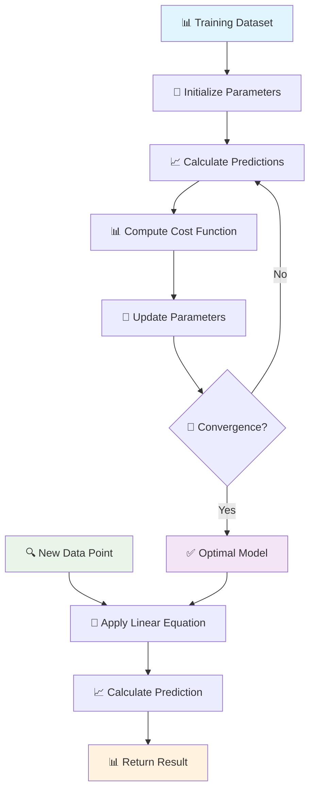
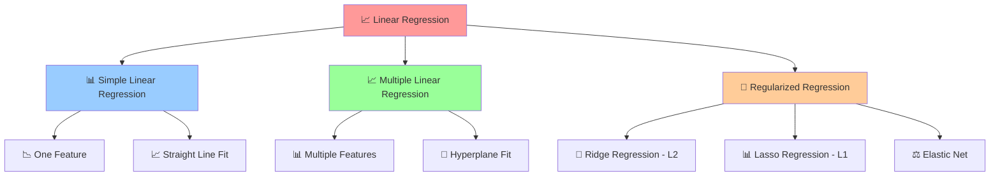
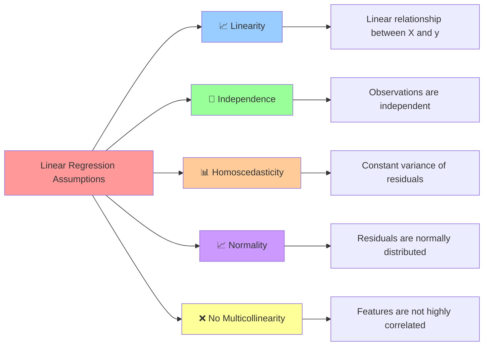

# 📈 Linear Regression

[](https://en.wikipedia.org/wiki/Linear_regression)
[](https://en.wikipedia.org/wiki/Regression_analysis)
[-orange.svg)](https://en.wikipedia.org/wiki/Time_complexity)

## 🎯 Overview

Linear Regression is a **fundamental statistical method** that models the relationship between a dependent variable and independent variables by fitting a linear equation to observed data. It's the foundation of many machine learning algorithms and provides interpretable results with clear mathematical relationships.

## 🧠 Algorithm Workflow



## 📐 Mathematical Foundation

### Simple Linear Regression
```
y = β₀ + β₁x + ε
```

### Multiple Linear Regression
```
y = β₀ + β₁x₁ + β₂x₂ + ... + βₙxₙ + ε
```

### Matrix Form
```
y = Xβ + ε
```

Where:
- **y**: Dependent variable (target)
- **X**: Independent variables (features)
- **β**: Coefficients (parameters)
- **ε**: Error term (residuals)

### Cost Function (Mean Squared Error)
```
MSE = (1/2m) × Σ(hθ(x⁽ⁱ⁾) - y⁽ⁱ⁾)²
```

### Normal Equation
```
β = (XᵀX)⁻¹Xᵀy
```

## 🔍 Types of Linear Regression



## 🎯 Regression Variants

### Ridge Regression (L2 Regularization)
```
Cost = MSE + α × Σβᵢ²
```

### Lasso Regression (L1 Regularization)
```
Cost = MSE + α × Σ|βᵢ|
```

### Elastic Net
```
Cost = MSE + α₁ × Σ|βᵢ| + α₂ × Σβᵢ²
```

## ✅ Assumptions



## ✅ Advantages

- **🔍 Interpretability**: Clear understanding of feature impact
- **⚡ Fast Training**: Closed-form solution available
- **📊 Statistical Inference**: Confidence intervals and p-values
- **🎯 Baseline Model**: Good starting point for regression problems
- **📈 Linear Relationships**: Excellent for linear patterns
- **💾 Memory Efficient**: Low computational requirements
- **🔧 No Hyperparameters**: Simple implementation

## ❌ Disadvantages

- **📈 Linear Assumption**: Cannot capture non-linear relationships
- **🎯 Outlier Sensitive**: Heavily influenced by outliers
- **📊 Feature Scaling**: Requires normalized features
- **🔄 Multicollinearity**: Problems with correlated features
- **📉 Underfitting**: May be too simple for complex data
- **🎪 Limited Flexibility**: Cannot model interactions without feature engineering

## 🎯 Use Cases & Applications

| Domain | Application | Example |
|--------|-------------|----------|
| **🏠 Real Estate** | Price Prediction | House price based on size, location |
| **💰 Finance** | Risk Assessment | Stock price prediction |
| **📊 Marketing** | Sales Forecasting | Revenue prediction from advertising spend |
| **🏥 Healthcare** | Medical Analysis | Drug dosage optimization |
| **🌾 Agriculture** | Crop Yield** | Yield prediction from weather data |
| **🚗 Automotive** | Fuel Efficiency | MPG prediction from car features |

## 📁 Project Structure

```
Linear Regression/
├── 📓 Simple+Linear+Regression.ipynb                          # Single feature regression
├── 📓 Multiple+Linear+Regression-+Economics+Dataset.ipynb     # Multiple feature regression
├── 📓 Model Training.ipynb                                     # Complete training process
├── 📓 Ridge, Lasso Regression.ipynb                          # Regularization techniques
├── 📊 Algerian_forest_fires_cleaned_dataset.csv              # Cleaned dataset
├── 📊 Algerian_forest_fires_dataset_UPDATE.csv               # Updated dataset
├── 📊 economic_index.csv                                      # Economics data
├── 📊 height-weight.csv                                       # Simple regression data
└── 📄 README.md                                               # This documentation
```

## 🚀 Implementation Guide

### 1. Simple Linear Regression
```python
import numpy as np
import pandas as pd
from sklearn.linear_model import LinearRegression
from sklearn.model_selection import train_test_split
from sklearn.metrics import mean_squared_error, r2_score
import matplotlib.pyplot as plt

# Load and prepare data
data = pd.read_csv('height-weight.csv')
X = data[['Height']].values
y = data['Weight'].values

# Split the data
X_train, X_test, y_train, y_test = train_test_split(X, y, test_size=0.2, random_state=42)

# Create and train model
model = LinearRegression()
model.fit(X_train, y_train)

# Make predictions
y_pred = model.predict(X_test)

# Evaluate model
mse = mean_squared_error(y_test, y_pred)
r2 = r2_score(y_test, y_pred)

print(f"MSE: {mse:.4f}")
print(f"R² Score: {r2:.4f}")
print(f"Coefficient: {model.coef_[0]:.4f}")
print(f"Intercept: {model.intercept_:.4f}")
```

### 2. Multiple Linear Regression
```python
from sklearn.preprocessing import StandardScaler
from sklearn.feature_selection import SelectKBest, f_regression

# Load economics dataset
data = pd.read_csv('economic_index.csv')
X = data.drop('target', axis=1)
y = data['target']

# Feature scaling
scaler = StandardScaler()
X_scaled = scaler.fit_transform(X)

# Feature selection
selector = SelectKBest(score_func=f_regression, k=5)
X_selected = selector.fit_transform(X_scaled, y)

# Split and train
X_train, X_test, y_train, y_test = train_test_split(X_selected, y, test_size=0.2, random_state=42)

model = LinearRegression()
model.fit(X_train, y_train)

# Predictions and evaluation
y_pred = model.predict(X_test)
print(f"Multiple R² Score: {r2_score(y_test, y_pred):.4f}")
```

### 3. Ridge Regression (L2 Regularization)
```python
from sklearn.linear_model import Ridge
from sklearn.model_selection import GridSearchCV

# Ridge regression with cross-validation
ridge = Ridge()
param_grid = {'alpha': [0.1, 1.0, 10.0, 100.0, 1000.0]}

grid_search = GridSearchCV(ridge, param_grid, cv=5, scoring='r2')
grid_search.fit(X_train, y_train)

best_ridge = grid_search.best_estimator_
y_pred_ridge = best_ridge.predict(X_test)

print(f"Best Alpha: {grid_search.best_params_['alpha']}")
print(f"Ridge R² Score: {r2_score(y_test, y_pred_ridge):.4f}")
```

### 4. Lasso Regression (L1 Regularization)
```python
from sklearn.linear_model import Lasso

# Lasso regression for feature selection
lasso = Lasso(alpha=0.1)
lasso.fit(X_train, y_train)

y_pred_lasso = lasso.predict(X_test)

# Check which features were selected (non-zero coefficients)
selected_features = X.columns[lasso.coef_ != 0]
print(f"Selected features: {list(selected_features)}")
print(f"Lasso R² Score: {r2_score(y_test, y_pred_lasso):.4f}")
```

### 5. Elastic Net
```python
from sklearn.linear_model import ElasticNet

# Elastic Net combines L1 and L2 regularization
elastic_net = ElasticNet(alpha=0.1, l1_ratio=0.5)
elastic_net.fit(X_train, y_train)

y_pred_elastic = elastic_net.predict(X_test)
print(f"Elastic Net R² Score: {r2_score(y_test, y_pred_elastic):.4f}")
```

## 📊 Model Evaluation & Diagnostics

### Residual Analysis
```python
# Calculate residuals
residuals = y_test - y_pred

# Plot residuals
plt.figure(figsize=(12, 4))

# Residuals vs Fitted
plt.subplot(1, 3, 1)
plt.scatter(y_pred, residuals)
plt.axhline(y=0, color='r', linestyle='--')
plt.xlabel('Fitted Values')
plt.ylabel('Residuals')
plt.title('Residuals vs Fitted')

# Q-Q plot for normality
from scipy import stats
plt.subplot(1, 3, 2)
stats.probplot(residuals, dist="norm", plot=plt)
plt.title('Q-Q Plot')

# Histogram of residuals
plt.subplot(1, 3, 3)
plt.hist(residuals, bins=20, edgecolor='black')
plt.xlabel('Residuals')
plt.ylabel('Frequency')
plt.title('Residual Distribution')

plt.tight_layout()
plt.show()
```

### Statistical Tests
```python
from scipy.stats import jarque_bera, durbin_watson
from statsmodels.stats.diagnostic import het_breuschpagan

# Test for normality of residuals
jb_stat, jb_pvalue = jarque_bera(residuals)
print(f"Jarque-Bera test p-value: {jb_pvalue:.4f}")

# Test for autocorrelation
dw_stat = durbin_watson(residuals)
print(f"Durbin-Watson statistic: {dw_stat:.4f}")

# Test for heteroscedasticity
# Note: This requires fitted model from statsmodels
```

## 🔧 Feature Engineering

### Polynomial Features
```python
from sklearn.preprocessing import PolynomialFeatures

# Create polynomial features
poly_features = PolynomialFeatures(degree=2, include_bias=False)
X_poly = poly_features.fit_transform(X)

# Train polynomial regression
X_train_poly, X_test_poly, y_train, y_test = train_test_split(X_poly, y, test_size=0.2, random_state=42)

poly_model = LinearRegression()
poly_model.fit(X_train_poly, y_train)

y_pred_poly = poly_model.predict(X_test_poly)
print(f"Polynomial R² Score: {r2_score(y_test, y_pred_poly):.4f}")
```

### Interaction Terms
```python
# Create interaction features
from itertools import combinations

# Manual interaction terms
X_interactions = X.copy()
for col1, col2 in combinations(X.columns, 2):
    X_interactions[f"{col1}_x_{col2}"] = X[col1] * X[col2]
```

## 📈 Model Comparison

```python
# Compare different regression models
models = {
    'Linear Regression': LinearRegression(),
    'Ridge': Ridge(alpha=1.0),
    'Lasso': Lasso(alpha=0.1),
    'Elastic Net': ElasticNet(alpha=0.1, l1_ratio=0.5)
}

results = {}
for name, model in models.items():
    model.fit(X_train, y_train)
    y_pred = model.predict(X_test)
    results[name] = {
        'R²': r2_score(y_test, y_pred),
        'MSE': mean_squared_error(y_test, y_pred),
        'RMSE': np.sqrt(mean_squared_error(y_test, y_pred))
    }

# Display results
results_df = pd.DataFrame(results).T
print(results_df.round(4))
```

## 📚 Learning Resources

- **Simple Regression**: [`Simple+Linear+Regression.ipynb`](./Simple+Linear+Regression.ipynb)
- **Multiple Regression**: [`Multiple+Linear+Regression-+Economics+Dataset.ipynb`](./Multiple+Linear+Regression-+Economics+Dataset.ipynb)
- **Model Training**: [`Model Training.ipynb`](./Model%20Training.ipynb)
- **Regularization**: [`Ridge, Lasso Regression.ipynb`](./Ridge,%20Lasso%20Regression.ipynb)
- **Scikit-learn Documentation**: [Linear Models](https://scikit-learn.org/stable/modules/linear_model.html)
- **Theory**: [Linear Regression](https://en.wikipedia.org/wiki/Linear_regression)

## 🎓 Key Takeaways

1. **📊 Foundation**: Understanding linear regression is crucial for all ML
2. **🔍 Interpretability**: Coefficients show feature importance and direction
3. **⚖️ Regularization**: Use Ridge/Lasso to prevent overfitting
4. **📈 Assumptions**: Verify linearity, independence, and normality
5. **🎯 Feature Engineering**: Polynomial and interaction terms for non-linearity
6. **📊 Diagnostics**: Always check residuals and model assumptions

---

*Navigate back to [Main Repository](../README.md) | Previous: [Decision Tree](../Decision%20Tree/README.md) | Next: [KNN](../KNN/README.md)*
