# 📊 Logistic Regression

[](https://en.wikipedia.org/wiki/Logistic_regression)
[](https://en.wikipedia.org/wiki/Statistical_classification)
[-orange.svg)](https://en.wikipedia.org/wiki/Time_complexity)

## 🎯 Overview

Logistic Regression is a **statistical method for binary and multiclass classification** that uses the logistic (sigmoid) function to model the probability of class membership. Despite its name, it's a classification algorithm that predicts the probability of categorical outcomes using a linear combination of input features.

## 🧠 Algorithm Workflow


## 📐 Mathematical Foundation

### Linear Combination
```
z = β₀ + β₁x₁ + β₂x₂ + ... + βₙxₙ = β^T x
```

### Sigmoid (Logistic) Function
```
σ(z) = 1 / (1 + e^(-z))
```

### Probability Prediction
```
P(y=1|x) = σ(β^T x) = 1 / (1 + e^(-β^T x))
P(y=0|x) = 1 - P(y=1|x)
```

### Log-Likelihood Function
```
L(β) = Σᵢ [yᵢ log(pᵢ) + (1-yᵢ) log(1-pᵢ)]
```

### Cost Function (Cross-Entropy Loss)
```
J(β) = -1/m Σᵢ [yᵢ log(hβ(xᵢ)) + (1-yᵢ) log(1-hβ(xᵢ))]
```

### Gradient
```
∇J(β) = 1/m X^T (h - y)
```

## 🌊 Sigmoid Function Properties

```mermaid
graph TB
    A[🌊 Sigmoid Function] --> B[📊 Properties]
    
    B --> B1[📈 S-shaped Curve]
    B --> B2[📊 Output Range: 0-1]
    B --> B3[🎯 Threshold at 0.5]
    B --> B4[📐 Smooth & Differentiable]
    
    C[🎯 Decision Boundary] --> C1[📊 Linear in Feature Space]
    C --> C2[🌊 Non-linear in Probability Space]
    
    D[🔄 Variants] --> D1[📊 Binary Logistic]
    D --> D2[🎪 Multinomial Logistic]
    D --> D3[📈 Ordinal Logistic]
    
    style A fill:#ff9999
    style B fill:#99ccff
    style C fill:#99ff99
    style D fill:#ffcc99
```



## 🎯 Types of Logistic Regression

```mermaid
graph LR
    A[📊 Logistic Regression] --> B[🎯 Binary Logistic]
    A --> C[🎪 Multinomial Logistic]
    A --> D[📈 Ordinal Logistic]
    
    B --> B1[Two classes 0/1]
    C --> C1[Multiple classes >2]
    D --> D1[Ordered categories]
    
    E[🔧 Regularization] --> E1[🎯 L1 - Lasso]
    E --> E2[📊 L2 - Ridge]
    E --> E3[⚖️ Elastic Net]
    
    style A fill:#ff9999
    style B fill:#99ccff
    style C fill:#99ff99
    style D fill:#ffcc99
    style E fill:#cc99ff
```



## ✅ Advantages

- **🚀 Fast & Efficient**: Quick training and prediction
- **📊 Probabilistic Output**: Provides probability estimates
- **🔍 Interpretable**: Clear coefficient interpretation
- **📈 No Feature Scaling Required**: Robust to feature scales
- **🎯 No Tuning Required**: Works well with default parameters
- **📊 Linear Decision Boundary**: Simple and interpretable
- **🔧 Regularization Support**: Built-in overfitting prevention
- **🎪 Multi-class Support**: Handles multiple classes

## ❌ Disadvantages

- **📈 Linear Assumption**: Assumes linear relationship between features and log-odds
- **🎯 Outlier Sensitive**: Can be affected by extreme values
- **📊 Large Sample Size**: Requires sufficient data for stable results
- **🔄 Feature Independence**: Assumes features are independent
- **🎭 Overfitting Risk**: With many features relative to samples
- **📈 Non-linear Patterns**: Cannot capture complex non-linear relationships

## 🎯 Use Cases & Applications

| Domain | Application | Example |
|--------|-------------|----------|
| **📧 Technology** | Spam Detection | Email classification |
| **🏥 Healthcare** | Medical Diagnosis | Disease prediction |
| **💰 Finance** | Credit Scoring | Loan approval decisions |
| **📊 Marketing** | Customer Behavior | Purchase prediction |
| **🎬 Entertainment** | Recommendation | Content preferences |
| **🚗 Transportation** | Risk Assessment | Insurance claims |

## 📁 Project Structure

```
Logistic Regression/
├── 📓 Logistic+Regression+Implementation.ipynb    # Complete implementation
└── 📄 README.md                                   # This documentation
```

## 🚀 Implementation Guide

### 1. Binary Logistic Regression
```python
import numpy as np
import pandas as pd
from sklearn.linear_model import LogisticRegression
from sklearn.model_selection import train_test_split
from sklearn.preprocessing import StandardScaler
from sklearn.metrics import accuracy_score, classification_report, confusion_matrix
import matplotlib.pyplot as plt

# Load and prepare data
X_train, X_test, y_train, y_test = train_test_split(X, y, test_size=0.2, random_state=42)

# Optional: Feature scaling (recommended but not required)
scaler = StandardScaler()
X_train_scaled = scaler.fit_transform(X_train)
X_test_scaled = scaler.transform(X_test)

# Create and train logistic regression model
log_reg = LogisticRegression(
    penalty='l2',           # Regularization type
    C=1.0,                  # Inverse regularization strength
    solver='liblinear',     # Optimization algorithm
    random_state=42,
    max_iter=1000
)

log_reg.fit(X_train_scaled, y_train)

# Make predictions
y_pred = log_reg.predict(X_test_scaled)
y_pred_proba = log_reg.predict_proba(X_test_scaled)

# Evaluate model
accuracy = accuracy_score(y_test, y_pred)
print(f"Accuracy: {accuracy:.4f}")
print(f"Model coefficients: {log_reg.coef_[0]}")
print(f"Model intercept: {log_reg.intercept_[0]:.4f}")

# Detailed evaluation
print("\nClassification Report:")
print(classification_report(y_test, y_pred))
```

### 2. Multinomial Logistic Regression
```python
from sklearn.datasets import make_classification

# Generate multi-class dataset
X_multi, y_multi = make_classification(
    n_samples=1000, n_features=20, n_classes=3, 
    n_informative=10, random_state=42
)

X_train_multi, X_test_multi, y_train_multi, y_test_multi = train_test_split(
    X_multi, y_multi, test_size=0.2, random_state=42
)

# Multi-class logistic regression
multi_log_reg = LogisticRegression(
    multi_class='multinomial',  # Multinomial approach
    solver='lbfgs',            # Solver for multinomial
    max_iter=1000,
    random_state=42
)

multi_log_reg.fit(X_train_multi, y_train_multi)

# Predictions
y_pred_multi = multi_log_reg.predict(X_test_multi)
y_pred_proba_multi = multi_log_reg.predict_proba(X_test_multi)

print(f"Multi-class Accuracy: {accuracy_score(y_test_multi, y_pred_multi):.4f}")
print(f"Number of classes: {len(multi_log_reg.classes_)}")
print(f"Classes: {multi_log_reg.classes_}")
```

### 3. Regularized Logistic Regression
```python
from sklearn.linear_model import LogisticRegressionCV

# L1 Regularization (Lasso)
lasso_log_reg = LogisticRegression(
    penalty='l1',
    solver='liblinear',
    C=0.1,
    random_state=42
)

# L2 Regularization (Ridge)
ridge_log_reg = LogisticRegression(
    penalty='l2',
    solver='liblinear',
    C=0.1,
    random_state=42
)

# Elastic Net
elastic_log_reg = LogisticRegression(
    penalty='elasticnet',
    solver='saga',
    C=0.1,
    l1_ratio=0.5,  # Balance between L1 and L2
    random_state=42,
    max_iter=1000
)

# Cross-validation for optimal C
log_reg_cv = LogisticRegressionCV(
    Cs=np.logspace(-4, 4, 20),  # Range of C values
    cv=5,
    penalty='l2',
    solver='liblinear',
    random_state=42
)

# Compare regularization methods
models = {
    'Lasso (L1)': lasso_log_reg,
    'Ridge (L2)': ridge_log_reg,
    'Elastic Net': elastic_log_reg,
    'CV Optimized': log_reg_cv
}

results = {}
for name, model in models.items():
    model.fit(X_train_scaled, y_train)
    y_pred = model.predict(X_test_scaled)
    accuracy = accuracy_score(y_test, y_pred)
    results[name] = accuracy

print("Regularization Comparison:")
for name, acc in results.items():
    print(f"{name}: {acc:.4f}")

if hasattr(log_reg_cv, 'C_'):
    print(f"\nOptimal C value: {log_reg_cv.C_[0]:.4f}")
```

### 4. Custom Decision Threshold
```python
from sklearn.metrics import precision_recall_curve, roc_curve, roc_auc_score

# Get prediction probabilities
y_scores = log_reg.predict_proba(X_test_scaled)[:, 1]

# Calculate ROC curve
fpr, tpr, thresholds_roc = roc_curve(y_test, y_scores)
auc_score = roc_auc_score(y_test, y_scores)

# Calculate Precision-Recall curve
precision, recall, thresholds_pr = precision_recall_curve(y_test, y_scores)

# Plot ROC curve
plt.figure(figsize=(12, 5))

plt.subplot(1, 2, 1)
plt.plot(fpr, tpr, label=f'ROC Curve (AUC = {auc_score:.4f})')
plt.plot([0, 1], [0, 1], 'k--', label='Random')
plt.xlabel('False Positive Rate')
plt.ylabel('True Positive Rate')
plt.title('ROC Curve')
plt.legend()
plt.grid(True)

# Plot Precision-Recall curve
plt.subplot(1, 2, 2)
plt.plot(recall, precision, label='Precision-Recall Curve')
plt.xlabel('Recall')
plt.ylabel('Precision')
plt.title('Precision-Recall Curve')
plt.legend()
plt.grid(True)

plt.tight_layout()
plt.show()

# Find optimal threshold using F1-score
from sklearn.metrics import f1_score

f1_scores = []
thresholds_test = np.arange(0.1, 1.0, 0.05)

for threshold in thresholds_test:
    y_pred_threshold = (y_scores >= threshold).astype(int)
    f1 = f1_score(y_test, y_pred_threshold)
    f1_scores.append(f1)

optimal_threshold = thresholds_test[np.argmax(f1_scores)]
print(f"Optimal threshold: {optimal_threshold:.2f}")
print(f"Best F1-score: {max(f1_scores):.4f}")
```

### 5. Feature Importance Analysis
```python
# Get feature coefficients
coefficients = log_reg.coef_[0]
feature_names = X.columns if hasattr(X, 'columns') else [f'Feature_{i}' for i in range(X.shape[1])]

# Create feature importance dataframe
feature_importance = pd.DataFrame({
    'feature': feature_names,
    'coefficient': coefficients,
    'abs_coefficient': np.abs(coefficients)
}).sort_values('abs_coefficient', ascending=False)

# Plot feature importance
plt.figure(figsize=(10, 8))
top_features = feature_importance.head(15)
colors = ['red' if coef < 0 else 'blue' for coef in top_features['coefficient']]

plt.barh(top_features['feature'], top_features['coefficient'], color=colors)
plt.xlabel('Coefficient Value')
plt.title('Logistic Regression Feature Importance')
plt.axvline(x=0, color='black', linestyle='-', alpha=0.3)
plt.gca().invert_yaxis()
plt.tight_layout()
plt.show()

print("Top 10 Most Important Features:")
print(feature_importance.head(10))
```

## 📊 Model Evaluation & Diagnostics

### Confusion Matrix Analysis
```python
import seaborn as sns
from sklearn.metrics import precision_score, recall_score, f1_score

# Confusion matrix
cm = confusion_matrix(y_test, y_pred)

plt.figure(figsize=(8, 6))
sns.heatmap(cm, annot=True, fmt='d', cmap='Blues', 
            xticklabels=['Negative', 'Positive'],
            yticklabels=['Negative', 'Positive'])
plt.title('Confusion Matrix')
plt.ylabel('True Label')
plt.xlabel('Predicted Label')
plt.show()

# Calculate metrics
precision = precision_score(y_test, y_pred)
recall = recall_score(y_test, y_pred)
f1 = f1_score(y_test, y_pred)

print(f"Precision: {precision:.4f}")
print(f"Recall: {recall:.4f}")
print(f"F1-Score: {f1:.4f}")
```

### Model Assumptions Check
```python
# Check for multicollinearity
from statsmodels.stats.outliers_influence import variance_inflation_factor

# Calculate VIF for each feature
vif_data = pd.DataFrame()
vif_data["Feature"] = feature_names
vif_data["VIF"] = [variance_inflation_factor(X_train_scaled, i) 
                   for i in range(X_train_scaled.shape[1])]

print("Variance Inflation Factors:")
print(vif_data.sort_values('VIF', ascending=False).head(10))

# Features with VIF > 10 indicate multicollinearity
high_vif = vif_data[vif_data['VIF'] > 10]
if not high_vif.empty:
    print(f"\nFeatures with high multicollinearity (VIF > 10):")
    print(high_vif)
```

## 🔧 Advanced Techniques

### 1. Polynomial Features
```python
from sklearn.preprocessing import PolynomialFeatures

# Create polynomial features
poly_features = PolynomialFeatures(degree=2, include_bias=False)
X_train_poly = poly_features.fit_transform(X_train_scaled)
X_test_poly = poly_features.transform(X_test_scaled)

# Logistic regression with polynomial features
poly_log_reg = LogisticRegression(C=0.1, random_state=42)
poly_log_reg.fit(X_train_poly, y_train)

y_pred_poly = poly_log_reg.predict(X_test_poly)
print(f"Polynomial Logistic Regression Accuracy: {accuracy_score(y_test, y_pred_poly):.4f}")
```

### 2. Handling Imbalanced Data
```python
from sklearn.utils.class_weight import compute_class_weight
from imblearn.over_sampling import SMOTE

# Method 1: Class weights
classes = np.unique(y_train)
class_weights = compute_class_weight('balanced', classes=classes, y=y_train)
class_weight_dict = dict(zip(classes, class_weights))

balanced_log_reg = LogisticRegression(
    class_weight='balanced',  # or class_weight_dict
    random_state=42
)
balanced_log_reg.fit(X_train_scaled, y_train)

# Method 2: SMOTE oversampling
smote = SMOTE(random_state=42)
X_train_balanced, y_train_balanced = smote.fit_resample(X_train_scaled, y_train)

smote_log_reg = LogisticRegression(random_state=42)
smote_log_reg.fit(X_train_balanced, y_train_balanced)

# Compare approaches
balanced_pred = balanced_log_reg.predict(X_test_scaled)
smote_pred = smote_log_reg.predict(X_test_scaled)

print(f"Balanced weights accuracy: {accuracy_score(y_test, balanced_pred):.4f}")
print(f"SMOTE accuracy: {accuracy_score(y_test, smote_pred):.4f}")
```

## 📚 Learning Resources

- **Implementation Notebook**: [`Logistic+Regression+Implementation.ipynb`](./Logistic+Regression+Implementation.ipynb)
- **Scikit-learn Documentation**: [Logistic Regression](https://scikit-learn.org/stable/modules/linear_model.html#logistic-regression)
- **Theory**: [Logistic Regression](https://en.wikipedia.org/wiki/Logistic_regression)

## 🎓 Key Takeaways

1. **📊 Probabilistic**: Provides probability estimates, not just classifications
2. **🌊 Sigmoid Function**: Maps any real number to (0,1) probability range
3. **🔧 Regularization**: Use L1/L2 to prevent overfitting with many features
4. **🎯 Threshold Tuning**: Adjust decision threshold based on business needs
5. **📈 Linear Boundary**: Assumes linear relationship in log-odds space
6. **⚖️ Feature Scaling**: Beneficial but not strictly required
7. **🎪 Multi-class**: Naturally extends to multiple classes

---

*Navigate back to [Main Repository](../README.md) | Previous: [Random Forest](../Random%20Forest/README.md) | Next: [XGBoost](../Xgboost/README.md)*
✅ Gives probability scores
✅ Good baseline for classification

## Next Steps
→ [`Decision Tree/`](../Decision%20Tree/) for non-linear classification
