# 🔧 Data Preprocessing & Missing Values

[](https://en.wikipedia.org/wiki/Data_preprocessing)
[](https://scikit-learn.org/stable/modules/preprocessing.html)
[](https://en.wikipedia.org/wiki/Feature_engineering)

## 🎯 Overview

Data preprocessing is the **foundation of successful machine learning**. This comprehensive guide covers essential techniques for handling missing values, outliers, categorical encoding, and imbalanced datasets. Real-world data is messy, incomplete, and often biased - these techniques transform raw data into clean, ML-ready datasets.

## 🧠 Data Preprocessing Workflow

```mermaid
flowchart TD
    A[📊 Raw Dataset] --> B[🔍 Data Exploration]
    B --> C{❓ Missing Values?}
    C -->|Yes| D[🔧 Handle Missing Data]
    C -->|No| E{📈 Outliers Present?}
    
    D --> D1[📊 Statistical Imputation]
    D --> D2[🤖 Model-based Imputation]
    D --> D3[🗑️ Deletion Methods]
    
    D1 --> E
    D2 --> E
    D3 --> E
    
    E -->|Yes| F[🎯 Outlier Treatment]
    E -->|No| G{🏷️ Categorical Data?}
    
    F --> F1[📉 Statistical Methods]
    F --> F2[🔍 Isolation-based]
    F --> F3[✂️ Trimming/Capping]
    
    F1 --> G
    F2 --> G
    F3 --> G
    
    G -->|Yes| H[🔤 Categorical Encoding]
    G -->|No| I{⚖️ Imbalanced Classes?}
    
    H --> H1[🎯 One-Hot Encoding]
    H --> H2[📊 Ordinal Encoding]
    H --> H3[🎪 Target Encoding]
    
    H1 --> I
    H2 --> I
    H3 --> I
    
    I -->|Yes| J[⚖️ Balance Dataset]
    I -->|No| K[✅ Clean Dataset]
    
    J --> J1[📈 Oversampling - SMOTE]
    J --> J2[📉 Undersampling]
    J --> J3[🎭 Ensemble Methods]
    
    J1 --> K
    J2 --> K
    J3 --> K
    
    style A fill:#ffebee
    style K fill:#c8e6c9
    style D fill:#e3f2fd
    style F fill:#fff3e0
    style H fill:#f3e5f5
    style J fill:#e8f5e8
```



## 📁 Project Structure

```
Missing Values/
├── 📓 1.0-Handling Missing Values.ipynb              # Missing data imputation techniques
├── 📓 4.0-Handling+Outliers.ipynb                   # Outlier detection and treatment
├── 📓 5.0-Nominal+or+OHE.ipynb                      # Categorical encoding methods
├── 📓 8.0-Target+Guided+Ordinal+Encoding.ipynb      # Advanced encoding techniques
├── 📓 Handling Imbalance Dataset.ipynb              # Class imbalance solutions
├── 📓 Handling Imbalanced Dataset using Smote.ipynb # SMOTE implementation
└── 📄 README.md                                      # This documentation
```

## 🔧 Missing Values Handling

### Types of Missing Data


### Implementation Guide

#### 1. Statistical Imputation
```python
import pandas as pd
import numpy as np
from sklearn.impute import SimpleImputer, KNNImputer
from sklearn.experimental import enable_iterative_imputer
from sklearn.impute import IterativeImputer
import matplotlib.pyplot as plt
import seaborn as sns

# Create sample data with missing values
np.random.seed(42)
data = {
    'age': np.random.normal(35, 10, 1000),
    'income': np.random.normal(50000, 15000, 1000),
    'score': np.random.normal(75, 15, 1000)
}
df = pd.DataFrame(data)

# Introduce missing values
missing_indices = np.random.choice(df.index, size=int(0.2 * len(df)), replace=False)
df.loc[missing_indices[:50], 'age'] = np.nan
df.loc[missing_indices[50:100], 'income'] = np.nan
df.loc[missing_indices[100:150], 'score'] = np.nan

print("Missing Values Summary:")
print(df.isnull().sum())
print(f"\nMissing percentage: {(df.isnull().sum() / len(df) * 100).round(2)}%")

# Visualize missing data pattern
plt.figure(figsize=(12, 8))

# Missing data heatmap
plt.subplot(2, 2, 1)
sns.heatmap(df.isnull(), cbar=True, yticklabels=False, cmap='viridis')
plt.title('Missing Data Pattern')

# Missing data bar plot
plt.subplot(2, 2, 2)
missing_counts = df.isnull().sum()
missing_counts.plot(kind='bar', color='skyblue')
plt.title('Missing Values Count')
plt.ylabel('Count')
plt.xticks(rotation=45)

# Distribution before imputation
plt.subplot(2, 2, 3)
df['age'].hist(bins=30, alpha=0.7, label='Original', color='blue')
plt.title('Age Distribution (with missing values)')
plt.xlabel('Age')
plt.ylabel('Frequency')
plt.legend()

plt.tight_layout()
plt.show()
```

#### 2. Different Imputation Strategies
```python
# Compare different imputation methods
imputation_methods = {
    'Mean': SimpleImputer(strategy='mean'),
    'Median': SimpleImputer(strategy='median'),
    'Mode': SimpleImputer(strategy='most_frequent'),
    'KNN': KNNImputer(n_neighbors=5),
    'Iterative': IterativeImputer(random_state=42)
}

# Apply different imputation methods
imputed_data = {}
for name, imputer in imputation_methods.items():
    if name == 'Mode':
        # Mode works better with categorical data, skip for numerical
        continue
    
    imputed_df = pd.DataFrame(
        imputer.fit_transform(df),
        columns=df.columns
    )
    imputed_data[name] = imputed_df

# Compare distributions
fig, axes = plt.subplots(2, 3, figsize=(18, 12))
axes = axes.flatten()

# Original data (complete cases only)
original_complete = df.dropna()
axes[0].hist(original_complete['age'], bins=30, alpha=0.7, color='blue', label='Original')
axes[0].set_title('Original Data (Complete Cases)')
axes[0].set_xlabel('Age')
axes[0].set_ylabel('Frequency')
axes[0].legend()

# Imputed data comparisons
colors = ['red', 'green', 'orange', 'purple']
for i, (name, data) in enumerate(imputed_data.items()):
    axes[i+1].hist(data['age'], bins=30, alpha=0.7, color=colors[i], label=f'{name} Imputed')
    axes[i+1].set_title(f'{name} Imputation')
    axes[i+1].set_xlabel('Age')
    axes[i+1].set_ylabel('Frequency')
    axes[i+1].legend()

plt.tight_layout()
plt.show()

# Evaluate imputation quality
print("Imputation Quality Comparison:")
print("-" * 50)
original_stats = original_complete.describe()

for name, data in imputed_data.items():
    imputed_stats = data.describe()
    
    print(f"\n{name} Imputation:")
    print(f"Age - Mean: {imputed_stats.loc['mean', 'age']:.2f} (Original: {original_stats.loc['mean', 'age']:.2f})")
    print(f"Age - Std:  {imputed_stats.loc['std', 'age']:.2f} (Original: {original_stats.loc['std', 'age']:.2f})")
```

## 📈 Outlier Detection & Treatment

### Outlier Detection Methods

```mermaid
graph TB
    A[🎯 Outlier Detection] --> B[📊 Statistical Methods]
    A --> C[🤖 Model-based Methods]
    A --> D[🔍 Distance-based Methods]
    
    B --> B1[Z-Score]
    B --> B2[IQR Method]
    B --> B3[Modified Z-Score]
    
    C --> C1[Isolation Forest]
    C --> C2[One-Class SVM]
    C --> C3[Local Outlier Factor]
    
    D --> D1[K-Nearest Neighbors]
    D --> D2[DBSCAN]
    D --> D3[Mahalanobis Distance]
    
    style A fill:#ff9999
    style B fill:#99ccff
    style C fill:#99ff99
    style D fill:#ffcc99
```



#### Implementation Example
```python
from sklearn.ensemble import IsolationForest
from sklearn.neighbors import LocalOutlierFactor
from sklearn.svm import OneClassSVM
from scipy import stats

# Generate data with outliers
np.random.seed(42)
normal_data = np.random.normal(0, 1, (200, 2))
outliers = np.random.uniform(-4, 4, (20, 2))
X = np.vstack([normal_data, outliers])

# Different outlier detection methods
detectors = {
    'Isolation Forest': IsolationForest(contamination=0.1, random_state=42),
    'Local Outlier Factor': LocalOutlierFactor(n_neighbors=20, contamination=0.1),
    'One-Class SVM': OneClassSVM(nu=0.1)
}

# Statistical method (Z-score)
def detect_outliers_zscore(data, threshold=3):
    z_scores = np.abs(stats.zscore(data))
    return (z_scores > threshold).any(axis=1)

# Apply detection methods
fig, axes = plt.subplots(2, 2, figsize=(15, 12))

# Original data
axes[0, 0].scatter(X[:200, 0], X[:200, 1], c='blue', alpha=0.6, label='Normal')
axes[0, 0].scatter(X[200:, 0], X[200:, 1], c='red', alpha=0.8, label='Outliers')
axes[0, 0].set_title('Original Data')
axes[0, 0].legend()
axes[0, 0].grid(True, alpha=0.3)

# Z-score method
z_outliers = detect_outliers_zscore(X)
axes[0, 1].scatter(X[~z_outliers, 0], X[~z_outliers, 1], c='blue', alpha=0.6, label='Normal')
axes[0, 1].scatter(X[z_outliers, 0], X[z_outliers, 1], c='red', alpha=0.8, label='Detected Outliers')
axes[0, 1].set_title('Z-Score Method')
axes[0, 1].legend()
axes[0, 1].grid(True, alpha=0.3)

# Model-based methods
plot_idx = 2
for name, detector in list(detectors.items())[:2]:  # Plot first 2 methods
    if name == 'Local Outlier Factor':
        outlier_labels = detector.fit_predict(X)
    else:
        outlier_labels = detector.fit(X).predict(X)
    
    row, col = divmod(plot_idx, 2)
    
    normal_mask = outlier_labels == 1
    outlier_mask = outlier_labels == -1
    
    axes[row, col].scatter(X[normal_mask, 0], X[normal_mask, 1], c='blue', alpha=0.6, label='Normal')
    axes[row, col].scatter(X[outlier_mask, 0], X[outlier_mask, 1], c='red', alpha=0.8, label='Detected Outliers')
    axes[row, col].set_title(name)
    axes[row, col].legend()
    axes[row, col].grid(True, alpha=0.3)
    
    plot_idx += 1

plt.tight_layout()
plt.show()

# Evaluate detection performance
print("Outlier Detection Performance:")
print("-" * 40)
true_outliers = np.zeros(len(X), dtype=bool)
true_outliers[200:] = True  # Last 20 points are outliers

for name, detector in detectors.items():
    if name == 'Local Outlier Factor':
        predicted = detector.fit_predict(X) == -1
    else:
        predicted = detector.fit(X).predict(X) == -1
    
    # Calculate metrics
    tp = np.sum(predicted & true_outliers)
    fp = np.sum(predicted & ~true_outliers)
    fn = np.sum(~predicted & true_outliers)
    tn = np.sum(~predicted & ~true_outliers)
    
    precision = tp / (tp + fp) if (tp + fp) > 0 else 0
    recall = tp / (tp + fn) if (tp + fn) > 0 else 0
    f1 = 2 * precision * recall / (precision + recall) if (precision + recall) > 0 else 0
    
    print(f"{name:20}: Precision={precision:.3f}, Recall={recall:.3f}, F1={f1:.3f}")

# Z-score evaluation
z_predicted = detect_outliers_zscore(X)
tp_z = np.sum(z_predicted & true_outliers)
fp_z = np.sum(z_predicted & ~true_outliers)
fn_z = np.sum(~z_predicted & true_outliers)

precision_z = tp_z / (tp_z + fp_z) if (tp_z + fp_z) > 0 else 0
recall_z = tp_z / (tp_z + fn_z) if (tp_z + fn_z) > 0 else 0
f1_z = 2 * precision_z * recall_z / (precision_z + recall_z) if (precision_z + recall_z) > 0 else 0

print(f"{'Z-Score':20}: Precision={precision_z:.3f}, Recall={recall_z:.3f}, F1={f1_z:.3f}")
```

## 🔤 Categorical Encoding

### Encoding Methods Overview

```mermaid
graph TB
    A[🏷️ Categorical Encoding] --> B[📊 Nominal Data]
    A --> C[📈 Ordinal Data]
    
    B --> B1[One-Hot Encoding]
    B --> B2[Binary Encoding]
    B --> B3[Target Encoding]
    B --> B4[Frequency Encoding]
    
    C --> C1[Label Encoding]
    C --> C2[Ordinal Encoding]
    C --> C3[Target-Guided Ordinal]
    
    style A fill:#ff9999
    style B fill:#99ccff
    style C fill:#99ff99
```



#### Implementation Examples
```python
from sklearn.preprocessing import LabelEncoder, OneHotEncoder, OrdinalEncoder
from sklearn.model_selection import cross_val_score
from sklearn.ensemble import RandomForestClassifier
import pandas as pd

# Create sample categorical data
np.random.seed(42)
data = {
    'color': np.random.choice(['red', 'blue', 'green', 'yellow'], 1000),
    'size': np.random.choice(['small', 'medium', 'large'], 1000),
    'grade': np.random.choice(['A', 'B', 'C', 'D', 'F'], 1000),
    'target': np.random.choice([0, 1], 1000)
}
df_cat = pd.DataFrame(data)

print("Categorical Data Summary:")
print(df_cat.head())
print(f"\nUnique values per column:")
for col in df_cat.columns[:-1]:
    print(f"{col}: {df_cat[col].nunique()} unique values")

# 1. One-Hot Encoding
from sklearn.preprocessing import OneHotEncoder

encoder_ohe = OneHotEncoder(sparse=False, drop='first')
X_ohe = encoder_ohe.fit_transform(df_cat[['color', 'size']])
feature_names_ohe = encoder_ohe.get_feature_names_out(['color', 'size'])

print(f"\nOne-Hot Encoding:")
print(f"Original shape: {df_cat[['color', 'size']].shape}")
print(f"Encoded shape: {X_ohe.shape}")
print(f"Feature names: {feature_names_ohe}")

# 2. Label Encoding
label_encoder = LabelEncoder()
df_cat['color_label'] = label_encoder.fit_transform(df_cat['color'])
print(f"\nLabel Encoding for 'color':")
print(df_cat[['color', 'color_label']].drop_duplicates().sort_values('color_label'))

# 3. Ordinal Encoding (for ordered categories)
ordinal_encoder = OrdinalEncoder(categories=[['small', 'medium', 'large']])
df_cat['size_ordinal'] = ordinal_encoder.fit_transform(df_cat[['size']])
print(f"\nOrdinal Encoding for 'size':")
print(df_cat[['size', 'size_ordinal']].drop_duplicates().sort_values('size_ordinal'))

# 4. Target Encoding
def target_encode(X, y, column):
    """Simple target encoding implementation"""
    target_mean = y.mean()
    category_means = X.groupby(column)[y.name].mean()
    return X[column].map(category_means).fillna(target_mean)

df_cat['color_target'] = target_encode(df_cat, df_cat['target'], 'color')
print(f"\nTarget Encoding for 'color':")
target_summary = df_cat.groupby('color').agg({
    'target': ['mean', 'count'],
    'color_target': 'first'
}).round(3)
print(target_summary)
```

## ⚖️ Handling Imbalanced Datasets

### Class Imbalance Techniques


#### SMOTE Implementation
```python
from imblearn.over_sampling import SMOTE, ADASYN, BorderlineSMOTE
from imblearn.under_sampling import RandomUnderSampler, TomekLinks
from imblearn.combine import SMOTEENN, SMOTETomek
from sklearn.datasets import make_classification
from sklearn.model_selection import train_test_split
from sklearn.metrics import classification_report, confusion_matrix
from collections import Counter

# Create imbalanced dataset
X_imb, y_imb = make_classification(
    n_samples=1000, n_features=20, n_informative=15,
    n_redundant=5, n_clusters_per_class=1,
    weights=[0.9, 0.1], random_state=42
)

print("Original dataset distribution:")
print(f"Class distribution: {Counter(y_imb)}")
print(f"Imbalance ratio: {Counter(y_imb)[0] / Counter(y_imb)[1]:.2f}:1")

# Split the data
X_train, X_test, y_train, y_test = train_test_split(
    X_imb, y_imb, test_size=0.2, random_state=42, stratify=y_imb
)

# Different resampling techniques
resampling_methods = {
    'Original': None,
    'SMOTE': SMOTE(random_state=42),
    'ADASYN': ADASYN(random_state=42),
    'Borderline SMOTE': BorderlineSMOTE(random_state=42),
    'Random Undersampling': RandomUnderSampler(random_state=42),
    'SMOTE + Tomek': SMOTETomek(random_state=42)
}

# Evaluate different resampling methods
results = {}
for name, resampler in resampling_methods.items():
    if resampler is None:
        X_resampled, y_resampled = X_train, y_train
    else:
        X_resampled, y_resampled = resampler.fit_resample(X_train, y_train)
    
    # Train classifier
    clf = RandomForestClassifier(n_estimators=100, random_state=42)
    clf.fit(X_resampled, y_resampled)
    
    # Predict and evaluate
    y_pred = clf.predict(X_test)
    
    # Store results
    results[name] = {
        'distribution': Counter(y_resampled),
        'predictions': y_pred,
        'classifier': clf
    }
    
    print(f"\n{name}:")
    print(f"Training distribution: {Counter(y_resampled)}")
    print(classification_report(y_test, y_pred, target_names=['Majority', 'Minority']))

# Visualize class distributions
fig, axes = plt.subplots(2, 3, figsize=(18, 12))
axes = axes.flatten()

for i, (name, result) in enumerate(results.items()):
    if i >= len(axes):
        break
    
    distribution = result['distribution']
    classes = list(distribution.keys())
    counts = list(distribution.values())
    
    axes[i].bar(classes, counts, color=['skyblue', 'lightcoral'])
    axes[i].set_title(f'{name}\nClass Distribution')
    axes[i].set_xlabel('Class')
    axes[i].set_ylabel('Count')
    axes[i].set_xticks(classes)
    
    # Add count labels on bars
    for j, count in enumerate(counts):
        axes[i].text(classes[j], count + max(counts) * 0.01, str(count), 
                    ha='center', va='bottom')

plt.tight_layout()
plt.show()
```

## ✅ Advantages & Disadvantages

### Missing Values Handling
| Method | ✅ Advantages | ❌ Disadvantages |
|--------|---------------|------------------|
| **Deletion** | Simple, preserves data distribution | Reduces sample size, may introduce bias |
| **Mean/Median** | Quick, maintains sample size | Reduces variance, ignores relationships |
| **KNN Imputation** | Considers feature relationships | Computationally expensive, sensitive to outliers |
| **Iterative** | Models feature dependencies | Complex, may not converge |

### Outlier Treatment
| Method | ✅ Advantages | ❌ Disadvantages |
|--------|---------------|------------------|
| **Z-Score** | Simple, interpretable | Assumes normal distribution |
| **IQR** | Robust to distribution | May be too conservative |
| **Isolation Forest** | Handles high dimensions | Black box, parameter tuning needed |
| **LOF** | Considers local density | Sensitive to neighborhood size |

## 🎯 Use Cases & Applications

| Domain | Challenge | Solution | Example |
|--------|-----------|----------|---------|
| **🏥 Healthcare** | Missing patient data | Multiple imputation | Clinical trial analysis |
| **💰 Finance** | Fraudulent transactions | Outlier detection | Credit card fraud |
| **🛒 E-commerce** | Imbalanced purchases | SMOTE oversampling | Recommendation systems |
| **📱 Tech** | Categorical features | Target encoding | User behavior analysis |
| **🏭 Manufacturing** | Sensor anomalies | Isolation Forest | Quality control |

## 📊 Model Evaluation

### Preprocessing Impact Assessment
```python
def evaluate_preprocessing_impact(X_original, y, preprocessing_steps):
    """Evaluate the impact of different preprocessing steps"""
    
    results = {}
    
    for name, preprocessor in preprocessing_steps.items():
        # Apply preprocessing
        if preprocessor is not None:
            if hasattr(preprocessor, 'fit_resample'):
                X_processed, y_processed = preprocessor.fit_resample(X_original, y)
            else:
                X_processed = preprocessor.fit_transform(X_original)
                y_processed = y
        else:
            X_processed, y_processed = X_original, y
        
        # Train and evaluate model
        clf = RandomForestClassifier(n_estimators=100, random_state=42)
        scores = cross_val_score(clf, X_processed, y_processed, cv=5, scoring='f1_macro')
        
        results[name] = {
            'mean_f1': scores.mean(),
            'std_f1': scores.std(),
            'shape': X_processed.shape
        }
    
    return results

# Example evaluation
preprocessing_steps = {
    'Original': None,
    'With SMOTE': SMOTE(random_state=42),
    'With Undersampling': RandomUnderSampler(random_state=42)
}

results = evaluate_preprocessing_impact(X_train, y_train, preprocessing_steps)

print("Preprocessing Impact on Model Performance:")
print("-" * 60)
for name, metrics in results.items():
    print(f"{name:20}: F1={metrics['mean_f1']:.4f} (±{metrics['std_f1']:.4f}), Shape={metrics['shape']}")
```

## 🔧 Advanced Techniques

### 1. Custom Imputation Strategies
```python
class CustomImputer:
    """Custom imputer with multiple strategies"""
    
    def __init__(self, strategy='auto'):
        self.strategy = strategy
        self.fill_values_ = {}
    
    def fit(self, X, y=None):
        for column in X.columns:
            if X[column].dtype in ['object', 'category']:
                # Mode for categorical
                self.fill_values_[column] = X[column].mode().iloc[0]
            elif X[column].skew() > 1:
                # Median for skewed numerical
                self.fill_values_[column] = X[column].median()
            else:
                # Mean for normal numerical
                self.fill_values_[column] = X[column].mean()
        
        return self
    
    def transform(self, X):
        X_filled = X.copy()
        for column, fill_value in self.fill_values_.items():
            X_filled[column].fillna(fill_value, inplace=True)
        return X_filled
    
    def fit_transform(self, X, y=None):
        return self.fit(X, y).transform(X)

# Usage example
custom_imputer = CustomImputer()
X_custom_imputed = custom_imputer.fit_transform(df)
print("Custom Imputation Results:")
print(f"Missing values after imputation: {X_custom_imputed.isnull().sum().sum()}")
```

### 2. Pipeline Integration
```python
from sklearn.pipeline import Pipeline
from sklearn.compose import ColumnTransformer
from sklearn.preprocessing import StandardScaler

# Create comprehensive preprocessing pipeline
numeric_features = ['age', 'income', 'score']
categorical_features = ['color', 'size']

numeric_transformer = Pipeline(steps=[
    ('imputer', KNNImputer(n_neighbors=5)),
    ('scaler', StandardScaler())
])

categorical_transformer = Pipeline(steps=[
    ('imputer', SimpleImputer(strategy='most_frequent')),
    ('encoder', OneHotEncoder(drop='first', sparse=False))
])

preprocessor = ColumnTransformer(
    transformers=[
        ('num', numeric_transformer, numeric_features),
        ('cat', categorical_transformer, categorical_features)
    ]
)

# Complete ML pipeline
ml_pipeline = Pipeline(steps=[
    ('preprocessor', preprocessor),
    ('classifier', RandomForestClassifier(n_estimators=100, random_state=42))
])

print("Complete ML Pipeline with Preprocessing:")
print(ml_pipeline)
```

## 📚 Learning Resources

- **Implementation Notebooks**: 
  - [`1.0-Handling Missing Values.ipynb`](./1.0-Handling%20Missing%20Values.ipynb)
  - [`4.0-Handling+Outliers.ipynb`](./4.0-Handling+Outliers.ipynb)
  - [`5.0-Nominal+or+OHE.ipynb`](./5.0-Nominal+or+OHE.ipynb)
  - [`8.0-Target+Guided+Ordinal+Encoding.ipynb`](./8.0-Target+Guided+Ordinal+Encoding.ipynb)
  - [`Handling Imbalanced Dataset using Smote.ipynb`](./Handling%20Imbalanced%20Dataset%20using%20Smote.ipynb)

- **Documentation**: 
  - [Scikit-learn Preprocessing](https://scikit-learn.org/stable/modules/preprocessing.html)
  - [Imbalanced-learn Documentation](https://imbalanced-learn.org/stable/)

## 🎓 Key Takeaways

1. **🔍 Understand Your Data**: Always explore missing patterns before choosing imputation
2. **🎯 Context Matters**: Domain knowledge guides the best preprocessing approach
3. **⚖️ Balance is Key**: Address class imbalance for better model performance
4. **🔄 Iterative Process**: Preprocessing often requires multiple iterations
5. **📊 Evaluate Impact**: Always measure how preprocessing affects model performance
6. **🔧 Custom Solutions**: Sometimes custom preprocessing works better than standard methods
7. **📈 Pipeline Integration**: Use pipelines for reproducible preprocessing workflows

---

*Navigate back to [Main Repository](../README.md) | Previous: [Hierarchical Clustering](../Hierarichal%20Clustering/README.md) | Next: [EDA](../EDA/README.md)*
- Remove rows with missing data
```

### Outliers
```
Problem: Some values are too extreme
Solutions:
- Remove extreme values
- Cap at reasonable limits
- Transform the data
```

### Categories
```
Problem: Text data (Red, Blue, Green)
Solutions:
- One-Hot: Red=1,0,0  Blue=0,1,0
- Numbers: Red=1, Blue=2, Green=3
```

## Quick Examples
```python
# Fill missing with mean
data['age'].fillna(data['age'].mean())

# Remove outliers
Q1 = data['price'].quantile(0.25)
Q3 = data['price'].quantile(0.75)
data = data[(data['price'] >= Q1) & (data['price'] <= Q3)]

# Convert categories to numbers
pd.get_dummies(data['color'])
```

## Next Steps
→ [`Linear Regression/`](../Linear%20Regression/) to start modeling
