# 📊 Naive Bayes Classifier

[](https://en.wikipedia.org/wiki/Naive_Bayes_classifier)
[](https://en.wikipedia.org/wiki/Statistical_classification)
[-orange.svg)](https://en.wikipedia.org/wiki/Time_complexity)

## 🎯 Overview

Naive Bayes is a **probabilistic classification algorithm** based on Bayes' theorem with the "naive" assumption of conditional independence between features. Despite its simplicity, it's highly effective for many real-world applications, especially text classification and spam filtering.

## 🧠 Algorithm Workflow

```mermaid
flowchart TD
    A[📊 Training Data] --> B[📈 Calculate Prior Probabilities]
    B --> C[📊 Calculate Likelihood for Each Feature]
    C --> D[🎯 Store Model Parameters]
    
    E[🔍 New Data Point] --> F[📊 Calculate Posterior Probability]
    F --> G[🎯 Apply Bayes' Theorem]
    G --> H[📈 Compare Class Probabilities]
    H --> I[✅ Predict Class with Highest Probability]
    
    D --> F
    
    style A fill:#e1f5fe
    style E fill:#e8f5e8
    style I fill:#fff3e0
```



## 📐 Mathematical Foundation

### Bayes' Theorem
```
P(Class|Features) = P(Features|Class) × P(Class) / P(Features)
```

### For Multiple Features
```
P(C|x₁,x₂,...,xₙ) = P(x₁|C) × P(x₂|C) × ... × P(xₙ|C) × P(C) / P(x₁,x₂,...,xₙ)
```

Where:
- **P(C|x)**: Posterior probability of class C given features x
- **P(x|C)**: Likelihood of features x given class C
- **P(C)**: Prior probability of class C
- **P(x)**: Evidence (marginal probability of features)

## 🔍 Types of Naive Bayes


## ✅ Advantages

- **Fast Training & Prediction**: Linear time complexity
- **Small Dataset Friendly**: Works well with limited data
- **Multi-class Classification**: Natural support for multiple classes
- **Feature Independence**: No correlation assumptions needed
- **Probabilistic Output**: Provides confidence scores
- **Memory Efficient**: Low storage requirements

## ❌ Disadvantages

- **Independence Assumption**: Features must be independent (rarely true)
- **Categorical Inputs**: Struggles with continuous variables
- **Zero Probability**: Issues with unseen feature combinations
- **Poor Estimator**: Probability estimates can be inaccurate

## 🎯 Use Cases

| Application | Description | Example |
|-------------|-------------|---------|
| **Text Classification** | Document categorization | Spam detection, sentiment analysis |
| **Medical Diagnosis** | Disease prediction | Symptom-based diagnosis |
| **Recommendation Systems** | Content filtering | News article recommendations |
| **Real-time Predictions** | Fast classification | Live fraud detection |

## 📁 Project Structure

```
Naive Bayes/
├── 📓 3.0-Naive+Bayes+Implementation.ipynb    # Complete implementation
└── 📄 README.md                               # This documentation
```

## 🚀 Quick Start

### 1. Basic Implementation
```python
from sklearn.naive_bayes import GaussianNB
from sklearn.model_selection import train_test_split
from sklearn.metrics import accuracy_score

# Load your data
X_train, X_test, y_train, y_test = train_test_split(X, y, test_size=0.2)

# Create and train model
nb_model = GaussianNB()
nb_model.fit(X_train, y_train)

# Make predictions
predictions = nb_model.predict(X_test)
accuracy = accuracy_score(y_test, predictions)
```

### 2. Text Classification Example
```python
from sklearn.naive_bayes import MultinomialNB
from sklearn.feature_extraction.text import TfidfVectorizer

# Vectorize text data
vectorizer = TfidfVectorizer()
X_vectorized = vectorizer.fit_transform(text_data)

# Train Multinomial Naive Bayes
text_classifier = MultinomialNB()
text_classifier.fit(X_vectorized, labels)
```

## 📊 Performance Metrics

### Model Evaluation
```python
from sklearn.metrics import classification_report, confusion_matrix

# Detailed performance report
print(classification_report(y_test, predictions))

# Confusion matrix
cm = confusion_matrix(y_test, predictions)
```

## 🔧 Hyperparameter Tuning

### Key Parameters
- **alpha**: Smoothing parameter (default=1.0)
- **fit_prior**: Whether to learn class prior probabilities
- **class_prior**: Prior probabilities of classes

### Grid Search Example
```python
from sklearn.model_selection import GridSearchCV

param_grid = {
    'alpha': [0.1, 0.5, 1.0, 2.0],
    'fit_prior': [True, False]
}

grid_search = GridSearchCV(GaussianNB(), param_grid, cv=5)
grid_search.fit(X_train, y_train)
```

## 📚 Learning Resources

- **Jupyter Notebook**: [`3.0-Naive+Bayes+Implementation.ipynb`](./3.0-Naive+Bayes+Implementation.ipynb)
- **Scikit-learn Documentation**: [Naive Bayes](https://scikit-learn.org/stable/modules/naive_bayes.html)
- **Theory**: [Bayes' Theorem](https://en.wikipedia.org/wiki/Bayes%27_theorem)

## 🎓 Key Takeaways

1. **Simple yet Powerful**: Despite naive assumptions, often performs surprisingly well
2. **Baseline Model**: Excellent starting point for classification problems
3. **Interpretable**: Easy to understand and explain predictions
4. **Scalable**: Handles large datasets efficiently
5. **Probabilistic**: Provides uncertainty estimates with predictions

---

*Navigate back to [Main Repository](../README.md) | Next: [Decision Tree](../Decision%20Tree/README.md)*
