# 📊 Principal Component Analysis (PCA)

[](https://en.wikipedia.org/wiki/Principal_component_analysis)
[](https://en.wikipedia.org/wiki/Dimensionality_reduction)
[-orange.svg)](https://en.wikipedia.org/wiki/Time_complexity)

## 🎯 Overview

Principal Component Analysis (PCA) is a **powerful dimensionality reduction technique** that transforms high-dimensional data into a lower-dimensional space while preserving as much variance as possible. It identifies the principal components (directions of maximum variance) in the data, making it invaluable for data visualization, noise reduction, and feature extraction.

## 🧠 Algorithm Workflow

```mermaid
flowchart TD
    A[📊 High-Dimensional Data] --> B[📈 Standardize Data]
    B --> C[🔢 Compute Covariance Matrix]
    C --> D[🎯 Calculate Eigenvalues & Eigenvectors]
    D --> E[📊 Sort by Eigenvalues]
    E --> F[🎪 Select Top k Components]
    F --> G[🔄 Transform Data]
    G --> H[✅ Reduced Dimensional Data]
    
    I[🔍 New Data Point] --> J[📈 Apply Same Standardization]
    J --> K[🔄 Apply PCA Transformation]
    K --> L[📊 Reduced Representation]
    
    H --> K
    
    M[🔧 Key Steps] --> M1[📊 Data Centering]
    M --> M2[🔢 Covariance Computation]
    M --> M3[🎯 Eigendecomposition]
    M --> M4[📈 Variance Explanation]
    
    style A fill:#e1f5fe
    style I fill:#e8f5e8
    style L fill:#fff3e0
    style H fill:#f3e5f5
```



## 📐 Mathematical Foundation

### Data Standardization
```
X_standardized = (X - μ) / σ
```

### Covariance Matrix
```
C = (1/(n-1)) * X^T * X
```

### Eigenvalue Decomposition
```
C * v = λ * v
```

### Principal Components
```
PC_i = X * v_i
```

### Variance Explained
```
Explained Variance Ratio = λ_i / Σλ_j
```

### Data Transformation
```
X_transformed = X * V_k
```

Where:
- **X**: Original data matrix
- **μ**: Mean vector
- **σ**: Standard deviation vector
- **C**: Covariance matrix
- **v_i**: i-th eigenvector (principal component)
- **λ_i**: i-th eigenvalue
- **V_k**: Matrix of first k eigenvectors

## ✅ Advantages

- **📊 Variance Preservation**: Retains maximum variance in fewer dimensions
- **🔍 Noise Reduction**: Filters out noise in lower components
- **⚡ Computational Efficiency**: Reduces computational complexity
- **📈 Visualization**: Enables 2D/3D visualization of high-D data
- **🎯 Feature Extraction**: Creates meaningful composite features
- **📉 Storage Efficiency**: Reduces storage requirements
- **🔄 Reversible**: Can reconstruct original data (with some loss)

## ❌ Disadvantages

- **📈 Linear Assumptions**: Only captures linear relationships
- **🔍 Interpretability**: Principal components may lack clear meaning
- **📊 Standardization Required**: Sensitive to feature scaling
- **🎯 Component Selection**: Choosing number of components is subjective
- **💾 Memory Requirements**: Requires computing full covariance matrix
- **📉 Information Loss**: Some variance is always lost
- **🔄 Global Method**: Sensitive to outliers

## 🎯 Use Cases & Applications

| Domain | Application | Example |
|--------|-------------|----------|
| **🎨 Computer Vision** | Image Compression | JPEG compression, face recognition |
| **🧬 Bioinformatics** | Gene Expression | Genomic data analysis, biomarkers |
| **📈 Finance** | Risk Management | Portfolio optimization, factor models |
| **📊 Marketing** | Customer Analysis | Market segmentation, survey analysis |
| **🔍 Data Science** | Preprocessing | Feature reduction, visualization |
| **🎵 Signal Processing** | Audio/Speech | Noise reduction, compression |

## 📁 Project Structure

```
PCA/
├── 📓 Principal+Component+Analysis+(PCA)+Implementation.ipynb    # Complete implementation
└── 📄 README.md                                                  # This documentation
```

## 🚀 Implementation Guide

### 1. Basic PCA Implementation
```python
import numpy as np
import pandas as pd
import matplotlib.pyplot as plt
from sklearn.decomposition import PCA
from sklearn.preprocessing import StandardScaler
from sklearn.datasets import load_iris
import seaborn as sns

# Load sample data
iris = load_iris()
X, y = iris.data, iris.target
feature_names = iris.feature_names

# Standardize the data (crucial for PCA)
scaler = StandardScaler()
X_scaled = scaler.fit_transform(X)

# Apply PCA
pca = PCA()
X_pca = pca.fit_transform(X_scaled)

# Get explained variance
explained_variance_ratio = pca.explained_variance_ratio_
cumulative_variance = np.cumsum(explained_variance_ratio)

print("PCA Results:")
print(f"Original dimensions: {X.shape[1]}")
print(f"Explained variance ratio: {explained_variance_ratio}")
print(f"Cumulative variance: {cumulative_variance}")

# Visualize explained variance
plt.figure(figsize=(12, 5))

plt.subplot(1, 2, 1)
plt.bar(range(1, len(explained_variance_ratio) + 1), explained_variance_ratio)
plt.xlabel('Principal Component')
plt.ylabel('Explained Variance Ratio')
plt.title('Explained Variance by Component')
plt.grid(True, alpha=0.3)

plt.subplot(1, 2, 2)
plt.plot(range(1, len(cumulative_variance) + 1), cumulative_variance, 'bo-')
plt.axhline(y=0.95, color='r', linestyle='--', label='95% Variance')
plt.xlabel('Number of Components')
plt.ylabel('Cumulative Explained Variance')
plt.title('Cumulative Explained Variance')
plt.legend()
plt.grid(True, alpha=0.3)

plt.tight_layout()
plt.show()
```

### 2. 2D Visualization with PCA
```python
# Reduce to 2 components for visualization
pca_2d = PCA(n_components=2)
X_pca_2d = pca_2d.fit_transform(X_scaled)

# Create visualization
plt.figure(figsize=(15, 5))

# Original features (first 2)
plt.subplot(1, 3, 1)
scatter = plt.scatter(X[:, 0], X[:, 1], c=y, cmap='viridis', alpha=0.7)
plt.xlabel(feature_names[0])
plt.ylabel(feature_names[1])
plt.title('Original Features (First 2)')
plt.colorbar(scatter)

# PCA components
plt.subplot(1, 3, 2)
scatter = plt.scatter(X_pca_2d[:, 0], X_pca_2d[:, 1], c=y, cmap='viridis', alpha=0.7)
plt.xlabel(f'PC1 ({pca_2d.explained_variance_ratio_[0]:.2%} variance)')
plt.ylabel(f'PC2 ({pca_2d.explained_variance_ratio_[1]:.2%} variance)')
plt.title('PCA Transformation')
plt.colorbar(scatter)

# Biplot (features and samples)
plt.subplot(1, 3, 3)
plt.scatter(X_pca_2d[:, 0], X_pca_2d[:, 1], c=y, cmap='viridis', alpha=0.7)

# Plot feature vectors
feature_vectors = pca_2d.components_.T * np.sqrt(pca_2d.explained_variance_)
for i, (feature, vector) in enumerate(zip(feature_names, feature_vectors)):
    plt.arrow(0, 0, vector[0]*3, vector[1]*3, head_width=0.1, 
              head_length=0.1, fc='red', ec='red')
    plt.text(vector[0]*3.2, vector[1]*3.2, feature, fontsize=10, ha='center')

plt.xlabel(f'PC1 ({pca_2d.explained_variance_ratio_[0]:.2%} variance)')
plt.ylabel(f'PC2 ({pca_2d.explained_variance_ratio_[1]:.2%} variance)')
plt.title('PCA Biplot')

plt.tight_layout()
plt.show()

print(f"2D PCA explains {sum(pca_2d.explained_variance_ratio_):.2%} of variance")
```

### 3. Choosing Optimal Number of Components
```python
# Method 1: Elbow method
def find_elbow_point(explained_variance):
    """Find elbow point in explained variance curve"""
    n_components = len(explained_variance)
    cumsum = np.cumsum(explained_variance)
    
    # Calculate differences
    diffs = np.diff(cumsum)
    second_diffs = np.diff(diffs)
    
    # Find elbow (maximum curvature)
    elbow_idx = np.argmax(second_diffs) + 2
    return elbow_idx

# Method 2: Variance threshold
def components_for_variance(explained_variance, threshold=0.95):
    """Find number of components for variance threshold"""
    cumsum = np.cumsum(explained_variance)
    return np.argmax(cumsum >= threshold) + 1

# Apply methods
elbow_components = find_elbow_point(explained_variance_ratio)
variance_95_components = components_for_variance(explained_variance_ratio, 0.95)
variance_99_components = components_for_variance(explained_variance_ratio, 0.99)

print("Component Selection Methods:")
print(f"Elbow method: {elbow_components} components")
print(f"95% variance: {variance_95_components} components")
print(f"99% variance: {variance_99_components} components")

# Visualize selection criteria
plt.figure(figsize=(10, 6))
plt.plot(range(1, len(cumulative_variance) + 1), cumulative_variance, 'bo-', label='Cumulative Variance')
plt.axhline(y=0.95, color='r', linestyle='--', label='95% Threshold')
plt.axhline(y=0.99, color='g', linestyle='--', label='99% Threshold')
plt.axvline(x=elbow_components, color='orange', linestyle=':', label=f'Elbow Point ({elbow_components})')
plt.xlabel('Number of Components')
plt.ylabel('Cumulative Explained Variance')
plt.title('Component Selection Criteria')
plt.legend()
plt.grid(True, alpha=0.3)
plt.show()
```

### 4. Advanced PCA Techniques
```python
from sklearn.decomposition import IncrementalPCA, KernelPCA, SparsePCA

# Incremental PCA for large datasets
ipca = IncrementalPCA(n_components=2, batch_size=50)
X_ipca = ipca.fit_transform(X_scaled)

# Kernel PCA for non-linear relationships
kpca = KernelPCA(n_components=2, kernel='rbf', gamma=0.1)
X_kpca = kpca.fit_transform(X_scaled)

# Sparse PCA for feature selection
spca = SparsePCA(n_components=2, alpha=0.1, random_state=42)
X_spca = spca.fit_transform(X_scaled)

# Compare methods
fig, axes = plt.subplots(2, 2, figsize=(12, 10))

methods = [
    ('Standard PCA', X_pca_2d),
    ('Incremental PCA', X_ipca),
    ('Kernel PCA (RBF)', X_kpca),
    ('Sparse PCA', X_spca)
]

for i, (name, X_transformed) in enumerate(methods):
    ax = axes[i//2, i%2]
    scatter = ax.scatter(X_transformed[:, 0], X_transformed[:, 1], c=y, cmap='viridis', alpha=0.7)
    ax.set_title(name)
    ax.set_xlabel('Component 1')
    ax.set_ylabel('Component 2')

plt.tight_layout()
plt.show()
```

## 📊 Model Evaluation & Applications

### Component Analysis
```python
def analyze_pca_components(pca_model, feature_names=None, n_components=None):
    """Analyze and interpret PCA components"""
    if n_components is None:
        n_components = min(3, len(pca_model.explained_variance_ratio_))
    
    if feature_names is None:
        feature_names = [f'Feature_{i}' for i in range(pca_model.n_features_in_)]
    
    print("PCA Component Analysis:")
    print("=" * 50)
    
    for i in range(n_components):
        print(f"\nPrincipal Component {i+1}:")
        print(f"Explained Variance: {pca_model.explained_variance_ratio_[i]:.4f} ({pca_model.explained_variance_ratio_[i]*100:.2f}%)")
        
        # Get component loadings
        loadings = pca_model.components_[i]
        
        # Find most important features
        feature_importance = list(zip(feature_names, loadings))
        feature_importance.sort(key=lambda x: abs(x[1]), reverse=True)
        
        print("Top contributing features:")
        for j, (feature, loading) in enumerate(feature_importance[:3]):
            print(f"  {j+1}. {feature}: {loading:.4f}")

# Analyze iris PCA
analyze_pca_components(pca_2d, feature_names)
```

### Data Reconstruction
```python
# Reconstruct data with different numbers of components
n_components_list = [1, 2, 3, 4]
reconstruction_errors = []

for n_comp in n_components_list:
    pca_recon = PCA(n_components=n_comp)
    X_reduced = pca_recon.fit_transform(X_scaled)
    X_reconstructed = pca_recon.inverse_transform(X_reduced)
    
    # Calculate reconstruction error
    mse = np.mean((X_scaled - X_reconstructed) ** 2)
    reconstruction_errors.append(mse)

# Plot reconstruction error
plt.figure(figsize=(10, 6))
plt.plot(n_components_list, reconstruction_errors, 'bo-')
plt.xlabel('Number of Components')
plt.ylabel('Reconstruction Error (MSE)')
plt.title('Reconstruction Quality vs Number of Components')
plt.grid(True, alpha=0.3)
plt.show()

print("Reconstruction Errors:")
for n_comp, error in zip(n_components_list, reconstruction_errors):
    print(f"{n_comp} components: MSE = {error:.6f}")
```

## 🔧 Advanced Applications

### 1. Anomaly Detection
```python
def pca_anomaly_detection(X, n_components=2, threshold_percentile=95):
    """Detect anomalies using PCA reconstruction error"""
    pca = PCA(n_components=n_components)
    X_reduced = pca.fit_transform(X)
    X_reconstructed = pca.inverse_transform(X_reduced)
    
    # Calculate reconstruction errors
    reconstruction_errors = np.sum((X - X_reconstructed) ** 2, axis=1)
    
    # Set threshold
    threshold = np.percentile(reconstruction_errors, threshold_percentile)
    anomalies = reconstruction_errors > threshold
    
    return anomalies, reconstruction_errors, threshold

# Example usage
anomalies, errors, threshold = pca_anomaly_detection(X_scaled)
print(f"Detected {np.sum(anomalies)} anomalies out of {len(X_scaled)} samples")
```

### 2. Feature Importance
```python
# Calculate feature importance based on PCA loadings
def get_feature_importance_pca(pca_model, feature_names=None):
    """Calculate feature importance from PCA loadings"""
    if feature_names is None:
        feature_names = [f'Feature_{i}' for i in range(pca_model.n_features_in_)]
    
    # Weight by explained variance
    weighted_loadings = np.abs(pca_model.components_).T * pca_model.explained_variance_ratio_
    feature_importance = np.sum(weighted_loadings, axis=1)
    
    # Normalize
    feature_importance = feature_importance / np.sum(feature_importance)
    
    return dict(zip(feature_names, feature_importance))

# Get feature importance
importance = get_feature_importance_pca(pca_2d, feature_names)

# Visualize
plt.figure(figsize=(10, 6))
features = list(importance.keys())
importances = list(importance.values())
plt.barh(features, importances)
plt.xlabel('Relative Importance')
plt.title('Feature Importance from PCA')
plt.grid(True, alpha=0.3)
plt.show()

print("Feature Importance (PCA-based):")
for feature, imp in sorted(importance.items(), key=lambda x: x[1], reverse=True):
    print(f"{feature}: {imp:.4f}")
```

## 📚 Learning Resources

- **Implementation Notebook**: [`Principal+Component+Analysis+(PCA)+Implementation.ipynb`](./Principal+Component+Analysis+(PCA)+Implementation.ipynb)
- **Scikit-learn Documentation**: [PCA](https://scikit-learn.org/stable/modules/decomposition.html#pca)
- **Theory**: [Principal Component Analysis](https://en.wikipedia.org/wiki/Principal_component_analysis)

## 🎓 Key Takeaways

1. **📊 Standardization**: Always standardize features before applying PCA
2. **🎯 Component Selection**: Use explained variance, elbow method, or cross-validation
3. **📈 Interpretation**: Principal components are linear combinations of original features
4. **🔍 Visualization**: PCA enables visualization of high-dimensional data
5. **⚡ Efficiency**: Reduces computational complexity for downstream tasks
6. **🔄 Reversibility**: Can reconstruct original data with some information loss
7. **📉 Limitations**: Only captures linear relationships in data

---

*Navigate back to [Main Repository](../README.md) | Previous: [K-means](../kmeans/README.md) | Next: [AdaBoost](../Adaboost/README.md)*
