# 📈 Polynomial Regression

[](https://en.wikipedia.org/wiki/Polynomial_regression)
[](https://en.wikipedia.org/wiki/Regression_analysis)
[-orange.svg)](https://en.wikipedia.org/wiki/Time_complexity)

## 🎯 Overview

Polynomial Regression is an extension of **Linear Regression** that models the relationship between independent and dependent variables as an nth degree polynomial. It allows us to capture **non-linear relationships** while still using the linear regression framework by transforming features into polynomial terms.

## 🧠 Algorithm Workflow

```mermaid
flowchart TD
    A[📊 Original Features] --> B[🔄 Polynomial Feature Transform]
    B --> C[📐 Create Polynomial Terms]
    C --> D[📈 Apply Linear Regression]
    D --> E[🎯 Train Model]
    E --> F[✅ Polynomial Model]
    
    G[🔍 New Data Point] --> H[🔄 Transform to Polynomial]
    H --> I[📐 Apply Linear Equation]
    I --> J[📊 Non-linear Prediction]
    
    F --> H
    
    K[📊 Polynomial Degrees] --> K1[📉 Degree 1: Linear]
    K --> K2[📈 Degree 2: Quadratic]
    K --> K3[🌊 Degree 3: Cubic]
    K --> K4[🎢 Higher Degrees]
    
    style A fill:#e1f5fe
    style G fill:#e8f5e8
    style J fill:#fff3e0
    style F fill:#f3e5f5
```



## 📐 Mathematical Foundation

### Polynomial Equation (Degree n)
```
y = β₀ + β₁x + β₂x² + β₃x³ + ... + βₙxⁿ + ε
```

### Multiple Features Polynomial
```
y = β₀ + β₁x₁ + β₂x₂ + β₃x₁² + β₄x₂² + β₅x₁x₂ + ... + ε
```

### Matrix Form
```
y = Xₚₒₗᵧβ + ε
```

Where **Xₚₒₗᵧ** contains polynomial features:
```
Xₚₒₗᵧ = [1, x, x², x³, ..., xⁿ]
```

### Feature Transformation Examples
- **Degree 2**: [x₁, x₂] → [1, x₁, x₂, x₁², x₁x₂, x₂²]
- **Degree 3**: [x₁, x₂] → [1, x₁, x₂, x₁², x₁x₂, x₂², x₁³, x₁²x₂, x₁x₂², x₂³]

## 🎲 Polynomial Degrees

```mermaid
graph TB
    A[📈 Polynomial Regression] --> B[📉 Linear - Degree 1]
    A --> C[📈 Quadratic - Degree 2]
    A --> D[🌊 Cubic - Degree 3]
    A --> E[🎢 Higher Degrees - 4+]
    
    B --> B1[y = β₀ + β₁x]
    C --> C1[y = β₀ + β₁x + β₂x²]
    D --> D1[y = β₀ + β₁x + β₂x² + β₃x³]
    E --> E1[y = β₀ + β₁x + ... + βₙxⁿ]
    
    F[📊 Complexity vs Fit] --> F1[🔵 Low Degree: Underfitting]
    F --> F2[🟢 Optimal Degree: Good Fit]
    F --> F3[🔴 High Degree: Overfitting]
    
    style A fill:#ff9999
    style B fill:#99ccff
    style C fill:#99ff99
    style D fill:#ffcc99
    style E fill:#cc99ff
```



## 🎯 Polynomial Curves Examples

```mermaid
graph LR
    A[📈 Curve Types] --> B[📉 Linear]
    A --> C[🌙 Quadratic]
    A --> D[🌊 Cubic]
    A --> E[🎢 Quartic]
    
    B --> B1[Straight line]
    C --> C1[Parabola/U-shape]
    D --> D1[S-curve/Wave]
    E --> E1[Complex curves]
    
    style A fill:#ff9999
    style B fill:#99ccff
    style C fill:#99ff99
    style D fill:#ffcc99
    style E fill:#cc99ff
```



## ✅ Advantages

- **🌊 Non-linear Relationships**: Captures curved patterns in data
- **🔧 Flexible**: Can model various curve shapes
- **📊 Linear Framework**: Uses familiar linear regression techniques
- **🎯 Feature Engineering**: Automatic creation of polynomial features
- **📈 Better Fit**: Often provides better fit than linear regression
- **🔍 Interpretable**: Still maintains some interpretability
- **🎪 Versatile**: Works with single or multiple features

## ❌ Disadvantages

- **🎭 Overfitting Risk**: High-degree polynomials can overfit easily
- **📊 Extrapolation Issues**: Poor predictions outside training range
- **💾 Memory Usage**: Creates many additional features
- **🔢 Multicollinearity**: Polynomial terms are often correlated
- **⚖️ Feature Scaling**: Requires careful scaling of features
- **🎢 Oscillations**: High-degree polynomials can oscillate wildly
- **🔍 Model Selection**: Difficult to choose optimal degree

## 🎯 Use Cases & Applications

| Domain | Application | Example |
|--------|-------------|----------|
| **🏠 Real Estate** | Price Modeling | Non-linear price vs size relationship |
| **🌡️ Science** | Physical Phenomena | Temperature vs pressure curves |
| **💰 Finance** | Risk Modeling | Non-linear risk-return relationships |
| **🚗 Engineering** | Performance Curves | Engine efficiency vs RPM |
| **📊 Economics** | Demand Curves | Price elasticity modeling |
| **🏥 Healthcare** | Dose Response** | Drug effectiveness vs dosage |

## 📁 Project Structure

```
Polynomial Resgression/
├── 📓 Polynomial+Regression+Implementation.ipynb    # Complete implementation
└── 📄 README.md                                     # This documentation
```

## 🚀 Implementation Guide

### 1. Simple Polynomial Regression
```python
import numpy as np
import pandas as pd
import matplotlib.pyplot as plt
from sklearn.preprocessing import PolynomialFeatures
from sklearn.linear_model import LinearRegression
from sklearn.pipeline import Pipeline
from sklearn.model_selection import train_test_split
from sklearn.metrics import mean_squared_error, r2_score

# Generate sample data with non-linear relationship
np.random.seed(42)
X = np.linspace(0, 4, 100).reshape(-1, 1)
y = 2 + 3*X.ravel() + 0.5*X.ravel()**2 + np.random.normal(0, 0.5, 100)

# Split the data
X_train, X_test, y_train, y_test = train_test_split(X, y, test_size=0.2, random_state=42)

# Create polynomial features and fit model
degree = 2
poly_features = PolynomialFeatures(degree=degree, include_bias=False)
X_train_poly = poly_features.fit_transform(X_train)
X_test_poly = poly_features.transform(X_test)

# Train polynomial regression
poly_model = LinearRegression()
poly_model.fit(X_train_poly, y_train)

# Make predictions
y_pred = poly_model.predict(X_test_poly)

# Evaluate model
mse = mean_squared_error(y_test, y_pred)
r2 = r2_score(y_test, y_pred)

print(f"Polynomial Degree: {degree}")
print(f"MSE: {mse:.4f}")
print(f"R² Score: {r2:.4f}")
```

### 2. Pipeline Approach
```python
from sklearn.preprocessing import StandardScaler

# Create polynomial regression pipeline
poly_pipeline = Pipeline([
    ('scaler', StandardScaler()),
    ('poly', PolynomialFeatures(degree=3)),
    ('regressor', LinearRegression())
])

# Fit the pipeline
poly_pipeline.fit(X_train, y_train)

# Make predictions
y_pred_pipeline = poly_pipeline.predict(X_test)

print(f"Pipeline R² Score: {r2_score(y_test, y_pred_pipeline):.4f}")
```

### 3. Multiple Features Polynomial
```python
# Load dataset with multiple features
from sklearn.datasets import make_regression

# Generate multi-feature dataset
X_multi, y_multi = make_regression(n_samples=1000, n_features=3, noise=10, random_state=42)
X_train_multi, X_test_multi, y_train_multi, y_test_multi = train_test_split(
    X_multi, y_multi, test_size=0.2, random_state=42
)

# Create polynomial features for multiple variables
poly_multi = PolynomialFeatures(degree=2, interaction_only=False, include_bias=False)
X_train_poly_multi = poly_multi.fit_transform(X_train_multi)
X_test_poly_multi = poly_multi.transform(X_test_multi)

print(f"Original features: {X_train_multi.shape[1]}")
print(f"Polynomial features: {X_train_poly_multi.shape[1]}")
print(f"Feature names: {poly_multi.get_feature_names_out()}")

# Train model
poly_multi_model = LinearRegression()
poly_multi_model.fit(X_train_poly_multi, y_train_multi)

# Evaluate
y_pred_multi = poly_multi_model.predict(X_test_poly_multi)
print(f"Multi-feature Polynomial R² Score: {r2_score(y_test_multi, y_pred_multi):.4f}")
```

### 4. Finding Optimal Degree
```python
from sklearn.model_selection import validation_curve

# Test different polynomial degrees
degrees = range(1, 11)
train_scores, val_scores = validation_curve(
    Pipeline([('poly', PolynomialFeatures()), ('regressor', LinearRegression())]),
    X_train, y_train,
    param_name='poly__degree',
    param_range=degrees,
    cv=5,
    scoring='r2'
)

# Calculate mean and std
train_mean = train_scores.mean(axis=1)
train_std = train_scores.std(axis=1)
val_mean = val_scores.mean(axis=1)
val_std = val_scores.std(axis=1)

# Plot validation curve
plt.figure(figsize=(10, 6))
plt.plot(degrees, train_mean, 'o-', color='blue', label='Training Score')
plt.fill_between(degrees, train_mean - train_std, train_mean + train_std, alpha=0.1, color='blue')
plt.plot(degrees, val_mean, 'o-', color='red', label='Validation Score')
plt.fill_between(degrees, val_mean - val_std, val_mean + val_std, alpha=0.1, color='red')

plt.xlabel('Polynomial Degree')
plt.ylabel('R² Score')
plt.title('Validation Curve for Polynomial Regression')
plt.legend()
plt.grid(True)
plt.show()

# Find optimal degree
optimal_degree = degrees[np.argmax(val_mean)]
print(f"Optimal Polynomial Degree: {optimal_degree}")
```

### 5. Regularized Polynomial Regression
```python
from sklearn.linear_model import Ridge, Lasso

# High-degree polynomial with regularization
degree = 8
poly_features_high = PolynomialFeatures(degree=degree)
X_train_high_poly = poly_features_high.fit_transform(X_train)
X_test_high_poly = poly_features_high.transform(X_test)

# Compare different regularization methods
models = {
    'Linear Regression': LinearRegression(),
    'Ridge Regression': Ridge(alpha=1.0),
    'Lasso Regression': Lasso(alpha=0.1)
}

results = {}
for name, model in models.items():
    model.fit(X_train_high_poly, y_train)
    y_pred = model.predict(X_test_high_poly)
    r2 = r2_score(y_test, y_pred)
    mse = mean_squared_error(y_test, y_pred)
    results[name] = {'R²': r2, 'MSE': mse}

# Display results
results_df = pd.DataFrame(results).T
print(f"High-degree Polynomial (degree={degree}) Results:")
print(results_df.round(4))
```

## 📊 Model Evaluation & Visualization

### Polynomial Curve Visualization
```python
def plot_polynomial_fit(X, y, degree, title="Polynomial Regression"):
    # Create polynomial features
    poly_features = PolynomialFeatures(degree=degree)
    X_poly = poly_features.fit_transform(X)
    
    # Fit model
    model = LinearRegression()
    model.fit(X_poly, y)
    
    # Create smooth curve for plotting
    X_plot = np.linspace(X.min(), X.max(), 300).reshape(-1, 1)
    X_plot_poly = poly_features.transform(X_plot)
    y_plot = model.predict(X_plot_poly)
    
    # Plot
    plt.figure(figsize=(10, 6))
    plt.scatter(X, y, alpha=0.6, label='Data Points')
    plt.plot(X_plot, y_plot, color='red', linewidth=2, label=f'Polynomial Degree {degree}')
    plt.xlabel('X')
    plt.ylabel('y')
    plt.title(title)
    plt.legend()
    plt.grid(True, alpha=0.3)
    plt.show()
    
    # Calculate R² score
    y_pred = model.predict(X_poly)
    r2 = r2_score(y, y_pred)
    print(f"R² Score for degree {degree}: {r2:.4f}")

# Plot different degrees
for degree in [1, 2, 3, 5]:
    plot_polynomial_fit(X_train, y_train, degree)
```

### Overfitting Analysis
```python
def analyze_overfitting(X_train, y_train, X_test, y_test, max_degree=10):
    train_errors = []
    test_errors = []
    degrees = range(1, max_degree + 1)
    
    for degree in degrees:
        # Create polynomial features
        poly_features = PolynomialFeatures(degree=degree)
        X_train_poly = poly_features.fit_transform(X_train)
        X_test_poly = poly_features.transform(X_test)
        
        # Fit model
        model = LinearRegression()
        model.fit(X_train_poly, y_train)
        
        # Calculate errors
        train_pred = model.predict(X_train_poly)
        test_pred = model.predict(X_test_poly)
        
        train_errors.append(mean_squared_error(y_train, train_pred))
        test_errors.append(mean_squared_error(y_test, test_pred))
    
    # Plot overfitting analysis
    plt.figure(figsize=(10, 6))
    plt.plot(degrees, train_errors, 'o-', label='Training Error', color='blue')
    plt.plot(degrees, test_errors, 'o-', label='Test Error', color='red')
    plt.xlabel('Polynomial Degree')
    plt.ylabel('Mean Squared Error')
    plt.title('Overfitting Analysis: Training vs Test Error')
    plt.legend()
    plt.grid(True)
    plt.show()
    
    return degrees, train_errors, test_errors

# Analyze overfitting
degrees, train_errors, test_errors = analyze_overfitting(X_train, y_train, X_test, y_test)
```

## 🔧 Advanced Techniques

### 1. Feature Interaction Terms
```python
# Create only interaction terms (no pure polynomial terms)
poly_interaction = PolynomialFeatures(degree=2, interaction_only=True, include_bias=False)
X_interaction = poly_interaction.fit_transform(X_multi[:, :2])  # Use first 2 features

print("Interaction-only features:")
print(poly_interaction.get_feature_names_out(['x1', 'x2']))
```

### 2. Custom Polynomial Features
```python
def create_custom_polynomial_features(X, degree):
    """Create custom polynomial features with specific terms"""
    X_poly = X.copy()
    
    # Add quadratic terms
    if degree >= 2:
        X_poly = np.column_stack([X_poly, X**2])
    
    # Add cubic terms
    if degree >= 3:
        X_poly = np.column_stack([X_poly, X**3])
    
    # Add interaction terms for multiple features
    if X.shape[1] > 1 and degree >= 2:
        for i in range(X.shape[1]):
            for j in range(i+1, X.shape[1]):
                X_poly = np.column_stack([X_poly, X[:, i] * X[:, j]])
    
    return X_poly

# Example usage
X_custom = create_custom_polynomial_features(X_multi[:, :2], degree=3)
print(f"Custom polynomial features shape: {X_custom.shape}")
```

### 3. Polynomial Regression with Cross-Validation
```python
from sklearn.model_selection import cross_val_score

def polynomial_cv_score(X, y, degree, cv=5):
    """Calculate cross-validation score for polynomial regression"""
    pipeline = Pipeline([
        ('poly', PolynomialFeatures(degree=degree)),
        ('regressor', LinearRegression())
    ])
    
    scores = cross_val_score(pipeline, X, y, cv=cv, scoring='r2')
    return scores.mean(), scores.std()

# Test different degrees with cross-validation
print("Cross-Validation Results:")
for degree in range(1, 8):
    mean_score, std_score = polynomial_cv_score(X_train, y_train, degree)
    print(f"Degree {degree}: {mean_score:.4f} (+/- {std_score * 2:.4f})")
```

## 🛡️ Preventing Overfitting

### 1. Regularization
```python
from sklearn.linear_model import RidgeCV, LassoCV

# Ridge regression with cross-validation for alpha selection
ridge_cv = RidgeCV(alphas=[0.1, 1.0, 10.0, 100.0], cv=5)
poly_ridge_pipeline = Pipeline([
    ('poly', PolynomialFeatures(degree=6)),
    ('regressor', ridge_cv)
])

poly_ridge_pipeline.fit(X_train, y_train)
print(f"Best Ridge alpha: {ridge_cv.alpha_}")

# Lasso regression with cross-validation
lasso_cv = LassoCV(alphas=[0.001, 0.01, 0.1, 1.0], cv=5)
poly_lasso_pipeline = Pipeline([
    ('poly', PolynomialFeatures(degree=6)),
    ('regressor', lasso_cv)
])

poly_lasso_pipeline.fit(X_train, y_train)
print(f"Best Lasso alpha: {lasso_cv.alpha_}")
```

### 2. Feature Selection
```python
from sklearn.feature_selection import SelectKBest, f_regression

# Select best polynomial features
poly_features_all = PolynomialFeatures(degree=4)
X_train_all_poly = poly_features_all.fit_transform(X_train)

# Select top k features
selector = SelectKBest(score_func=f_regression, k=10)
X_train_selected = selector.fit_transform(X_train_all_poly, y_train)

print(f"Selected {X_train_selected.shape[1]} out of {X_train_all_poly.shape[1]} features")
```

## 📚 Learning Resources

- **Implementation Notebook**: [`Polynomial+Regression+Implementation.ipynb`](./Polynomial+Regression+Implementation.ipynb)
- **Scikit-learn Documentation**: [Polynomial Features](https://scikit-learn.org/stable/modules/generated/sklearn.preprocessing.PolynomialFeatures.html)
- **Theory**: [Polynomial Regression](https://en.wikipedia.org/wiki/Polynomial_regression)

## 🎓 Key Takeaways

1. **🌊 Non-linearity**: Captures curved relationships while using linear framework
2. **⚖️ Degree Selection**: Balance between underfitting and overfitting
3. **🛡️ Regularization**: Use Ridge/Lasso for high-degree polynomials
4. **📊 Feature Scaling**: Essential for polynomial features
5. **🔍 Cross-Validation**: Critical for model selection and evaluation
6. **📈 Extrapolation**: Be cautious when predicting outside training range
7. **🎯 Domain Knowledge**: Use understanding of problem to guide degree selection

---

*Navigate back to [Main Repository](../README.md) | Previous: [KNN](../KNN/README.md) | Next: [Support Vector Machine](../Support%20Vector%20Machine/README.md)*
