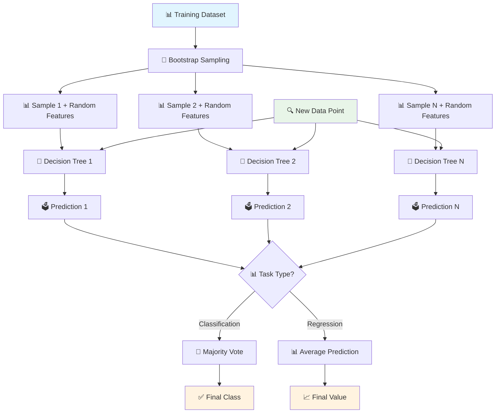
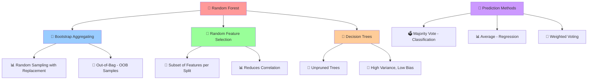
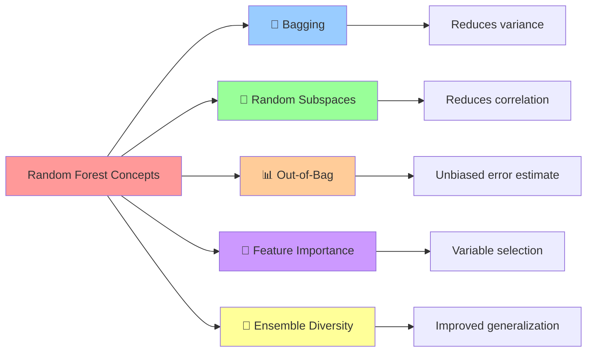

# 🌲 Random Forest

[](https://en.wikipedia.org/wiki/Random_forest)
[](https://en.wikipedia.org/wiki/Ensemble_learning)
[-orange.svg)](https://en.wikipedia.org/wiki/Time_complexity)

## 🎯 Overview

Random Forest is a **powerful ensemble learning method** that combines multiple decision trees using bootstrap aggregating (bagging). It creates a "forest" of decision trees and makes predictions by averaging their outputs (regression) or taking majority vote (classification), resulting in improved accuracy and reduced overfitting.

## 🧠 Algorithm Workflow



## 🎲 Ensemble Components



## 📐 Mathematical Foundation

### Bootstrap Sampling
```
For each tree i: Sample n observations with replacement from training set
```

### Random Feature Selection
```
At each split: Select m features randomly from p total features
Typically: m = √p (classification), m = p/3 (regression)
```

### Classification Prediction
```
ŷ = mode{T₁(x), T₂(x), ..., Tₙ(x)}
```

### Regression Prediction
```
ŷ = (1/N) × Σᵢ₌₁ᴺ Tᵢ(x)
```

### Out-of-Bag Error
```
OOB Error = (1/n) × Σᵢ₌₁ⁿ L(yᵢ, ŷᵢ⁽ᴼᴼᴮ⁾)
```

### Feature Importance
```
Importance(j) = Σᵢ₌₁ᴺ (Impurity_decrease(j, Tᵢ) / N)
```

## 🎯 Key Concepts



## ✅ Advantages

- **🎯 High Accuracy**: Often outperforms single decision trees
- **🛡️ Overfitting Resistance**: Bagging reduces overfitting
- **🌿 Feature Importance**: Built-in feature ranking
- **🔧 Handles Missing Values**: Robust to missing data
- **📊 No Feature Scaling**: Works with raw features
- **🎪 Versatile**: Both classification and regression
- **📈 Out-of-Bag Evaluation**: Built-in validation
- **🚀 Parallelizable**: Trees can be built independently

## ❌ Disadvantages

- **🔍 Less Interpretable**: Harder to interpret than single tree
- **💾 Memory Intensive**: Stores multiple trees
- **🎭 Can Overfit**: With very noisy data
- **⚖️ Biased Towards Categorical**: Favors categorical variables
- **📊 Extrapolation Issues**: Poor performance outside training range
- **🔧 Hyperparameter Tuning**: Multiple parameters to optimize

## 🎯 Use Cases & Applications

| Domain | Application | Example |
|--------|-------------|----------|
| **🏥 Healthcare** | Medical Diagnosis | Disease prediction, drug discovery |
| **💰 Finance** | Risk Assessment | Credit scoring, fraud detection |
| **🛒 E-commerce** | Recommendation | Product recommendations |
| **🎨 Computer Vision** | Image Classification | Object recognition, face detection |
| **🌾 Agriculture** | Crop Analysis | Yield prediction, disease detection |
| **🚗 Automotive** | Autonomous Driving | Object detection, path planning |

## 📁 Project Structure

```
Random Forest/
├── 📓 Random+Forest+Classification+Implementation.ipynb    # Classification examples
├── 📓 Random+Forest+Regression+Implementation.ipynb        # Regression examples
├── 📊 Travel.csv                                           # Travel dataset
├── 📊 cardekho_imputated.csv                              # Car price dataset
├── 🖼️ auc.png                                              # AUC visualization
└── 📄 README.md                                            # This documentation
```

## 🚀 Implementation Guide

### 1. Random Forest Classification
```python
import numpy as np
import pandas as pd
from sklearn.ensemble import RandomForestClassifier
from sklearn.model_selection import train_test_split
from sklearn.metrics import accuracy_score, classification_report, confusion_matrix
import matplotlib.pyplot as plt

# Load and prepare data
X_train, X_test, y_train, y_test = train_test_split(X, y, test_size=0.2, random_state=42)

# Create Random Forest classifier
rf_classifier = RandomForestClassifier(
    n_estimators=100,        # Number of trees
    max_depth=None,          # Maximum depth of trees
    min_samples_split=2,     # Minimum samples to split
    min_samples_leaf=1,      # Minimum samples in leaf
    max_features='sqrt',     # Number of features per split
    bootstrap=True,          # Bootstrap sampling
    oob_score=True,          # Out-of-bag score
    random_state=42,
    n_jobs=-1               # Use all processors
)

# Train the model
rf_classifier.fit(X_train, y_train)

# Make predictions
y_pred = rf_classifier.predict(X_test)
accuracy = accuracy_score(y_test, y_pred)

print(f"Accuracy: {accuracy:.4f}")
print(f"Out-of-Bag Score: {rf_classifier.oob_score_:.4f}")
print(f"Number of trees: {rf_classifier.n_estimators}")

# Detailed evaluation
print("\nClassification Report:")
print(classification_report(y_test, y_pred))
```

### 2. Random Forest Regression
```python
from sklearn.ensemble import RandomForestRegressor
from sklearn.metrics import mean_squared_error, r2_score, mean_absolute_error

# Create Random Forest regressor
rf_regressor = RandomForestRegressor(
    n_estimators=100,
    max_depth=None,
    min_samples_split=5,
    min_samples_leaf=2,
    max_features='auto',     # Use all features
    bootstrap=True,
    oob_score=True,
    random_state=42,
    n_jobs=-1
)

# Train the model
rf_regressor.fit(X_train, y_train)

# Make predictions
y_pred = rf_regressor.predict(X_test)

# Evaluate model
mse = mean_squared_error(y_test, y_pred)
rmse = np.sqrt(mse)
mae = mean_absolute_error(y_test, y_pred)
r2 = r2_score(y_test, y_pred)

print(f"MSE: {mse:.4f}")
print(f"RMSE: {rmse:.4f}")
print(f"MAE: {mae:.4f}")
print(f"R² Score: {r2:.4f}")
print(f"Out-of-Bag Score: {rf_regressor.oob_score_:.4f}")
```

### 3. Feature Importance Analysis
```python
# Get feature importance
feature_importance = rf_classifier.feature_importances_
feature_names = X.columns if hasattr(X, 'columns') else [f'Feature_{i}' for i in range(X.shape[1])]

# Create importance dataframe
importance_df = pd.DataFrame({
    'feature': feature_names,
    'importance': feature_importance
}).sort_values('importance', ascending=False)

# Plot feature importance
plt.figure(figsize=(10, 8))
plt.barh(importance_df['feature'][:15], importance_df['importance'][:15])
plt.xlabel('Feature Importance')
plt.title('Top 15 Feature Importances - Random Forest')
plt.gca().invert_yaxis()
plt.tight_layout()
plt.show()

print("Top 10 Most Important Features:")
print(importance_df.head(10))
```

### 4. Hyperparameter Tuning
```python
from sklearn.model_selection import GridSearchCV, RandomizedSearchCV

# Define parameter grid
param_grid = {
    'n_estimators': [50, 100, 200],
    'max_depth': [None, 10, 20, 30],
    'min_samples_split': [2, 5, 10],
    'min_samples_leaf': [1, 2, 4],
    'max_features': ['auto', 'sqrt', 'log2']
}

# Randomized search (faster than grid search)
random_search = RandomizedSearchCV(
    RandomForestClassifier(random_state=42),
    param_distributions=param_grid,
    n_iter=50,
    cv=5,
    scoring='accuracy',
    n_jobs=-1,
    random_state=42
)

random_search.fit(X_train, y_train)

print(f"Best parameters: {random_search.best_params_}")
print(f"Best cross-validation score: {random_search.best_score_:.4f}")

# Use best model
best_rf = random_search.best_estimator_
y_pred_best = best_rf.predict(X_test)
print(f"Test accuracy: {accuracy_score(y_test, y_pred_best):.4f}")
```

### 5. Out-of-Bag Analysis
```python
# OOB score progression
oob_scores = []
n_estimators_range = range(10, 201, 10)

for n_est in n_estimators_range:
    rf_temp = RandomForestClassifier(
        n_estimators=n_est,
        oob_score=True,
        random_state=42,
        n_jobs=-1
    )
    rf_temp.fit(X_train, y_train)
    oob_scores.append(rf_temp.oob_score_)

# Plot OOB score vs number of estimators
plt.figure(figsize=(10, 6))
plt.plot(n_estimators_range, oob_scores, 'b-', label='OOB Score')
plt.xlabel('Number of Estimators')
plt.ylabel('OOB Score')
plt.title('OOB Score vs Number of Estimators')
plt.legend()
plt.grid(True)
plt.show()

optimal_n_estimators = n_estimators_range[np.argmax(oob_scores)]
print(f"Optimal number of estimators: {optimal_n_estimators}")
```
✅ Works well out-of-the-box

## Code Example
```python
from sklearn.ensemble import RandomForestClassifier
model = RandomForestClassifier(n_estimators=100)
model.fit(X_train, y_train)
predictions = model.predict(X_test)
```

## Feature Importance
```python
importance = model.feature_importances_
```

## Next Steps
→ [`Gradient Boosting/`](../Gradient%20Boosting/) for sequential learning
