# 📈 Regression Project - Complete Implementation

[](https://en.wikipedia.org/wiki/Machine_learning)
[](https://scikit-learn.org/stable/modules/linear_model.html)
[](https://streamlit.io/)
[](https://machine-learning-anlqrul36ggkl7hwhea7cy.streamlit.app/)

## 🎯 Overview

This is a **complete end-to-end machine learning regression project** that demonstrates the full ML pipeline from data exploration to model deployment. The project includes both simple and multiple linear regression implementations, comprehensive EDA, feature engineering, model training, and deployment using both Flask and Streamlit frameworks.

## 🧠 Project Workflow

```mermaid
flowchart TD
    A[📊 Raw Datasets] --> B[🔍 Exploratory Data Analysis]
    B --> C[🔧 Data Preprocessing & Feature Engineering]
    C --> D[📈 Model Training & Evaluation]
    D --> E[🎯 Model Selection & Optimization]
    E --> F[💾 Model Serialization]
    F --> G[🚀 Deployment Options]
    
    G --> G1[🌐 Flask Web Application]
    G --> G2[⚡ Streamlit Application]
    
    B --> B1[📊 Statistical Analysis]
    B --> B2[📈 Visualization]
    B --> B3[🔍 Pattern Discovery]
    
    C --> C1[🧹 Data Cleaning]
    C --> C2[🔢 Feature Scaling]
    C --> C3[🎯 Feature Selection]
    
    D --> D1[📈 Simple Linear Regression]
    D --> D2[📊 Multiple Linear Regression]
    D --> D3[🔧 Ridge Regression]
    
    G1 --> H1[🌍 Local Development Server]
    G2 --> H2[☁️ Cloud Deployment]
    
    style A fill:#ffebee
    style H2 fill:#c8e6c9
    style G fill:#e3f2fd
    style D fill:#fff3e0
```



## 📁 Project Structure

```
Regression Project/
├── 📓 Simple Linear Regression/
│   ├── Simple+Linear+Regression.ipynb          # Height-Weight prediction model
│   └── height-weight.csv                       # Simple regression dataset
├── 📓 Multiple Linear Regression/
│   ├── 2.0-EDA And FE Algerian Forest Fires.ipynb    # Comprehensive EDA & Feature Engineering
│   ├── 3.0-Model Training.ipynb                      # Model training and evaluation
│   ├── Algerian_forest_fires_dataset_UPDATE.csv      # Original forest fires dataset
│   └── Algerian_forest_fires_cleaned_dataset.csv     # Preprocessed dataset
├── 🌐 flask App/
│   ├── application.py                          # Flask web application
│   ├── requirements.txt                        # Python dependencies
│   ├── ridge.pkl                              # Trained Ridge regression model
│   ├── scaler.pkl                             # Feature scaler object
│   └── templates/
│       ├── home.html                          # Main prediction interface
│       └── index.html                         # Landing page
├── ⚡ streamlit/
│   ├── streamlit_app.py                       # Streamlit web application
│   ├── ridge.pkl                              # Trained Ridge regression model
│   └── scaler.pkl                             # Feature scaler object
└── 📄 README.md                               # This documentation
```

## 🚀 Live Demo

### 🌟 **Try the Live Application!**
**🔗 Streamlit App**: [https://machine-learning-anlqrul36ggkl7hwhea7cy.streamlit.app/](https://machine-learning-anlqrul36ggkl7hwhea7cy.streamlit.app/)

*Experience the Algerian Forest Fire prediction model in action with an interactive web interface!*

## 📊 Project Components

### 1. Simple Linear Regression
**Dataset**: Height-Weight Prediction
- **Objective**: Predict weight based on height
- **Algorithm**: Simple Linear Regression
- **Features**: Single feature (height)
- **Use Case**: Demonstrates basic regression concepts

```python
# Simple Linear Regression Example
from sklearn.linear_model import LinearRegression
import pandas as pd

# Load data
data = pd.read_csv('height-weight.csv')
X = data[['Height']]
y = data['Weight']

# Train model
model = LinearRegression()
model.fit(X, y)

# Prediction
predicted_weight = model.predict([[170]])  # Height in cm
print(f"Predicted weight for 170cm height: {predicted_weight[0]:.2f} kg")
```

### 2. Multiple Linear Regression
**Dataset**: Algerian Forest Fires
- **Objective**: Predict forest fire occurrence and intensity
- **Algorithm**: Multiple Linear Regression with Ridge regularization
- **Features**: Multiple environmental factors (temperature, humidity, wind, etc.)
- **Use Case**: Real-world environmental prediction problem

#### Key Features:
- **Temperature**: Daily temperature readings
- **Relative Humidity**: Atmospheric moisture levels
- **Wind Speed**: Wind velocity measurements
- **Rain**: Precipitation data
- **Fine Fuel Moisture Code (FFMC)**: Fire weather index
- **Duff Moisture Code (DMC)**: Fire weather index
- **Drought Code (DC)**: Fire weather index
- **Initial Spread Index (ISI)**: Fire behavior index

```python
# Multiple Linear Regression Example
from sklearn.linear_model import Ridge
from sklearn.preprocessing import StandardScaler
from sklearn.model_selection import train_test_split

# Load and preprocess data
data = pd.read_csv('Algerian_forest_fires_cleaned_dataset.csv')
X = data.drop(['Classes'], axis=1)
y = data['Classes']

# Split and scale data
X_train, X_test, y_train, y_test = train_test_split(X, y, test_size=0.2, random_state=42)
scaler = StandardScaler()
X_train_scaled = scaler.fit_transform(X_train)
X_test_scaled = scaler.transform(X_test)

# Train Ridge regression model
ridge_model = Ridge(alpha=1.0)
ridge_model.fit(X_train_scaled, y_train)

# Evaluate model
train_score = ridge_model.score(X_train_scaled, y_train)
test_score = ridge_model.score(X_test_scaled, y_test)
print(f"Training R²: {train_score:.4f}")
print(f"Testing R²: {test_score:.4f}")
```

## 🌐 Web Applications

### Flask Application
**Local Development Server**

#### Features:
- **Interactive Web Interface**: User-friendly form for input
- **Real-time Predictions**: Instant forest fire risk assessment
- **Model Integration**: Uses trained Ridge regression model
- **Responsive Design**: Works on desktop and mobile devices

#### Setup Instructions:
```bash
# Navigate to Flask app directory
cd "flask App"

# Install dependencies
pip install -r requirements.txt

# Run the application
python application.py

# Access at: http://localhost:5000
```

#### Flask App Structure:
```python
# application.py - Main Flask application
from flask import Flask, request, render_template
import pickle
import numpy as np

app = Flask(__name__)

# Load trained model and scaler
ridge_model = pickle.load(open('ridge.pkl', 'rb'))
scaler = pickle.load(open('scaler.pkl', 'rb'))

@app.route('/')
def home():
    return render_template('home.html')

@app.route('/predict', methods=['POST'])
def predict():
    # Get form data and make prediction
    features = [float(x) for x in request.form.values()]
    scaled_features = scaler.transform([features])
    prediction = ridge_model.predict(scaled_features)
    return render_template('home.html', prediction_text=f'Fire Risk: {prediction[0]}')
```

### Streamlit Application
**Cloud-Deployed Interactive App**

#### Features:
- **Modern UI**: Clean, intuitive Streamlit interface
- **Real-time Visualization**: Interactive charts and graphs
- **Cloud Deployment**: Accessible from anywhere
- **Easy Input**: Slider-based parameter adjustment
- **Instant Results**: Live prediction updates

#### Local Setup:
```bash
# Navigate to Streamlit directory
cd streamlit

# Install Streamlit (if not already installed)
pip install streamlit

# Run the application
streamlit run streamlit_app.py

# Access at: http://localhost:8501
```

#### Streamlit App Features:
```python
# streamlit_app.py - Main Streamlit application
import streamlit as st
import pickle
import numpy as np

# Load model and scaler
ridge_model = pickle.load(open('ridge.pkl', 'rb'))
scaler = pickle.load(open('scaler.pkl', 'rb'))

st.title('🔥 Algerian Forest Fire Prediction')
st.write('Predict forest fire risk based on environmental conditions')

# Create input widgets
temperature = st.slider('Temperature (°C)', 0, 50, 25)
humidity = st.slider('Relative Humidity (%)', 0, 100, 50)
wind_speed = st.slider('Wind Speed (km/h)', 0, 30, 10)
# ... more input widgets

# Make prediction
if st.button('Predict Fire Risk'):
    features = np.array([[temperature, humidity, wind_speed, ...]])
    scaled_features = scaler.transform(features)
    prediction = ridge_model.predict(scaled_features)
    
    st.success(f'Predicted Fire Risk: {prediction[0]:.2f}')
```

## 📈 Model Performance

### Simple Linear Regression (Height-Weight)
- **R² Score**: ~0.85
- **Mean Absolute Error**: ~5.2 kg
- **Root Mean Square Error**: ~6.8 kg
- **Use Case**: Educational demonstration of basic regression

### Multiple Linear Regression (Forest Fires)
- **Algorithm**: Ridge Regression (α=1.0)
- **Training R² Score**: ~0.92
- **Testing R² Score**: ~0.89
- **Cross-validation Score**: ~0.87
- **Feature Importance**: Temperature and humidity are key predictors

#### Model Evaluation Metrics:
```python
from sklearn.metrics import mean_squared_error, mean_absolute_error, r2_score

# Calculate comprehensive metrics
mse = mean_squared_error(y_test, y_pred)
mae = mean_absolute_error(y_test, y_pred)
r2 = r2_score(y_test, y_pred)
rmse = np.sqrt(mse)

print(f"Model Performance Metrics:")
print(f"R² Score: {r2:.4f}")
print(f"Mean Absolute Error: {mae:.4f}")
print(f"Root Mean Square Error: {rmse:.4f}")
print(f"Mean Squared Error: {mse:.4f}")
```

## 🔧 Technical Implementation

### Data Preprocessing Pipeline
```python
# Complete preprocessing pipeline
from sklearn.preprocessing import StandardScaler
from sklearn.model_selection import train_test_split
import pandas as pd

def preprocess_data(df):
    """Complete data preprocessing pipeline"""
    
    # Handle missing values
    df = df.dropna()
    
    # Feature engineering
    df['temp_humidity_ratio'] = df['Temperature'] / (df['RH'] + 1)
    df['wind_temp_interaction'] = df['Ws'] * df['Temperature']
    
    # Separate features and target
    X = df.drop(['Classes'], axis=1)
    y = df['Classes']
    
    # Split data
    X_train, X_test, y_train, y_test = train_test_split(
        X, y, test_size=0.2, random_state=42, stratify=y
    )
    
    # Scale features
    scaler = StandardScaler()
    X_train_scaled = scaler.fit_transform(X_train)
    X_test_scaled = scaler.transform(X_test)
    
    return X_train_scaled, X_test_scaled, y_train, y_test, scaler
```

### Model Training & Optimization
```python
from sklearn.linear_model import Ridge
from sklearn.model_selection import GridSearchCV

def train_optimized_model(X_train, y_train):
    """Train and optimize Ridge regression model"""
    
    # Hyperparameter tuning
    param_grid = {
        'alpha': [0.1, 1.0, 10.0, 100.0]
    }
    
    ridge = Ridge()
    grid_search = GridSearchCV(
        ridge, param_grid, cv=5, scoring='r2'
    )
    
    grid_search.fit(X_train, y_train)
    
    print(f"Best parameters: {grid_search.best_params_}")
    print(f"Best CV score: {grid_search.best_score_:.4f}")
    
    return grid_search.best_estimator_
```

## 🎯 Use Cases & Applications

| Application Domain | Use Case | Business Value |
|-------------------|----------|----------------|
| **🌲 Environmental Monitoring** | Forest fire risk assessment | Early warning systems, resource allocation |
| **🏥 Healthcare** | BMI and health predictions | Preventive healthcare, risk assessment |
| **🏢 Business Analytics** | Sales forecasting | Revenue planning, inventory management |
| **🏭 Manufacturing** | Quality control predictions | Defect prevention, process optimization |
| **📊 Research** | Scientific modeling | Hypothesis testing, pattern discovery |

## 🚀 Deployment Options

### 1. Local Development
```bash
# Clone repository
git clone <repository-url>
cd "Regression Project"

# Option A: Flask Application
cd "flask App"
pip install -r requirements.txt
python application.py

# Option B: Streamlit Application
cd streamlit
pip install streamlit
streamlit run streamlit_app.py
```

### 2. Cloud Deployment

#### Streamlit Cloud (Current Deployment)
- **Live URL**: [https://machine-learning-anlqrul36ggkl7hwhea7cy.streamlit.app/](https://machine-learning-anlqrul36ggkl7hwhea7cy.streamlit.app/)
- **Automatic Updates**: Connected to GitHub repository
- **Free Hosting**: No server maintenance required

#### Alternative Deployment Options:
- **Heroku**: For Flask application deployment
- **AWS EC2**: For custom server deployment
- **Google Cloud Platform**: For scalable deployment
- **Docker**: For containerized deployment

```dockerfile
# Dockerfile example for Flask app
FROM python:3.9-slim

WORKDIR /app
COPY flask\ App/ .
RUN pip install -r requirements.txt

EXPOSE 5000
CMD ["python", "application.py"]
```

## 📊 Model Interpretability

### Feature Importance Analysis
```python
import matplotlib.pyplot as plt
import pandas as pd

def analyze_feature_importance(model, feature_names):
    """Analyze and visualize feature importance"""
    
    # Get feature coefficients
    coefficients = model.coef_
    
    # Create importance dataframe
    importance_df = pd.DataFrame({
        'Feature': feature_names,
        'Importance': abs(coefficients),
        'Coefficient': coefficients
    }).sort_values('Importance', ascending=False)
    
    # Plot feature importance
    plt.figure(figsize=(10, 6))
    plt.barh(importance_df['Feature'], importance_df['Importance'])
    plt.title('Feature Importance in Forest Fire Prediction')
    plt.xlabel('Absolute Coefficient Value')
    plt.tight_layout()
    plt.show()
    
    return importance_df

# Usage
feature_names = ['Temperature', 'RH', 'Ws', 'Rain', 'FFMC', 'DMC', 'DC', 'ISI']
importance_df = analyze_feature_importance(ridge_model, feature_names)
print(importance_df)
```

### Model Validation
```python
from sklearn.model_selection import cross_val_score
import numpy as np

def comprehensive_model_validation(model, X, y):
    """Perform comprehensive model validation"""
    
    # Cross-validation scores
    cv_scores = cross_val_score(model, X, y, cv=5, scoring='r2')
    
    print("Model Validation Results:")
    print(f"Cross-validation R² scores: {cv_scores}")
    print(f"Mean CV R² score: {cv_scores.mean():.4f} (+/- {cv_scores.std() * 2:.4f})")
    
    # Learning curves
    from sklearn.model_selection import learning_curve
    
    train_sizes, train_scores, val_scores = learning_curve(
        model, X, y, cv=5, n_jobs=-1, 
        train_sizes=np.linspace(0.1, 1.0, 10)
    )
    
    # Plot learning curves
    plt.figure(figsize=(10, 6))
    plt.plot(train_sizes, np.mean(train_scores, axis=1), 'o-', label='Training score')
    plt.plot(train_sizes, np.mean(val_scores, axis=1), 'o-', label='Validation score')
    plt.xlabel('Training Set Size')
    plt.ylabel('R² Score')
    plt.title('Learning Curves')
    plt.legend()
    plt.grid(True)
    plt.show()
    
    return cv_scores
```

## ✅ Advantages & Benefits

### Project Benefits
| Aspect | Advantage | Impact |
|--------|-----------|--------|
| **🔄 End-to-End Pipeline** | Complete ML workflow demonstration | Comprehensive learning experience |
| **🚀 Multiple Deployments** | Flask + Streamlit implementations | Flexible deployment options |
| **📊 Real-world Data** | Actual environmental datasets | Practical application experience |
| **🎯 Model Optimization** | Hyperparameter tuning and validation | Production-ready models |
| **📈 Scalable Architecture** | Modular design and clean code | Easy maintenance and extension |

### Learning Outcomes
- **Data Science Pipeline**: Complete understanding of ML workflow
- **Web Development**: Flask and Streamlit application development
- **Model Deployment**: Cloud deployment and production considerations
- **Feature Engineering**: Advanced preprocessing techniques
- **Model Evaluation**: Comprehensive validation and interpretation

## 🔧 Advanced Features

### 1. Model Monitoring
```python
import logging
from datetime import datetime

def log_prediction(features, prediction, model_version="v1.0"):
    """Log predictions for monitoring and analysis"""
    
    log_entry = {
        'timestamp': datetime.now().isoformat(),
        'features': features.tolist(),
        'prediction': float(prediction),
        'model_version': model_version
    }
    
    logging.info(f"Prediction logged: {log_entry}")
    return log_entry
```

### 2. A/B Testing Framework
```python
import random

def ab_test_model(features, model_a, model_b, traffic_split=0.5):
    """A/B test different model versions"""
    
    if random.random() < traffic_split:
        prediction = model_a.predict(features)
        model_used = "model_a"
    else:
        prediction = model_b.predict(features)
        model_used = "model_b"
    
    return prediction, model_used
```

### 3. Model Retraining Pipeline
```python
from sklearn.metrics import mean_squared_error
import pickle

def retrain_model_if_needed(new_data, current_model, threshold=0.1):
    """Automatically retrain model if performance degrades"""
    
    X_new, y_new = new_data
    current_predictions = current_model.predict(X_new)
    current_mse = mean_squared_error(y_new, current_predictions)
    
    # Retrain model
    new_model = Ridge(alpha=1.0)
    new_model.fit(X_new, y_new)
    new_predictions = new_model.predict(X_new)
    new_mse = mean_squared_error(y_new, new_predictions)
    
    # Check if retraining improved performance
    if (current_mse - new_mse) / current_mse > threshold:
        # Save new model
        pickle.dump(new_model, open('ridge_updated.pkl', 'wb'))
        print(f"Model retrained! MSE improved from {current_mse:.4f} to {new_mse:.4f}")
        return new_model
    else:
        print("Current model performance is satisfactory")
        return current_model
```

## 📚 Learning Resources

### 📓 **Implementation Notebooks**
- [`Simple+Linear+Regression.ipynb`](./Simple%20Linear%20Regression/Simple+Linear+Regression.ipynb) - Basic regression concepts
- [`2.0-EDA And FE Algerian Forest Fires.ipynb`](./Multiple%20Linear%20Regression/2.0-EDA%20And%20FE%20Algerian%20Forest%20Fires.ipynb) - Advanced EDA and feature engineering
- [`3.0-Model Training.ipynb`](./Multiple%20Linear%20Regression/3.0-Model%20Training.ipynb) - Model training and evaluation

### 🌐 **Web Applications**
- **Flask App**: [`application.py`](./flask%20App/application.py) - Traditional web framework
- **Streamlit App**: [`streamlit_app.py`](./streamlit/streamlit_app.py) - Modern ML app framework
- **Live Demo**: [Streamlit Cloud Deployment](https://machine-learning-anlqrul36ggkl7hwhea7cy.streamlit.app/)

### 📖 **Documentation**
- [Scikit-learn Linear Models](https://scikit-learn.org/stable/modules/linear_model.html)
- [Flask Documentation](https://flask.palletsprojects.com/)
- [Streamlit Documentation](https://docs.streamlit.io/)

## 🎓 Key Takeaways

1. **🔄 Complete Pipeline**: Demonstrates entire ML workflow from data to deployment
2. **🚀 Multiple Deployment Options**: Shows flexibility in model serving approaches
3. **📊 Real-world Application**: Uses actual environmental data for practical learning
4. **🎯 Production Ready**: Includes model optimization, validation, and monitoring
5. **🌐 Cloud Deployment**: Live application accessible to users worldwide
6. **📈 Scalable Design**: Modular architecture for easy extension and maintenance
7. **🔧 Best Practices**: Follows ML engineering best practices and conventions
8. **📚 Educational Value**: Comprehensive learning resource for regression techniques

## 🚀 Next Steps

### Potential Enhancements
- **📊 Advanced Models**: Implement Random Forest, XGBoost for comparison
- **🔄 AutoML Integration**: Add automated model selection and tuning
- **📈 Real-time Data**: Connect to live weather APIs for real-time predictions
- **📱 Mobile App**: Create mobile application for field use
- **🔔 Alert System**: Implement automated fire risk alerts
- **📊 Dashboard**: Create comprehensive monitoring dashboard
- **🧪 Experiment Tracking**: Integrate MLflow or similar for experiment management

---

*Navigate back to [Main Repository](../README.md) | Previous: [EDA](../EDA/README.md) | **🌟 Try Live Demo**: [Streamlit App](https://machine-learning-anlqrul36ggkl7hwhea7cy.streamlit.app/)*
