# ⚡ Support Vector Machine (SVM)

[](https://en.wikipedia.org/wiki/Support_vector_machine)
[](https://en.wikipedia.org/wiki/Statistical_classification)
[-orange.svg)](https://en.wikipedia.org/wiki/Time_complexity)

## 🎯 Overview

Support Vector Machine (SVM) is a **powerful supervised learning algorithm** that finds the optimal hyperplane to separate different classes or predict continuous values. It's particularly effective in high-dimensional spaces and uses the concept of **support vectors** to create robust decision boundaries with maximum margin.

## 🧠 Algorithm Workflow

```mermaid
flowchart TD
    A[📊 Training Data] --> B[🔍 Find Support Vectors]
    B --> C[📐 Calculate Optimal Hyperplane]
    C --> D[⚖️ Maximize Margin]
    D --> E[🎯 Apply Kernel Trick]
    E --> F[✅ SVM Model]
    
    G[🔍 New Data Point] --> H[📐 Apply Kernel Function]
    H --> I[📊 Calculate Distance to Hyperplane]
    I --> J{📈 Classification or Regression?}
    
    J -->|Classification| K[🎯 Determine Side of Hyperplane]
    J -->|Regression| L[📊 Predict Continuous Value]
    
    K --> M[✅ Class Prediction]
    L --> N[📈 Numerical Prediction]
    
    F --> H
    
    style A fill:#e1f5fe
    style G fill:#e8f5e8
    style M fill:#fff3e0
    style N fill:#fff3e0
```



## 🎲 SVM Types & Kernels

```mermaid
graph TB
    A[⚡ Support Vector Machine] --> B[🎯 SVM Classification - SVC]
    A --> C[📈 SVM Regression - SVR]
    
    D[🔧 Kernel Functions] --> D1[📐 Linear Kernel]
    D --> D2[🌊 Polynomial Kernel]
    D --> D3[🎯 RBF - Gaussian Kernel]
    D --> D4[📊 Sigmoid Kernel]
    D --> D5[🔧 Custom Kernels]
    
    B --> B1[🎪 Multi-class Classification]
    B --> B2[🎯 Binary Classification]
    
    C --> C1[📊 Epsilon-SVR]
    C --> C2[🎯 Nu-SVR]
    
    style A fill:#ff9999
    style B fill:#99ccff
    style C fill:#99ff99
    style D fill:#ffcc99
```



## 📐 Mathematical Foundation

### Linear SVM Decision Function
```
f(x) = sign(w·x + b)
```

### Optimization Problem (Primal Form)
```
minimize: (1/2)||w||² + C∑ξᵢ
subject to: yᵢ(w·xᵢ + b) ≥ 1 - ξᵢ, ξᵢ ≥ 0
```

### Dual Form (Lagrangian)
```
maximize: ∑αᵢ - (1/2)∑∑αᵢαⱼyᵢyⱼ(xᵢ·xⱼ)
subject to: 0 ≤ αᵢ ≤ C, ∑αᵢyᵢ = 0
```

### Kernel Functions

#### Linear Kernel
```
K(xᵢ, xⱼ) = xᵢ·xⱼ
```

#### Polynomial Kernel
```
K(xᵢ, xⱼ) = (γxᵢ·xⱼ + r)ᵈ
```

#### RBF (Radial Basis Function) Kernel
```
K(xᵢ, xⱼ) = exp(-γ||xᵢ - xⱼ||²)
```

#### Sigmoid Kernel
```
K(xᵢ, xⱼ) = tanh(γxᵢ·xⱼ + r)
```

## 🎯 Key Concepts


## ✅ Advantages

- **🎯 Effective in High Dimensions**: Works well with many features
- **💾 Memory Efficient**: Uses subset of training points (support vectors)
- **🔧 Versatile**: Different kernel functions for various data types
- **🛡️ Robust**: Less prone to overfitting in high dimensions
- **📊 Global Optimum**: Convex optimization guarantees global solution
- **🎪 Multi-class Support**: Can handle multiple classes
- **📈 Non-linear Boundaries**: Kernel trick enables complex decision boundaries

## ❌ Disadvantages

- **🐌 Slow on Large Datasets**: O(n²) to O(n³) time complexity
- **🔧 Parameter Sensitive**: Requires careful tuning of C and kernel parameters
- **📊 No Probability Estimates**: Doesn't provide direct probability outputs
- **⚖️ Feature Scaling**: Sensitive to feature scales
- **🎭 Noise Sensitive**: Outliers can significantly affect the model
- **🔍 Black Box**: Difficult to interpret (except linear kernel)
- **💾 Memory Usage**: Can be memory intensive for large datasets

## 🎯 Use Cases & Applications

| Domain | Application | Example |
|--------|-------------|----------|
| **📧 Text Classification** | Spam Detection | Email filtering systems |
| **🎨 Computer Vision** | Image Recognition | Face detection, object classification |
| **🏥 Healthcare** | Medical Diagnosis | Cancer detection, drug discovery |
| **💰 Finance** | Fraud Detection | Credit card fraud, algorithmic trading |
| **🧬 Bioinformatics** | Gene Classification | Protein structure prediction |
| **📊 Marketing** | Customer Segmentation | Targeted advertising |

## 📁 Project Structure

```
Support Vector Machine/
├── 📓 Basic+SVC+Implementation.ipynb                    # Basic SVM classification
├── 📓 SVM+Kernels+Implementation.ipynb                  # Different kernel implementations
├── 📓 Support+Vector+Regression+Implementation.ipynb    # SVM regression
└── 📄 README.md                                         # This documentation
```

## 🚀 Implementation Guide

### 1. Basic SVM Classification
```python
import numpy as np
import pandas as pd
from sklearn.svm import SVC
from sklearn.model_selection import train_test_split
from sklearn.preprocessing import StandardScaler
from sklearn.metrics import accuracy_score, classification_report, confusion_matrix
import matplotlib.pyplot as plt

# Load and prepare data
X_train, X_test, y_train, y_test = train_test_split(X, y, test_size=0.2, random_state=42)

# Feature scaling (crucial for SVM)
scaler = StandardScaler()
X_train_scaled = scaler.fit_transform(X_train)
X_test_scaled = scaler.transform(X_test)

# Create and train SVM classifier
svm_classifier = SVC(
    kernel='rbf',           # Kernel type
    C=1.0,                  # Regularization parameter
    gamma='scale',          # Kernel coefficient
    random_state=42
)

svm_classifier.fit(X_train_scaled, y_train)

# Make predictions
y_pred = svm_classifier.predict(X_test_scaled)
accuracy = accuracy_score(y_test, y_pred)

print(f"Accuracy: {accuracy:.4f}")
print(f"Number of support vectors: {svm_classifier.n_support_}")
print(f"Support vector indices: {svm_classifier.support_}")

# Detailed evaluation
print("\nClassification Report:")
print(classification_report(y_test, y_pred))
```

### 2. Different Kernel Implementations
```python
# Compare different kernels
kernels = ['linear', 'poly', 'rbf', 'sigmoid']
kernel_results = {}

for kernel in kernels:
    if kernel == 'poly':
        svm = SVC(kernel=kernel, degree=3, C=1.0, random_state=42)
    else:
        svm = SVC(kernel=kernel, C=1.0, random_state=42)
    
    svm.fit(X_train_scaled, y_train)
    y_pred = svm.predict(X_test_scaled)
    accuracy = accuracy_score(y_test, y_pred)
    
    kernel_results[kernel] = {
        'accuracy': accuracy,
        'n_support_vectors': svm.n_support_.sum()
    }

# Display results
print("Kernel Comparison:")
for kernel, results in kernel_results.items():
    print(f"{kernel.capitalize()}: Accuracy={results['accuracy']:.4f}, "
          f"Support Vectors={results['n_support_vectors']}")
```

### 3. SVM Regression (SVR)
```python
from sklearn.svm import SVR
from sklearn.metrics import mean_squared_error, r2_score

# Create SVR models with different kernels
svr_models = {
    'Linear SVR': SVR(kernel='linear', C=1.0),
    'Polynomial SVR': SVR(kernel='poly', degree=3, C=1.0),
    'RBF SVR': SVR(kernel='rbf', C=1.0, gamma='scale'),
    'Sigmoid SVR': SVR(kernel='sigmoid', C=1.0, gamma='scale')
}

svr_results = {}
for name, model in svr_models.items():
    model.fit(X_train_scaled, y_train)
    y_pred = model.predict(X_test_scaled)
    
    mse = mean_squared_error(y_test, y_pred)
    r2 = r2_score(y_test, y_pred)
    
    svr_results[name] = {'MSE': mse, 'R²': r2}

# Display regression results
print("SVR Results:")
for name, results in svr_results.items():
    print(f"{name}: MSE={results['MSE']:.4f}, R²={results['R²']:.4f}")
```

### 4. Hyperparameter Tuning
```python
from sklearn.model_selection import GridSearchCV

# Define parameter grid for RBF kernel
param_grid = {
    'C': [0.1, 1, 10, 100],
    'gamma': ['scale', 'auto', 0.001, 0.01, 0.1, 1],
    'kernel': ['rbf']
}

# Grid search with cross-validation
grid_search = GridSearchCV(
    SVC(random_state=42),
    param_grid,
    cv=5,
    scoring='accuracy',
    n_jobs=-1,
    verbose=1
)

grid_search.fit(X_train_scaled, y_train)

print(f"Best parameters: {grid_search.best_params_}")
print(f"Best cross-validation score: {grid_search.best_score_:.4f}")

# Evaluate best model
best_svm = grid_search.best_estimator_
y_pred_best = best_svm.predict(X_test_scaled)
print(f"Test accuracy: {accuracy_score(y_test, y_pred_best):.4f}")
```

### 5. Multi-class Classification
```python
from sklearn.datasets import make_classification

# Generate multi-class dataset
X_multi, y_multi = make_classification(
    n_samples=1000, n_features=20, n_classes=4, 
    n_informative=10, random_state=42
)

X_train_multi, X_test_multi, y_train_multi, y_test_multi = train_test_split(
    X_multi, y_multi, test_size=0.2, random_state=42
)

# Scale features
scaler_multi = StandardScaler()
X_train_multi_scaled = scaler_multi.fit_transform(X_train_multi)
X_test_multi_scaled = scaler_multi.transform(X_test_multi)

# Multi-class SVM
svm_multi = SVC(kernel='rbf', C=1.0, decision_function_shape='ovr')
svm_multi.fit(X_train_multi_scaled, y_train_multi)

y_pred_multi = svm_multi.predict(X_test_multi_scaled)
print(f"Multi-class accuracy: {accuracy_score(y_test_multi, y_pred_multi):.4f}")
```

## 📊 Model Evaluation & Visualization

### Decision Boundary Visualization (2D)
```python
def plot_svm_decision_boundary(X, y, model, title="SVM Decision Boundary"):
    h = 0.02  # Step size
    x_min, x_max = X[:, 0].min() - 1, X[:, 0].max() + 1
    y_min, y_max = X[:, 1].min() - 1, X[:, 1].max() + 1
    
    xx, yy = np.meshgrid(np.arange(x_min, x_max, h),
                         np.arange(y_min, y_max, h))
    
    Z = model.predict(np.c_[xx.ravel(), yy.ravel()])
    Z = Z.reshape(xx.shape)
    
    plt.figure(figsize=(12, 8))
    plt.contourf(xx, yy, Z, alpha=0.8, cmap=plt.cm.RdYlBu)
    
    # Plot data points
    scatter = plt.scatter(X[:, 0], X[:, 1], c=y, cmap=plt.cm.RdYlBu, edgecolors='black')
    
    # Plot support vectors
    if hasattr(model, 'support_vectors_'):
        plt.scatter(model.support_vectors_[:, 0], model.support_vectors_[:, 1],
                   s=100, facecolors='none', edgecolors='red', linewidth=2,
                   label='Support Vectors')
    
    plt.colorbar(scatter)
    plt.title(title)
    plt.xlabel('Feature 1')
    plt.ylabel('Feature 2')
    plt.legend()
    plt.show()

# Example usage (for 2D data)
if X_train_scaled.shape[1] == 2:
    plot_svm_decision_boundary(X_train_scaled, y_train, svm_classifier)
```

### Support Vector Analysis
```python
def analyze_support_vectors(model, X_train, y_train):
    """Analyze support vectors and their properties"""
    print(f"Total training samples: {len(X_train)}")
    print(f"Number of support vectors: {model.n_support_.sum()}")
    print(f"Support vectors per class: {model.n_support_}")
    print(f"Percentage of support vectors: {(model.n_support_.sum() / len(X_train)) * 100:.2f}%")
    
    # Support vector indices
    support_indices = model.support_
    print(f"Support vector indices: {support_indices[:10]}...")  # Show first 10
    
    # Dual coefficients (Lagrange multipliers)
    dual_coef = model.dual_coef_
    print(f"Dual coefficients shape: {dual_coef.shape}")
    print(f"Dual coefficients range: [{dual_coef.min():.4f}, {dual_coef.max():.4f}]")

# Analyze the trained model
analyze_support_vectors(svm_classifier, X_train_scaled, y_train)
```

### Performance Metrics
```python
from sklearn.metrics import precision_recall_fscore_support, roc_auc_score, roc_curve
import seaborn as sns

# Confusion Matrix
cm = confusion_matrix(y_test, y_pred)
plt.figure(figsize=(8, 6))
sns.heatmap(cm, annot=True, fmt='d', cmap='Blues')
plt.title('SVM Confusion Matrix')
plt.ylabel('True Label')
plt.xlabel('Predicted Label')
plt.show()

# Precision, Recall, F1-score
precision, recall, f1, support = precision_recall_fscore_support(y_test, y_pred, average='weighted')
print(f"Precision: {precision:.4f}")
print(f"Recall: {recall:.4f}")
print(f"F1-score: {f1:.4f}")

# ROC curve (for binary classification)
if len(np.unique(y)) == 2:
    # Get decision function scores
    decision_scores = svm_classifier.decision_function(X_test_scaled)
    fpr, tpr, _ = roc_curve(y_test, decision_scores)
    auc_score = roc_auc_score(y_test, decision_scores)
    
    plt.figure(figsize=(8, 6))
    plt.plot(fpr, tpr, label=f'SVM (AUC = {auc_score:.4f})')
    plt.plot([0, 1], [0, 1], 'k--', label='Random')
    plt.xlabel('False Positive Rate')
    plt.ylabel('True Positive Rate')
    plt.title('ROC Curve')
    plt.legend()
    plt.show()
```

## 🔧 Advanced Techniques

### 1. Custom Kernel Implementation
```python
def custom_kernel(X, Y):
    """Example of a custom kernel function"""
    # Polynomial kernel with custom parameters
    return (np.dot(X, Y.T) + 1) ** 2

# Use custom kernel
svm_custom = SVC(kernel=custom_kernel)
# Note: Custom kernels require precomputed kernel matrix
```

### 2. Probability Estimates
```python
# Enable probability estimates
svm_prob = SVC(kernel='rbf', C=1.0, probability=True, random_state=42)
svm_prob.fit(X_train_scaled, y_train)

# Get probability predictions
y_prob = svm_prob.predict_proba(X_test_scaled)
print(f"Probability predictions shape: {y_prob.shape}")
print(f"First 5 probability predictions:\n{y_prob[:5]}")
```

### 3. One-Class SVM (Anomaly Detection)
```python
from sklearn.svm import OneClassSVM

# One-class SVM for anomaly detection
one_class_svm = OneClassSVM(kernel='rbf', gamma='scale', nu=0.1)
one_class_svm.fit(X_train_scaled)

# Predict anomalies (-1 for outliers, 1 for inliers)
anomaly_pred = one_class_svm.predict(X_test_scaled)
n_outliers = np.sum(anomaly_pred == -1)
print(f"Number of detected outliers: {n_outliers}")
```

### 4. Feature Importance (Linear SVM)
```python
# Feature importance for linear SVM
svm_linear = SVC(kernel='linear', C=1.0)
svm_linear.fit(X_train_scaled, y_train)

# Get feature weights
feature_weights = svm_linear.coef_[0]
feature_importance = np.abs(feature_weights)

# Plot feature importance
plt.figure(figsize=(10, 6))
plt.bar(range(len(feature_importance)), feature_importance)
plt.title('SVM Feature Importance (Linear Kernel)')
plt.xlabel('Feature Index')
plt.ylabel('Absolute Weight')
plt.show()

print("Top 5 most important features:")
top_features = np.argsort(feature_importance)[::-1][:5]
for i, idx in enumerate(top_features):
    print(f"{i+1}. Feature {idx}: {feature_importance[idx]:.4f}")
```

## 🛡️ Handling Challenges

### 1. Imbalanced Data
```python
from sklearn.utils.class_weight import compute_class_weight

# Calculate class weights
classes = np.unique(y_train)
class_weights = compute_class_weight('balanced', classes=classes, y=y_train)
class_weight_dict = dict(zip(classes, class_weights))

# SVM with balanced class weights
svm_balanced = SVC(kernel='rbf', C=1.0, class_weight='balanced', random_state=42)
svm_balanced.fit(X_train_scaled, y_train)

y_pred_balanced = svm_balanced.predict(X_test_scaled)
print(f"Balanced SVM accuracy: {accuracy_score(y_test, y_pred_balanced):.4f}")
```

### 2. Large Dataset Handling
```python
from sklearn.svm import LinearSVC
from sklearn.linear_model import SGDClassifier

# Linear SVM for large datasets
linear_svm = LinearSVC(C=1.0, max_iter=1000, random_state=42)
linear_svm.fit(X_train_scaled, y_train)

# SGD with SVM loss (scalable alternative)
sgd_svm = SGDClassifier(loss='hinge', alpha=0.01, max_iter=1000, random_state=42)
sgd_svm.fit(X_train_scaled, y_train)

# Compare performance
linear_pred = linear_svm.predict(X_test_scaled)
sgd_pred = sgd_svm.predict(X_test_scaled)

print(f"LinearSVC accuracy: {accuracy_score(y_test, linear_pred):.4f}")
print(f"SGD SVM accuracy: {accuracy_score(y_test, sgd_pred):.4f}")
```

## 📚 Learning Resources

- **Basic Implementation**: [`Basic+SVC+Implementation.ipynb`](./Basic+SVC+Implementation.ipynb)
- **Kernel Methods**: [`SVM+Kernels+Implementation.ipynb`](./SVM+Kernels+Implementation.ipynb)
- **Regression**: [`Support+Vector+Regression+Implementation.ipynb`](./Support+Vector+Regression+Implementation.ipynb)
- **Scikit-learn Documentation**: [Support Vector Machines](https://scikit-learn.org/stable/modules/svm.html)
- **Theory**: [Support Vector Machine](https://en.wikipedia.org/wiki/Support_vector_machine)

## 🎓 Key Takeaways

1. **⚖️ Feature Scaling**: Always scale features for optimal SVM performance
2. **🔧 Kernel Selection**: Choose appropriate kernel based on data characteristics
3. **📊 Parameter Tuning**: C and gamma significantly impact performance
4. **🎯 Support Vectors**: Only support vectors determine the decision boundary
5. **💾 Memory Efficiency**: Good for high-dimensional, small to medium datasets
6. **🛡️ Regularization**: C parameter controls bias-variance tradeoff
7. **🎪 Versatility**: Works for classification, regression, and anomaly detection

---

*Navigate back to [Main Repository](../README.md) | Previous: [Polynomial Regression](../Polynomial%20Resgression/README.md) | Next: [Random Forest](../Random%20Forest/README.md)*
