# 🚀 XGBoost (Extreme Gradient Boosting)

[](https://en.wikipedia.org/wiki/XGBoost)
[](https://en.wikipedia.org/wiki/Ensemble_learning)
[-orange.svg)](https://en.wikipedia.org/wiki/Time_complexity)

## 🎯 Overview

XGBoost (Extreme Gradient Boosting) is a **highly optimized gradient boosting framework** designed for speed and performance. It's one of the most successful machine learning algorithms in competitions and real-world applications, combining the power of gradient boosting with advanced optimization techniques and regularization.

## 🧠 Algorithm Workflow

```mermaid
flowchart TD
    A[📊 Training Dataset] --> B[🎯 Initialize Base Prediction]
    B --> C[📈 Calculate Residuals]
    C --> D[🌳 Train Weak Learner - Tree]
    D --> E[🎯 Calculate Optimal Weights]
    E --> F[📊 Update Model Prediction]
    F --> G{🎯 Stopping Criteria Met?}
    G -->|No| H[📈 Calculate New Residuals]
    H --> D
    G -->|Yes| I[✅ Final Ensemble Model]
    
    J[🔍 New Data Point] --> K[🌳 Apply All Trees]
    K --> L[📊 Weighted Sum of Predictions]
    L --> M[📈 Final Prediction]
    
    I --> K
    
    N[🔧 Key Features] --> N1[🎯 Regularization]
    N --> N2[⚡ Parallel Processing]
    N --> N3[🌳 Tree Pruning]
    N --> N4[📊 Missing Value Handling]
    
    style A fill:#e1f5fe
    style J fill:#e8f5e8
    style M fill:#fff3e0
    style I fill:#f3e5f5
```



## 🎲 Gradient Boosting Process

```mermaid
graph TB
    A[🚀 XGBoost Process] --> B[🎯 Sequential Learning]
    A --> C[📈 Gradient-based Optimization]
    A --> D[🌳 Tree-based Weak Learners]
    
    B --> B1[🔄 Iterative Model Building]
    B --> B2[📊 Error Correction Focus]
    
    C --> C1[📈 First-order Gradients]
    C --> C2[📊 Second-order Gradients - Hessian]
    
    D --> D1[🌿 Decision Tree Stumps]
    D --> D2[🎯 Regularized Tree Growth]
    
    E[🔧 Advanced Features] --> E1[⚡ Parallel Tree Construction]
    E --> E2[🎯 Built-in Cross-Validation]
    E --> E3[📊 Feature Importance]
    E --> E4[🔧 Hyperparameter Tuning]
    
    style A fill:#ff9999
    style B fill:#99ccff
    style C fill:#99ff99
    style D fill:#ffcc99
    style E fill:#cc99ff
```



## 📐 Mathematical Foundation

### Objective Function
```
Obj = Σᵢ L(yᵢ, ŷᵢ) + Σₖ Ω(fₖ)
```

### Loss Function (L) + Regularization (Ω)
```
L(yᵢ, ŷᵢ) = Loss function (e.g., squared error, logistic loss)
Ω(fₖ) = γT + ½λ||w||²
```

### Taylor Expansion Approximation
```
Obj ≈ Σᵢ [gᵢfₜ(xᵢ) + ½hᵢfₜ²(xᵢ)] + Ω(fₜ)
```

Where:
- **gᵢ**: First-order gradient
- **hᵢ**: Second-order gradient (Hessian)
- **T**: Number of leaves
- **γ**: Minimum loss reduction for split
- **λ**: L2 regularization parameter

### Optimal Weight Calculation
```
w*ⱼ = -Gⱼ / (Hⱼ + λ)
```

### Gain Calculation for Split
```
Gain = ½[(G_L²/(H_L + λ)) + (G_R²/(H_R + λ)) - (G²/(H + λ))] - γ
```

## 🎯 Key Advantages of XGBoost

```mermaid
graph LR
    A[XGBoost Advantages] --> B[⚡ Performance]
    A --> C[🔧 Flexibility]
    A --> D[🛡️ Robustness]
    A --> E[🎯 Optimization]
    
    B --> B1[Parallel processing]
    B --> B2[Cache optimization]
    B --> B3[Fast training]
    
    C --> C1[Multiple objectives]
    C --> C2[Custom loss functions]
    C --> C3[Various data types]
    
    D --> D1[Missing value handling]
    D --> D2[Regularization]
    D --> D3[Cross-validation]
    
    E --> E1[Automatic feature selection]
    E --> E2[Early stopping]
    E --> E3[Hyperparameter tuning]
    
    style A fill:#ff9999
    style B fill:#99ccff
    style C fill:#99ff99
    style D fill:#ffcc99
    style E fill:#cc99ff
```



## ✅ Advantages

- **🚀 High Performance**: Often wins ML competitions
- **⚡ Speed**: Optimized for fast training and prediction
- **🔧 Regularization**: Built-in L1 and L2 regularization
- **📊 Missing Values**: Handles missing data automatically
- **🎯 Feature Importance**: Provides multiple importance metrics
- **🔄 Cross-Validation**: Built-in CV for model selection
- **🎪 Versatile**: Classification, regression, ranking
- **⚖️ Scalable**: Handles large datasets efficiently

## ❌ Disadvantages

- **🔧 Hyperparameter Sensitive**: Many parameters to tune
- **💾 Memory Usage**: Can be memory intensive
- **🎭 Overfitting Risk**: Can overfit with small datasets
- **📚 Learning Curve**: Requires understanding of many parameters
- **🔍 Black Box**: Less interpretable than simple models
- **⚡ Setup Complexity**: Installation and setup can be complex

## 🎯 Use Cases & Applications

| Domain | Application | Example |
|--------|-------------|----------|
| **💰 Finance** | Risk Assessment | Credit scoring, fraud detection |
| **🛒 E-commerce** | Recommendation | Product recommendations, ranking |
| **🏥 Healthcare** | Medical Diagnosis | Disease prediction, drug discovery |
| **📊 Marketing** | Customer Analytics | Churn prediction, lifetime value |
| **🎮 Gaming** | Player Behavior | Engagement prediction, monetization |
| **🚗 Transportation** | Demand Forecasting | Ride sharing, logistics |

## 📁 Project Structure

```
Xgboost/
├── 📓 XgboostBoost+Classification+Implementation.ipynb    # Classification examples
├── 📓 Xgboost+Regression+Implementation.ipynb             # Regression examples
├── 📊 Travel.csv                                          # Travel dataset
├── 📊 cardekho_imputated.csv                             # Car price dataset
├── 🖼️ auc.png                                             # AUC visualization
└── 📄 README.md                                           # This documentation
```

## 🚀 Implementation Guide

### 1. XGBoost Classification
```python
import numpy as np
import pandas as pd
import xgboost as xgb
from sklearn.model_selection import train_test_split
from sklearn.metrics import accuracy_score, classification_report, confusion_matrix
import matplotlib.pyplot as plt

# Load and prepare data
X_train, X_test, y_train, y_test = train_test_split(X, y, test_size=0.2, random_state=42)

# Create XGBoost classifier
xgb_classifier = xgb.XGBClassifier(
    n_estimators=100,        # Number of boosting rounds
    max_depth=6,             # Maximum tree depth
    learning_rate=0.1,       # Step size shrinkage
    subsample=0.8,           # Subsample ratio of training instances
    colsample_bytree=0.8,    # Subsample ratio of features
    reg_alpha=0,             # L1 regularization
    reg_lambda=1,            # L2 regularization
    random_state=42,
    n_jobs=-1,               # Use all processors
    eval_metric='logloss'    # Evaluation metric
)

# Train the model
xgb_classifier.fit(X_train, y_train)

# Make predictions
y_pred = xgb_classifier.predict(X_test)
y_pred_proba = xgb_classifier.predict_proba(X_test)

# Evaluate model
accuracy = accuracy_score(y_test, y_pred)
print(f"Accuracy: {accuracy:.4f}")

# Detailed evaluation
print("\nClassification Report:")
print(classification_report(y_test, y_pred))
```

### 2. XGBoost Regression
```python
from sklearn.metrics import mean_squared_error, r2_score, mean_absolute_error

# Create XGBoost regressor
xgb_regressor = xgb.XGBRegressor(
    n_estimators=100,
    max_depth=6,
    learning_rate=0.1,
    subsample=0.8,
    colsample_bytree=0.8,
    reg_alpha=0,
    reg_lambda=1,
    random_state=42,
    n_jobs=-1
)

# Train the model
xgb_regressor.fit(X_train, y_train)

# Make predictions
y_pred = xgb_regressor.predict(X_test)

# Evaluate model
mse = mean_squared_error(y_test, y_pred)
rmse = np.sqrt(mse)
mae = mean_absolute_error(y_test, y_pred)
r2 = r2_score(y_test, y_pred)

print(f"MSE: {mse:.4f}")
print(f"RMSE: {rmse:.4f}")
print(f"MAE: {mae:.4f}")
print(f"R² Score: {r2:.4f}")
```

### 3. Advanced Training with Early Stopping
```python
# Split training data for validation
X_train_split, X_val, y_train_split, y_val = train_test_split(
    X_train, y_train, test_size=0.2, random_state=42
)

# Create XGBoost with early stopping
xgb_early = xgb.XGBClassifier(
    n_estimators=1000,       # Large number for early stopping
    max_depth=6,
    learning_rate=0.1,
    subsample=0.8,
    colsample_bytree=0.8,
    reg_alpha=0,
    reg_lambda=1,
    random_state=42,
    n_jobs=-1
)

# Train with early stopping
xgb_early.fit(
    X_train_split, y_train_split,
    eval_set=[(X_val, y_val)],
    eval_metric='logloss',
    early_stopping_rounds=10,
    verbose=False
)

print(f"Best iteration: {xgb_early.best_iteration}")
print(f"Best score: {xgb_early.best_score:.4f}")

# Predictions with optimal number of estimators
y_pred_early = xgb_early.predict(X_test)
print(f"Early stopping accuracy: {accuracy_score(y_test, y_pred_early):.4f}")
```

### 4. Hyperparameter Tuning
```python
from sklearn.model_selection import GridSearchCV, RandomizedSearchCV

# Define parameter grid
param_grid = {
    'n_estimators': [50, 100, 200],
    'max_depth': [3, 6, 9],
    'learning_rate': [0.01, 0.1, 0.2],
    'subsample': [0.8, 0.9, 1.0],
    'colsample_bytree': [0.8, 0.9, 1.0],
    'reg_alpha': [0, 0.1, 1],
    'reg_lambda': [1, 1.5, 2]
}

# Randomized search (faster than grid search)
random_search = RandomizedSearchCV(
    xgb.XGBClassifier(random_state=42, n_jobs=-1),
    param_distributions=param_grid,
    n_iter=50,
    cv=5,
    scoring='accuracy',
    n_jobs=-1,
    random_state=42,
    verbose=1
)

random_search.fit(X_train, y_train)

print(f"Best parameters: {random_search.best_params_}")
print(f"Best cross-validation score: {random_search.best_score_:.4f}")

# Use best model
best_xgb = random_search.best_estimator_
y_pred_best = best_xgb.predict(X_test)
print(f"Test accuracy: {accuracy_score(y_test, y_pred_best):.4f}")
```

### 5. Feature Importance Analysis
```python
# Get feature importance (multiple methods)
importance_gain = xgb_classifier.feature_importances_
importance_weight = xgb_classifier.get_booster().get_score(importance_type='weight')
importance_cover = xgb_classifier.get_booster().get_score(importance_type='cover')

feature_names = X.columns if hasattr(X, 'columns') else [f'Feature_{i}' for i in range(X.shape[1])]

# Create importance dataframe
importance_df = pd.DataFrame({
    'feature': feature_names,
    'gain': importance_gain,
}).sort_values('gain', ascending=False)

# Plot feature importance
fig, axes = plt.subplots(1, 2, figsize=(15, 6))

# Gain-based importance
axes[0].barh(importance_df['feature'][:15], importance_df['gain'][:15])
axes[0].set_xlabel('Importance (Gain)')
axes[0].set_title('XGBoost Feature Importance (Gain)')
axes[0].invert_yaxis()

# Built-in plot
xgb.plot_importance(xgb_classifier, max_num_features=15, ax=axes[1])
axes[1].set_title('XGBoost Built-in Importance Plot')

plt.tight_layout()
plt.show()

print("Top 10 Most Important Features:")
print(importance_df.head(10))
```

## 📊 Model Evaluation & Visualization

### Learning Curves
```python
# Plot learning curves
results = xgb_early.evals_result()

plt.figure(figsize=(12, 5))

# Training and validation loss
plt.subplot(1, 2, 1)
plt.plot(results['validation_0']['logloss'], label='Validation Loss')
plt.xlabel('Boosting Rounds')
plt.ylabel('Log Loss')
plt.title('XGBoost Learning Curve')
plt.legend()
plt.grid(True)

# Feature importance
plt.subplot(1, 2, 2)
xgb.plot_importance(xgb_classifier, max_num_features=10)
plt.title('Top 10 Feature Importance')

plt.tight_layout()
plt.show()
```

### Tree Visualization
```python
# Visualize individual trees (requires graphviz)
try:
    import graphviz
    
    # Plot first tree
    fig, ax = plt.subplots(figsize=(20, 10))
    xgb.plot_tree(xgb_classifier, num_trees=0, ax=ax)
    plt.title('XGBoost Tree Structure (Tree 0)')
    plt.show()
    
except ImportError:
    print("Graphviz not installed. Tree visualization not available.")
    
# Text representation of tree
tree_dump = xgb_classifier.get_booster().get_dump()[0]
print("First tree structure (text):")
print(tree_dump[:500] + "..." if len(tree_dump) > 500 else tree_dump)
```

### SHAP Values for Interpretability
```python
try:
    import shap
    
    # Initialize SHAP explainer
    explainer = shap.TreeExplainer(xgb_classifier)
    shap_values = explainer.shap_values(X_test[:100])  # Use subset for speed
    
    # Summary plot
    plt.figure(figsize=(10, 6))
    shap.summary_plot(shap_values, X_test[:100], feature_names=feature_names, show=False)
    plt.title('SHAP Summary Plot')
    plt.tight_layout()
    plt.show()
    
    # Feature importance plot
    plt.figure(figsize=(10, 6))
    shap.summary_plot(shap_values, X_test[:100], feature_names=feature_names, 
                     plot_type="bar", show=False)
    plt.title('SHAP Feature Importance')
    plt.tight_layout()
    plt.show()
    
except ImportError:
    print("SHAP not installed. Model interpretability plots not available.")
```

## 🔧 Advanced Techniques

### 1. Custom Objective Functions
```python
def custom_objective(y_true, y_pred):
    """Custom objective function example"""
    grad = y_pred - y_true
    hess = np.ones_like(y_true)
    return grad, hess

def custom_eval_metric(y_true, y_pred):
    """Custom evaluation metric"""
    error = np.mean(np.abs(y_true - y_pred))
    return 'custom_mae', error

# Use custom functions
xgb_custom = xgb.XGBRegressor(
    objective=custom_objective,
    n_estimators=100,
    random_state=42
)

# Note: Custom objectives require DMatrix format for full functionality
```

### 2. Handling Imbalanced Data
```python
from sklearn.utils.class_weight import compute_class_weight

# Calculate class weights
classes = np.unique(y_train)
class_weights = compute_class_weight('balanced', classes=classes, y=y_train)
scale_pos_weight = class_weights[1] / class_weights[0]

# XGBoost with class balancing
xgb_balanced = xgb.XGBClassifier(
    scale_pos_weight=scale_pos_weight,  # For binary classification
    n_estimators=100,
    max_depth=6,
    learning_rate=0.1,
    random_state=42
)

xgb_balanced.fit(X_train, y_train)
y_pred_balanced = xgb_balanced.predict(X_test)

print(f"Balanced XGBoost accuracy: {accuracy_score(y_test, y_pred_balanced):.4f}")
```

### 3. Multi-class Classification
```python
from sklearn.datasets import make_classification

# Generate multi-class dataset
X_multi, y_multi = make_classification(
    n_samples=1000, n_features=20, n_classes=4, 
    n_informative=10, random_state=42
)

X_train_multi, X_test_multi, y_train_multi, y_test_multi = train_test_split(
    X_multi, y_multi, test_size=0.2, random_state=42
)

# Multi-class XGBoost
xgb_multi = xgb.XGBClassifier(
    objective='multi:softprob',  # Multi-class objective
    n_estimators=100,
    max_depth=6,
    learning_rate=0.1,
    random_state=42
)

xgb_multi.fit(X_train_multi, y_train_multi)
y_pred_multi = xgb_multi.predict(X_test_multi)

print(f"Multi-class accuracy: {accuracy_score(y_test_multi, y_pred_multi):.4f}")
print(f"Number of classes: {len(np.unique(y_multi))}")
```

### 4. Cross-Validation
```python
# Built-in cross-validation
dtrain = xgb.DMatrix(X_train, label=y_train)

params = {
    'objective': 'binary:logistic',
    'max_depth': 6,
    'learning_rate': 0.1,
    'subsample': 0.8,
    'colsample_bytree': 0.8,
    'eval_metric': 'logloss'
}

# Cross-validation
cv_results = xgb.cv(
    params,
    dtrain,
    num_boost_round=100,
    nfold=5,
    stratified=True,
    shuffle=True,
    seed=42,
    early_stopping_rounds=10,
    verbose_eval=False
)

print(f"Best CV score: {cv_results['test-logloss-mean'].min():.4f}")
print(f"Best iteration: {cv_results['test-logloss-mean'].idxmin()}")
```

## 📚 Learning Resources

- **Classification Notebook**: [`XgboostBoost+Classification+Implementation.ipynb`](./XgboostBoost+Classification+Implementation.ipynb)
- **Regression Notebook**: [`Xgboost+Regression+Implementation.ipynb`](./Xgboost+Regression+Implementation.ipynb)
- **XGBoost Documentation**: [Official XGBoost Docs](https://xgboost.readthedocs.io/)
- **Theory**: [XGBoost Paper](https://arxiv.org/abs/1603.02754)

## 🎓 Key Takeaways

1. **🚀 Performance**: Often the go-to algorithm for structured data competitions
2. **🔧 Regularization**: Built-in L1/L2 regularization prevents overfitting
3. **⚡ Optimization**: Highly optimized for speed and memory efficiency
4. **📊 Missing Values**: Handles missing data automatically during training
5. **🎯 Feature Importance**: Multiple methods for understanding feature contributions
6. **🔄 Early Stopping**: Built-in early stopping prevents overfitting
7. **🎪 Versatility**: Supports classification, regression, and ranking tasks

---

*Navigate back to [Main Repository](../README.md) | Previous: [Logistic Regression](../Logistic%20Regression/README.md) | Next: [K-means](../kmeans/README.md)*
