# ⭕ K-means Clustering

[](https://en.wikipedia.org/wiki/K-means_clustering)
[](https://en.wikipedia.org/wiki/Unsupervised_learning)
[-orange.svg)](https://en.wikipedia.org/wiki/Time_complexity)

## 🎯 Overview

K-means is a **popular unsupervised clustering algorithm** that partitions data into k clusters by minimizing the within-cluster sum of squares. It iteratively assigns data points to the nearest centroid and updates centroids based on cluster assignments, making it ideal for discovering hidden patterns in unlabeled data.

## 🧠 Algorithm Workflow

```mermaid
flowchart TD
    A[📊 Input Data + K Value] --> B[🎯 Initialize K Centroids]
    B --> C[📏 Calculate Distances to Centroids]
    C --> D[🎪 Assign Points to Nearest Centroid]
    D --> E[📊 Update Centroid Positions]
    E --> F{🎯 Centroids Changed?}
    F -->|Yes| G[📈 Calculate New Distances]
    G --> D
    F -->|No| H[✅ Final Clusters]
    
    I[🔍 New Data Point] --> J[📏 Calculate Distance to All Centroids]
    J --> K[🎯 Assign to Nearest Cluster]
    
    H --> J
    
    L[🔧 Key Steps] --> L1[🎲 Random Initialization]
    L --> L2[📏 Distance Calculation]
    L --> L3[🎪 Cluster Assignment]
    L --> L4[📊 Centroid Update]
    
    style A fill:#e1f5fe
    style I fill:#e8f5e8
    style K fill:#fff3e0
    style H fill:#f3e5f5
```



## 🎲 Clustering Process

```mermaid
graph TB
    A[⭕ K-means Process] --> B[🎯 Centroid-based Clustering]
    A --> C[📏 Distance Minimization]
    A --> D[🔄 Iterative Optimization]
    
    B --> B1[🎪 Partition into K clusters]
    B --> B2[📊 Each point belongs to one cluster]
    
    C --> C1[📐 Euclidean Distance - default]
    C --> C2[📊 Manhattan Distance]
    C --> C3[🎯 Cosine Distance]
    
    D --> D1[🔄 Lloyd's Algorithm]
    D --> D2[🎯 Expectation-Maximization]
    
    E[🔧 Variants] --> E1[⭕ Standard K-means]
    E --> E2[🎯 K-means++]
    E --> E3[📊 Mini-batch K-means]
    E --> E4[🌐 Fuzzy C-means]
    
    style A fill:#ff9999
    style B fill:#99ccff
    style C fill:#99ff99
    style D fill:#ffcc99
    style E fill:#cc99ff
```



## 📐 Mathematical Foundation

### Objective Function (Within-Cluster Sum of Squares)
```
WCSS = Σᵢ₌₁ᵏ Σₓ∈Cᵢ ||x - μᵢ||²
```

### Centroid Update Rule
```
μᵢ = (1/|Cᵢ|) Σₓ∈Cᵢ x
```

### Distance Metrics

#### Euclidean Distance (Default)
```
d(x, μ) = √Σⱼ(xⱼ - μⱼ)²
```

#### Manhattan Distance
```
d(x, μ) = Σⱼ|xⱼ - μⱼ|
```

#### Cosine Distance
```
d(x, μ) = 1 - (x·μ)/(||x|| ||μ||)
```

### Cluster Assignment
```
Cᵢ = {x : ||x - μᵢ|| ≤ ||x - μⱼ|| ∀j}
```

## 🎯 K-means Variants

```mermaid
graph LR
    A[K-means Variants] --> B[⭕ Standard K-means]
    A --> C[🎯 K-means++]
    A --> D[📊 Mini-batch K-means]
    A --> E[🌐 Fuzzy C-means]
    A --> F[🎪 Spherical K-means]
    
    B --> B1[Random initialization]
    C --> C1[Smart initialization]
    D --> D1[Scalable for large data]
    E --> E1[Soft clustering]
    F --> F1[Unit sphere data]
    
    style A fill:#ff9999
    style B fill:#99ccff
    style C fill:#99ff99
    style D fill:#ffcc99
    style E fill:#cc99ff
    style F fill:#ffff99
```



## ✅ Advantages

- **🚀 Simple & Fast**: Easy to understand and implement
- **⚡ Computationally Efficient**: Linear time complexity
- **📊 Scalable**: Works well with large datasets
- **🎯 Guaranteed Convergence**: Always converges to local optimum
- **💾 Memory Efficient**: Low memory requirements
- **🔧 Few Parameters**: Only requires k (number of clusters)
- **📈 Well-studied**: Extensive theoretical foundation

## ❌ Disadvantages

- **🎯 Choose K**: Need to specify number of clusters beforehand
- **🎲 Initialization Sensitive**: Results depend on initial centroids
- **⭕ Spherical Clusters**: Assumes clusters are spherical and similar size
- **📊 Outlier Sensitive**: Affected by outliers and noise
- **🔄 Local Optimum**: May get stuck in local minima
- **⚖️ Feature Scaling**: Sensitive to feature scales
- **📈 Non-convex Shapes**: Struggles with non-spherical clusters

## 🎯 Use Cases & Applications

| Domain | Application | Example |
|--------|-------------|----------|
| **📊 Marketing** | Customer Segmentation | Market research, targeted campaigns |
| **🎨 Computer Vision** | Image Segmentation | Object detection, color quantization |
| **🧬 Bioinformatics** | Gene Analysis | Gene expression clustering |
| **📈 Finance** | Portfolio Management | Asset grouping, risk analysis |
| **🌐 Social Media** | Community Detection | User behavior analysis |
| **🏭 Manufacturing** | Quality Control | Defect pattern analysis |

## 📁 Project Structure

```
kmeans/
├── 📓 K+Means+Clustering+Algorithms+implementation.ipynb    # Complete implementation
└── 📄 README.md                                             # This documentation
```

## 🚀 Implementation Guide

### 1. Basic K-means Clustering
```python
import numpy as np
import pandas as pd
import matplotlib.pyplot as plt
from sklearn.cluster import KMeans
from sklearn.preprocessing import StandardScaler
from sklearn.datasets import make_blobs
import seaborn as sns

# Generate sample data
X, y_true = make_blobs(n_samples=300, centers=4, cluster_std=0.60, 
                       random_state=42, n_features=2)

# Standardize features (recommended)
scaler = StandardScaler()
X_scaled = scaler.fit_transform(X)

# Create K-means model
kmeans = KMeans(
    n_clusters=4,           # Number of clusters
    init='k-means++',       # Initialization method
    n_init=10,              # Number of random initializations
    max_iter=300,           # Maximum iterations
    tol=1e-4,               # Tolerance for convergence
    random_state=42
)

# Fit the model
kmeans.fit(X_scaled)

# Get cluster labels and centroids
labels = kmeans.labels_
centroids = kmeans.cluster_centers_
inertia = kmeans.inertia_  # Within-cluster sum of squares

print(f"Number of clusters: {kmeans.n_clusters}")
print(f"Inertia (WCSS): {inertia:.4f}")
print(f"Number of iterations: {kmeans.n_iter_}")

# Visualize results
plt.figure(figsize=(12, 5))

# Original data
plt.subplot(1, 2, 1)
plt.scatter(X[:, 0], X[:, 1], c=y_true, cmap='viridis', alpha=0.7)
plt.title('Original Data (True Clusters)')
plt.xlabel('Feature 1')
plt.ylabel('Feature 2')

# K-means results
plt.subplot(1, 2, 2)
plt.scatter(X_scaled[:, 0], X_scaled[:, 1], c=labels, cmap='viridis', alpha=0.7)
plt.scatter(centroids[:, 0], centroids[:, 1], c='red', marker='x', s=200, linewidths=3)
plt.title('K-means Clustering Results')
plt.xlabel('Feature 1 (Scaled)')
plt.ylabel('Feature 2 (Scaled)')

plt.tight_layout()
plt.show()
```

### 2. Finding Optimal Number of Clusters (Elbow Method)
```python
# Elbow method to find optimal k
k_range = range(1, 11)
inertias = []
silhouette_scores = []

from sklearn.metrics import silhouette_score

for k in k_range:
    kmeans = KMeans(n_clusters=k, random_state=42, n_init=10)
    kmeans.fit(X_scaled)
    inertias.append(kmeans.inertia_)
    
    if k > 1:  # Silhouette score requires at least 2 clusters
        score = silhouette_score(X_scaled, kmeans.labels_)
        silhouette_scores.append(score)

# Plot elbow curve
plt.figure(figsize=(12, 5))

plt.subplot(1, 2, 1)
plt.plot(k_range, inertias, 'bo-')
plt.xlabel('Number of Clusters (k)')
plt.ylabel('Inertia (WCSS)')
plt.title('Elbow Method for Optimal k')
plt.grid(True)

# Plot silhouette scores
plt.subplot(1, 2, 2)
plt.plot(range(2, 11), silhouette_scores, 'ro-')
plt.xlabel('Number of Clusters (k)')
plt.ylabel('Silhouette Score')
plt.title('Silhouette Analysis')
plt.grid(True)

plt.tight_layout()
plt.show()

# Find optimal k
optimal_k_elbow = k_range[np.argmin(np.diff(inertias, 2)) + 2]  # Elbow point
optimal_k_silhouette = range(2, 11)[np.argmax(silhouette_scores)]

print(f"Optimal k (Elbow method): {optimal_k_elbow}")
print(f"Optimal k (Silhouette): {optimal_k_silhouette}")
```

### 3. K-means++ Initialization
```python
# Compare different initialization methods
init_methods = ['random', 'k-means++']
results = {}

for init_method in init_methods:
    # Run multiple times to see consistency
    inertias_method = []
    
    for _ in range(10):
        kmeans = KMeans(n_clusters=4, init=init_method, n_init=1, random_state=None)
        kmeans.fit(X_scaled)
        inertias_method.append(kmeans.inertia_)
    
    results[init_method] = inertias_method

# Compare initialization methods
plt.figure(figsize=(10, 6))
plt.boxplot([results['random'], results['k-means++']], 
            labels=['Random', 'K-means++'])
plt.ylabel('Inertia (WCSS)')
plt.title('Comparison of Initialization Methods')
plt.grid(True)
plt.show()

print("Initialization Method Comparison:")
for method, inertias_list in results.items():
    print(f"{method}: Mean={np.mean(inertias_list):.4f}, Std={np.std(inertias_list):.4f}")
```

### 4. Mini-batch K-means for Large Datasets
```python
from sklearn.cluster import MiniBatchKMeans
import time

# Generate larger dataset
X_large, _ = make_blobs(n_samples=10000, centers=5, cluster_std=1.0, 
                        random_state=42, n_features=10)
X_large_scaled = StandardScaler().fit_transform(X_large)

# Compare standard K-means vs Mini-batch K-means
models = {
    'Standard K-means': KMeans(n_clusters=5, random_state=42),
    'Mini-batch K-means': MiniBatchKMeans(n_clusters=5, random_state=42, batch_size=100)
}

results_comparison = {}

for name, model in models.items():
    start_time = time.time()
    model.fit(X_large_scaled)
    end_time = time.time()
    
    results_comparison[name] = {
        'time': end_time - start_time,
        'inertia': model.inertia_,
        'n_iter': model.n_iter_
    }

print("Performance Comparison:")
for name, metrics in results_comparison.items():
    print(f"{name}:")
    print(f"  Time: {metrics['time']:.4f} seconds")
    print(f"  Inertia: {metrics['inertia']:.4f}")
    print(f"  Iterations: {metrics['n_iter']}")
    print()
```

### 5. Advanced Clustering Analysis
```python
from sklearn.metrics import adjusted_rand_score, normalized_mutual_info_score
from sklearn.decomposition import PCA

# Comprehensive clustering evaluation
def evaluate_clustering(X, labels_true, labels_pred):
    """Evaluate clustering performance with multiple metrics"""
    metrics = {}
    
    # Internal metrics (don't require true labels)
    metrics['silhouette'] = silhouette_score(X, labels_pred)
    metrics['inertia'] = KMeans(n_clusters=len(np.unique(labels_pred))).fit(X).inertia_
    
    # External metrics (require true labels)
    if labels_true is not None:
        metrics['adjusted_rand'] = adjusted_rand_score(labels_true, labels_pred)
        metrics['normalized_mutual_info'] = normalized_mutual_info_score(labels_true, labels_pred)
    
    return metrics

# Evaluate our clustering
metrics = evaluate_clustering(X_scaled, y_true, labels)

print("Clustering Evaluation Metrics:")
for metric, value in metrics.items():
    print(f"{metric.replace('_', ' ').title()}: {value:.4f}")

# PCA visualization for high-dimensional data
if X_scaled.shape[1] > 2:
    pca = PCA(n_components=2)
    X_pca = pca.fit_transform(X_scaled)
    
    plt.figure(figsize=(12, 5))
    
    plt.subplot(1, 2, 1)
    plt.scatter(X_pca[:, 0], X_pca[:, 1], c=y_true, cmap='viridis', alpha=0.7)
    plt.title('True Clusters (PCA)')
    plt.xlabel(f'PC1 ({pca.explained_variance_ratio_[0]:.2%} variance)')
    plt.ylabel(f'PC2 ({pca.explained_variance_ratio_[1]:.2%} variance)')
    
    plt.subplot(1, 2, 2)
    plt.scatter(X_pca[:, 0], X_pca[:, 1], c=labels, cmap='viridis', alpha=0.7)
    plt.title('K-means Clusters (PCA)')
    plt.xlabel(f'PC1 ({pca.explained_variance_ratio_[0]:.2%} variance)')
    plt.ylabel(f'PC2 ({pca.explained_variance_ratio_[1]:.2%} variance)')
    
    plt.tight_layout()
    plt.show()
```

## 📊 Model Evaluation & Visualization

### Cluster Analysis
```python
# Detailed cluster analysis
def analyze_clusters(X, labels, centroids, feature_names=None):
    """Analyze cluster characteristics"""
    n_clusters = len(np.unique(labels))
    
    if feature_names is None:
        feature_names = [f'Feature_{i}' for i in range(X.shape[1])]
    
    cluster_stats = []
    
    for i in range(n_clusters):
        cluster_mask = labels == i
        cluster_data = X[cluster_mask]
        
        stats = {
            'cluster': i,
            'size': np.sum(cluster_mask),
            'percentage': np.sum(cluster_mask) / len(X) * 100,
            'centroid': centroids[i],
            'mean': np.mean(cluster_data, axis=0),
            'std': np.std(cluster_data, axis=0)
        }
        cluster_stats.append(stats)
    
    return cluster_stats

# Analyze clusters
cluster_analysis = analyze_clusters(X_scaled, labels, centroids)

print("Cluster Analysis:")
for stats in cluster_analysis:
    print(f"\nCluster {stats['cluster']}:")
    print(f"  Size: {stats['size']} ({stats['percentage']:.1f}%)")
    print(f"  Centroid: {stats['centroid']}")
    print(f"  Mean: {stats['mean']}")
    print(f"  Std: {stats['std']}")

# Visualize cluster characteristics
if X_scaled.shape[1] <= 10:  # Only for reasonable number of features
    fig, axes = plt.subplots(2, 2, figsize=(15, 10))
    
    # Cluster sizes
    cluster_sizes = [stats['size'] for stats in cluster_analysis]
    axes[0, 0].bar(range(len(cluster_sizes)), cluster_sizes)
    axes[0, 0].set_title('Cluster Sizes')
    axes[0, 0].set_xlabel('Cluster')
    axes[0, 0].set_ylabel('Number of Points')
    
    # Feature means by cluster
    feature_means = np.array([stats['mean'] for stats in cluster_analysis])
    im = axes[0, 1].imshow(feature_means, cmap='viridis', aspect='auto')
    axes[0, 1].set_title('Feature Means by Cluster')
    axes[0, 1].set_xlabel('Feature')
    axes[0, 1].set_ylabel('Cluster')
    plt.colorbar(im, ax=axes[0, 1])
    
    # Intra-cluster distances
    intra_distances = []
    for i in range(len(cluster_analysis)):
        cluster_mask = labels == i
        cluster_data = X_scaled[cluster_mask]
        centroid = centroids[i]
        distances = np.linalg.norm(cluster_data - centroid, axis=1)
        intra_distances.append(distances)
    
    axes[1, 0].boxplot(intra_distances, labels=range(len(intra_distances)))
    axes[1, 0].set_title('Intra-cluster Distances')
    axes[1, 0].set_xlabel('Cluster')
    axes[1, 0].set_ylabel('Distance to Centroid')
    
    # Silhouette analysis
    from sklearn.metrics import silhouette_samples
    silhouette_vals = silhouette_samples(X_scaled, labels)
    
    y_lower = 10
    for i in range(len(cluster_analysis)):
        cluster_silhouette_vals = silhouette_vals[labels == i]
        cluster_silhouette_vals.sort()
        
        size_cluster_i = cluster_silhouette_vals.shape[0]
        y_upper = y_lower + size_cluster_i
        
        color = plt.cm.nipy_spectral(float(i) / len(cluster_analysis))
        axes[1, 1].fill_betweenx(np.arange(y_lower, y_upper),
                                0, cluster_silhouette_vals,
                                facecolor=color, edgecolor=color, alpha=0.7)
        
        y_lower = y_upper + 10
    
    axes[1, 1].axvline(x=silhouette_score(X_scaled, labels), color="red", linestyle="--")
    axes[1, 1].set_title('Silhouette Analysis')
    axes[1, 1].set_xlabel('Silhouette Coefficient Values')
    axes[1, 1].set_ylabel('Cluster Label')
    
    plt.tight_layout()
    plt.show()
```

## 🔧 Advanced Techniques

### 1. Handling Different Data Types
```python
# Mixed data types (numerical + categorical)
from sklearn.preprocessing import LabelEncoder, OneHotEncoder
from sklearn.compose import ColumnTransformer

# Example with mixed data
mixed_data = pd.DataFrame({
    'age': np.random.randint(18, 80, 1000),
    'income': np.random.normal(50000, 15000, 1000),
    'category': np.random.choice(['A', 'B', 'C'], 1000),
    'binary': np.random.choice([0, 1], 1000)
})

# Preprocessing pipeline
preprocessor = ColumnTransformer([
    ('num', StandardScaler(), ['age', 'income']),
    ('cat', OneHotEncoder(drop='first'), ['category']),
    ('bin', 'passthrough', ['binary'])
])

X_mixed_processed = preprocessor.fit_transform(mixed_data)

# Apply K-means
kmeans_mixed = KMeans(n_clusters=3, random_state=42)
labels_mixed = kmeans_mixed.fit_predict(X_mixed_processed)

print(f"Mixed data clustering completed with {len(np.unique(labels_mixed))} clusters")
```

### 2. Fuzzy C-means (Soft Clustering)
```python
# Fuzzy C-means implementation (conceptual)
def fuzzy_cmeans_step(X, centroids, m=2):
    """Single step of fuzzy c-means algorithm"""
    n_points, n_features = X.shape
    n_clusters = len(centroids)
    
    # Calculate membership matrix
    membership = np.zeros((n_points, n_clusters))
    
    for i in range(n_points):
        for j in range(n_clusters):
            distances = [np.linalg.norm(X[i] - centroids[k]) for k in range(n_clusters)]
            if distances[j] == 0:
                membership[i, j] = 1.0
            else:
                sum_term = sum([(distances[j] / distances[k]) ** (2/(m-1)) 
                               for k in range(n_clusters)])
                membership[i, j] = 1.0 / sum_term
    
    # Update centroids
    new_centroids = []
    for j in range(n_clusters):
        weights = membership[:, j] ** m
        new_centroid = np.sum(weights.reshape(-1, 1) * X, axis=0) / np.sum(weights)
        new_centroids.append(new_centroid)
    
    return np.array(new_centroids), membership

print("Fuzzy C-means provides soft clustering with membership probabilities")
```

### 3. Constrained K-means
```python
# Semi-supervised K-means with constraints
def constrained_kmeans(X, must_link=None, cannot_link=None, k=3):
    """K-means with must-link and cannot-link constraints"""
    # This is a simplified conceptual implementation
    # In practice, you would use specialized libraries like scikit-learn-extra
    
    print("Constrained K-means allows incorporating prior knowledge:")
    if must_link:
        print(f"Must-link constraints: {len(must_link)} pairs")
    if cannot_link:
        print(f"Cannot-link constraints: {len(cannot_link)} pairs")
    
    # Standard K-means as fallback
    kmeans = KMeans(n_clusters=k, random_state=42)
    labels = kmeans.fit_predict(X)
    
    return labels

# Example usage
must_link_pairs = [(0, 1), (2, 3)]  # Points that must be in same cluster
cannot_link_pairs = [(0, 10), (1, 11)]  # Points that cannot be in same cluster

constrained_labels = constrained_kmeans(X_scaled, must_link_pairs, cannot_link_pairs)
```

## 📚 Learning Resources

- **Implementation Notebook**: [`K+Means+Clustering+Algorithms+implementation.ipynb`](./K+Means+Clustering+Algorithms+implementation.ipynb)
- **Scikit-learn Documentation**: [K-means](https://scikit-learn.org/stable/modules/clustering.html#k-means)
- **Theory**: [K-means Clustering](https://en.wikipedia.org/wiki/K-means_clustering)

## 🎓 Key Takeaways

1. **🎯 Choose K Wisely**: Use elbow method, silhouette analysis, or domain knowledge
2. **🎲 Initialization Matters**: K-means++ generally provides better results
3. **⚖️ Feature Scaling**: Always scale features for distance-based algorithms
4. **📊 Evaluation**: Use multiple metrics to assess clustering quality
5. **🔄 Local Optima**: Run multiple times with different initializations
6. **📈 Data Shape**: Works best with spherical, similar-sized clusters
7. **💾 Scalability**: Consider Mini-batch K-means for large datasets

---

*Navigate back to [Main Repository](../README.md) | Previous: [XGBoost](../Xgboost/README.md) | Next: [PCA](../PCA/README.md)*
